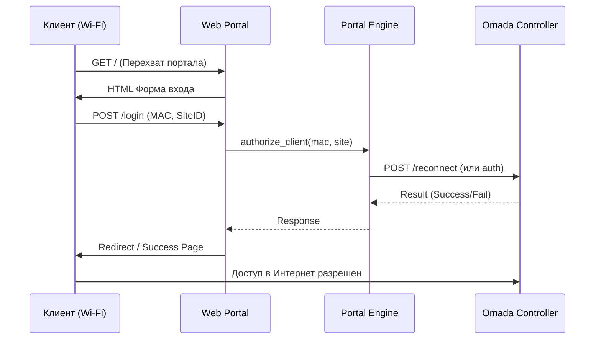
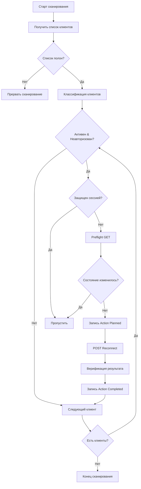
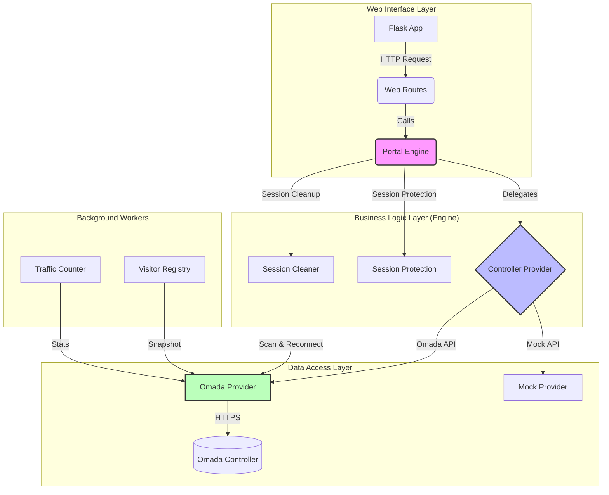
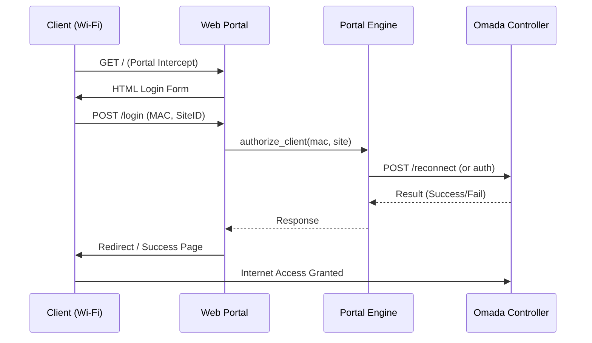
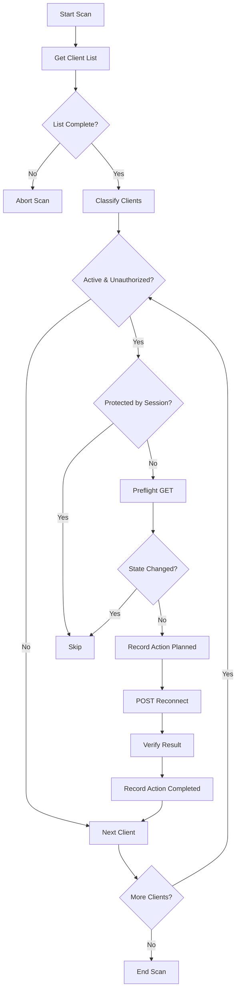

# CaptivePortal Core Platform
[](LICENSE)
[](https://www.python.org/)
[]()
Профессиональная платформа управления гостевым доступом (Captive Portal) для контроллеров TP-Link Omada. Построена на принципах чистой архитектуры, модульности и масштабируемости.
## 📖 Оглавление
- [Обзор](#обзор)
- [Архитектура системы](#архитектура-системы)
- [Модули платформы](#модули-платформы)
- [Процессы работы](#процессы-работы)
- [Установка и запуск](#установка-и-запуск)
- [Конфигурация](#конфигурация)
- [Статус функций](#статус-функций)
---
## 🌟 Обзор
CaptivePortal — это решение корпоративного уровня для организации безопасного гостевого Wi-Fi доступа. Платформа абстрагирует бизнес-логику от конкретного оборудования, позволяя легко масштабировать функционал и добавлять новые интеграции.
### Ключевые возможности
- ✅ Интеграция с **TP-Link Omada Controller** (API v1/v2)
- ✅ Автоматическая авторизация клиентов через портал
- ✅ Мониторинг и очистка "зависших" сессий (**Pending Session Cleaner**)
- ✅ Реестр устройств посетителей (**Visitor Device Registry**)
- ✅ Модульная архитектура (Clean Architecture)
- ✅ Строгая типизация и валидация данных
- ✅ Асинхронная обработка фоновых задач
---
## 🏗 Архитектура системы
Платформа построена по принципу разделения ответственности. Каждый слой знает только о слое непосредственно под ним.

### Принципы проектирования
1.  **Слабая связанность (Loose Coupling):** Модули взаимодействуют через интерфейсы.
2.  **Внедрение зависимостей (DI):** Зависимости передаются извне, а не создаются внутри.
3.  **Единый источник истины:** Конфигурация и состояние хранятся централизованно.
4.  **Fail-Open:** Ошибки второстепенных модулей (Cleaner) не должны ломать основную авторизацию.
---
## 🧩 Модули платформы
### 1. Core Platform (`app/core`)
Фундамент системы. Отвечает за базовые функции:
- Загрузка конфигурации
- Единая система логирования
- Управление исключениями
- Точка входа (`run.py`)
### 2. Controller Providers (`app/controllers`)
Адаптеры для работы с оборудованием.
- **OmadaProvider:** Реализация API для контроллеров TP-Link Omada.
- **Interface:** Базовый контракт для будущих провайдеров (UniFi, MikroTik).
### 3. Portal Engine (`app/engine`)
Центральный мозг системы. Обрабатывает бизнес-логику авторизации:
- Валидация запросов
- Управление состояниями сессий
- Координация между Web и Контроллером
### 4. Web Interface (`app/web`)
HTTP-сервер на базе Flask.
- Отдача страниц портала (HTML/CSS)
- Обработка CAPPORT запросов (RFC 8908)
- REST API для внешних систем
### 5. Pending Session Cleaner (`app/pending_sessions`) ⚡
Фоновый сервис для поддержания чистоты сети.
- Сканирование активных клиентов
- Выявление неавторизованных "зависших" сессий
- Автоматический реконнект (разрыв) проблемных клиентов
- Журналирование всех действий (Audit Log)
### 6. Visitor Registry (`app/visitor_registry`)
Реестр устройств и истории посещений.
- Снимки состояния клиентов (Snapshots)
- Привязка MAC-адресов к устройствам
- Хранение истории подключений
Унифицированные ответы |
---*Portal
## 🔄 Процессы работы
### Сценарий авторизации клиента

### Алгоритм работы Session Cleaner

---
## 🚀 Установка и запуск
### Требования
- Python 3.10+
- Linux OS (рекомендуется Ubuntu 22.04+)
- Доступ к Omada Controller (API v1/v2)
### Быстрый старт
1.  **Клонирование репозитория:**
    ```bash
    git clone https://github.com/ZaurNavi/CaptivePortal.git
    cd CaptivePortal
    ```
2.  **Установка зависимостей:**
    ```bash
    pip install -r requirements.txt
    ```
3.  **Настройка окружения:**
    Скопируйте `.env.example` в `.env` и заполните параметрами вашего контроллера:
    ```bash
    cp .env.example .env
    nano .env
    ```
4.  **Запуск:**
    ```bash
    python3 run.py
    ```
---
## ⚙️ Конфигурация
Основные параметры настраиваются через переменные окружения или файл `.env`.
| Параметр | Описание | По умолчанию |
| :--- | :--- | :--- |
| `OMADA_HOST` | IP или домен контроллера Omada | `localhost` |
| `OMADA_PORT` | Порт API контроллера | `8043` |
| `OMADA_USER` | Имя пользователя API | `admin` |
| `OMADA_PASSWORD` | Пароль пользователя API | - |
| `CAPPORT_SITE_ID` | ID сайта в Omada | - |
| `PENDING_SESSION_CLEANER_ENABLED` | Включить очистку сессий | `false` |
| `PENDING_SESSION_CLEANER_SSIDS` | Список SSID для мониторинга | `Zefer_Parki` |
| `LOG_LEVEL` | Уровень логирования | `INFO` |
---
## 📊 Статус функций
| Модуль | Статус | Версия | Описание |
| :--- | :---: | :---: | :--- |
| **Core Platform** | ✅ Готово | v1.0 | Фундамент, логи, конфиг |
| **Controller Provider** | ✅ Готово | v1.1 | Интерфейс и Omada реализация |
| **Result Model** | ✅ Готово | v1.2 | Унифицированные ответы |
| **Portal Engine** | ✅ Готово | v1.0 | Бизнес-логика авторизации |
| **Web Interface** | ✅ Готово | v1.0 | Минимальный портал |
| **Session Cleaner** | ✅ Готово | v1.0 | Очистка зависших сессий |
| **Visitor Registry** | 🚧 В работе | v0.9 | Реестр устройств |
---
## 📄 Лицензия
MIT License. См. файл [LICENSE](LICENSE) для деталей.
---
*Документация актуальна для версии проекта от августа 2026 года.*
EOF
echo "README_RU.md создан успешно."
README_RU.md создан успешно.
Теперь создам английскую версию README:
Shell
$ cat > /workspace/README.md << 'EOF'
# CaptivePortal Core Platform
[](LICENSE)
[](https://www.python.org/)
[]()
Professional guest access management platform (Captive Portal) for TP-Link Omada controllers. Built on clean architecture principles, modularity, and scalability.
## 📖 Table of Contents
- [Overview](#overview)
- [System Architecture](#system-architecture)
- [Platform Modules](#platform-modules)
- [Workflows](#workflows)
- [Installation & Quick Start](#installation--quick-start)
- [Configuration](#configuration)
- [Feature Status](#feature-status)
---
## 🌟 Overview
CaptivePortal is an enterprise-grade solution for organizing secure guest Wi-Fi access. The platform abstracts business logic from specific hardware, allowing easy feature scaling and new integrations.
### Key Features
- ✅ Integration with **TP-Link Omada Controller** (API v1/v2)
- ✅ Automatic client authorization via portal
- ✅ Monitoring and cleanup of "stuck" sessions (**Pending Session Cleaner**)
- ✅ Visitor device registry (**Visitor Device Registry**)
- ✅ Modular architecture (Clean Architecture)
- ✅ Strict typing and data validation
- ✅ Asynchronous background task processing
---
## 🏗 System Architecture
The platform is built on the principle of separation of concerns. Each layer knows only about the layer directly beneath it.

### Design Principles
1.  **Loose Coupling:** Modules interact through interfaces.
2.  **Dependency Injection (DI):** Dependencies are passed from outside, not created internally.
3.  **Single Source of Truth:** Configuration and state are stored centrally.
4.  **Fail-Open:** Errors in secondary modules (Cleaner) should not break core authorization.
---
## 🧩 Platform Modules
### 1. Core Platform (`app/core`)
System foundation. Handles basic functions:
- Configuration loading
- Unified logging system
- Exception handling
- Entry point (`run.py`)
### 2. Controller Providers (`app/controllers`)
Adapters for hardware interaction.
- **OmadaProvider:** API implementation for TP-Link Omada controllers.
- **Interface:** Base contract for future providers (UniFi, MikroTik).
### 3. Portal Engine (`app/engine`)
Central brain of the system. Handles authorization business logic:
- Request validation
- Session state management
- Coordination between Web and Controller
### 4. Web Interface (`app/web`)
Flask-based HTTP server.
- Serving portal pages (HTML/CSS)
- Handling CAPPORT requests (RFC 8908)
- REST API for external systems
### 5. Pending Session Cleaner (`app/pending_sessions`) ⚡
Background service for network hygiene.
- Scanning active clients
- Detecting unauthorized "stuck" sessions
- Automatic reconnect (disconnect) of problematic clients
- Audit logging of all actions
### 6. Visitor Registry (`app/visitor_registry`)
Device and visit history registry.
- Client state snapshots
- MAC address to device binding
- Connection history storage
---
## 🔄 Workflows
### Client Authorization Flow

### Session Cleaner Algorithm

---
## 🚀 Installation & Quick Start
### Requirements
- Python 3.10+
- Linux OS (Ubuntu 22.04+ recommended)
- Access to Omada Controller (API v1/v2)
### Quick Start
1.  **Clone repository:**
    ```bash
    git clone https://github.com/ZaurNavi/CaptivePortal.git
    cd CaptivePortal
    ```
2.  **Install dependencies:**
    ```bash
    pip install -r requirements.txt
    ```
3.  **Configure environment:**
    Copy `.env.example` to `.env` and fill with your controller parameters:
    ```bash
    cp .env.example .env
    nano .env
    ```
4.  **Run:**
    ```bash
    python3 run.py
    ```
---
## ⚙️ Configuration
Main parameters are configured via environment variables or `.env` file.
| Parameter | Description | Default |
| :--- | :--- | :--- |
| `OMADA_HOST` | Omada controller IP or domain | `localhost` |
| `OMADA_PORT` | Controller API port | `8043` |
| `OMADA_USER` | API username | `admin` |
| `OMADA_PASSWORD` | API user password | - |
| `CAPPORT_SITE_ID` | Site ID in Omada | - |
| `PENDING_SESSION_CLEANER_ENABLED` | Enable session cleaner | `false` |
| `PENDING_SESSION_CLEANER_SSIDS` | SSIDs list for monitoring | `Zefer_Parki` |
| `LOG_LEVEL` | Logging level | `INFO` |
---
## 📊 Feature Status
| Module | Status | Version | Description |
| :--- | :---: | :---: | :--- |
| **Core Platform** | ✅ Ready | v1.0 | Foundation, logs, config |
| **Controller Provider** | ✅ Ready | v1.1 | Interface & Omada implementation |
| **Result Model** | ✅ Ready | v1.2 | Unified responses |
| **Portal Engine** | ✅ Ready | v1.0 | Authorization business logic |
| **Web Interface** | ✅ Ready | v1.0 | Minimal portal |
| **Session Cleaner** | ✅ Ready | v1.0 | Stuck session cleanup |
| **Visitor Registry** | 🚧 WIP | v0.9 | Device registry |
---
## 📄 License
MIT License. See [LICENSE](LICENSE) file for details.
---
*Documentation is current as of August 2026 project version.*
EOF
echo "README.md (English) created successfully."
cat > /workspace/README.md << 'EOF'
# CaptivePortal Core Platform
[](LICENSE)
[](https://www.python.org/)
[]()
Professional guest access management platform (Captive Portal) for TP-Link Omada controllers. Built on clean architecture principles, modularity, and scalability.
## 📖 Table of Contents
- [Overview](#overview)
- [System Architecture](#system-architecture)
- [Platform Modules](#platform-modules)
- [Workflows](#workflows)
- [Installation & Quick Start](#installation--quick-start)
- [Configuration](#configuration)
- [Feature Status](#feature-status)
---
## 🌟 Overview
CaptivePortal is an enterprise-grade solution for organizing secure guest Wi-Fi access. The platform abstracts business logic from specific hardware, allowing easy feature scaling and new integrations.
### Key Features
- ✅ Integration with **TP-Link Omada Controller** (API v1/v2)
- ✅ Automatic client authorization via portal
- ✅ Monitoring and cleanup of "stuck" sessions (**Pending Session Cleaner**)
- ✅ Visitor device registry (**Visitor Device Registry**)
- ✅ Modular architecture (Clean Architecture)
- ✅ Strict typing and data validation
- ✅ Asynchronous background task processing
---
## 🏗 System Architecture
The platform is built on the principle of separation of concerns. Each layer knows only about the layer directly beneath it.

### Design Principles
1.  **Loose Coupling:** Modules interact through interfaces.
2.  **Dependency Injection (DI):** Dependencies are passed from outside, not created internally.
3.  **Single Source of Truth:** Configuration and state are stored centrally.
4.  **Fail-Open:** Errors in secondary modules (Cleaner) should not break core authorization.
---
## 🧩 Platform Modules
### 1. Core Platform (`app/core`)
System foundation. Handles basic functions:
- Configuration loading
- Unified logging system
- Exception handling
- Entry point (`run.py`)
### 2. Controller Providers (`app/controllers`)
Adapters for hardware interaction.
- **OmadaProvider:** API implementation for TP-Link Omada controllers.
- **Interface:** Base contract for future providers (UniFi, MikroTik).
### 3. Portal Engine (`app/engine`)
Central brain of the system. Handles authorization business logic:
- Request validation
- Session state management
- Coordination between Web and Controller
### 4. Web Interface (`app/web`)
Flask-based HTTP server.
- Serving portal pages (HTML/CSS)
- Handling CAPPORT requests (RFC 8908)
- REST API for external systems
### 5. Pending Session Cleaner (`app/pending_sessions`) ⚡
Background service for network hygiene.
- Scanning active clients
- Detecting unauthorized "stuck" sessions
- Automatic reconnect (disconnect) of problematic clients
- Audit logging of all actions
### 6. Visitor Registry (`app/visitor_registry`)
Device and visit history registry.
- Client state snapshots
- MAC address to device binding
- Connection history storage
---
## 🔄 Workflows
### Client Authorization Flow

### Session Cleaner Algorithm

---
## 🚀 Installation & Quick Start
### Requirements
- Python 3.10+
- Linux OS (Ubuntu 22.04+ recommended)
- Access to Omada Controller (API v1/v2)
### Quick Start
1.  **Clone repository:**
    ```bash
    git clone https://github.com/ZaurNavi/CaptivePortal.git
    cd CaptivePortal
    ```
2.  **Install dependencies:**
    ```bash
    pip install -r requirements.txt
    ```
3.  **Configure environment:**
    Copy `.env.example` to `.env` and fill with your controller parameters:
    ```bash
    cp .env.example .env
    nano .env
    ```
4.  **Run:**
    ```bash
    python3 run.py
    ```
---
## ⚙️ Configuration
Main parameters are configured via environment variables or `.env` file.
| Parameter | Description | Default |
| :--- | :--- | :--- |
| `OMADA_HOST` | Omada controller IP or domain | `localhost` |
| `OMADA_PORT` | Controller API port | `8043` |
| `OMADA_USER` | API username | `admin` |
| `OMADA_PASSWORD` | API user password | - |
| `CAPPORT_SITE_ID` | Site ID in Omada | - |
| `PENDING_SESSION_CLEANER_ENABLED` | Enable session cleaner | `false` |
| `PENDING_SESSION_CLEANER_SSIDS` | SSIDs list for monitoring | `Zefer_Parki` |
| `LOG_LEVEL` | Logging level | `INFO` |
---
## 📊 Feature Status
| Module | Status | Version | Description |
| :--- | :---: | :---: | :--- |
| **Core Platform** | ✅ Ready | v1.0 | Foundation, logs, config |
| **Controller Provider** | ✅ Ready | v1.1 | Interface & Omada implementation |
| **Result Model** | ✅ Ready | v1.2 | Unified responses |
| **Portal Engine** | ✅ Ready | v1.0 | Authorization business logic |
| **Web Interface** | ✅ Ready | v1.0 | Minimal portal |
| **Session Cleaner** | ✅ Ready | v1.0 | Stuck session cleanup |
| **Visitor Registry** | 🚧 WIP | v0.9 | Device registry |
---
## 📄 License
MIT License. See [LICENSE](LICENSE) file for details.
---
*Documentation is current as of August 2026 project version.*
EOF
echo "README.md (English) created successfully."
cat > /workspace/README.md << 'EOF'
# CaptivePortal Core Platform
[](LICENSE)
[](https://www.python.org/)
[]()
Professional guest access management platform (Captive Portal) for TP-Link Omada controllers. Built on clean architecture principles, modularity, and scalability.
## 📖 Table of Contents
- [Overview](#overview)
- [System Architecture](#system-architecture)
- [Platform Modules](#platform-modules)
- [Workflows](#workflows)
- [Installation & Quick Start](#installation--quick-start)
- [Configuration](#configuration)
- [Feature Status](#feature-status)
---
## 🌟 Overview
CaptivePortal is an enterprise-grade solution for organizing secure guest Wi-Fi access. The platform abstracts business logic from specific hardware, allowing easy feature scaling and new integrations.
### Key Features
- ✅ Integration with **TP-Link Omada Controller** (API v1/v2)
- ✅ Automatic client authorization via portal
- ✅ Monitoring and cleanup of "stuck" sessions (**Pending Session Cleaner**)
- ✅ Visitor device registry (**Visitor Device Registry**)
- ✅ Modular architecture (Clean Architecture)
- ✅ Strict typing and data validation
- ✅ Asynchronous background task processing
---
## 🏗 System Architecture
The platform is built on the principle of separation of concerns. Each layer knows only about the layer directly beneath it.
```mermaid
graph TD
    subgraph "Web Interface Layer"
        A[Flask App] -->|HTTP Request| B(Web Routes)
        B -->|Calls| C(Portal Engine)
    end
    subgraph "Business Logic Layer (Engine)"
        C -->|Delegates| D{Controller Provider}
        C -->|Session Protection| E[Session Protection]
        C -->|Session Cleanup| F[Session Cleaner]
    end
    subgraph "Data Access Layer"
        D -->|Omada API| G[Omada Provider]
        D -->|Mock API| H[Mock Provider]
        G -->|HTTPS| I[(Omada Controller)]
    end
    subgraph "Background Workers"
        F -->|Scan & Reconnect| G
i        J[Visitor Registry] -->|Snapshot| G
        K[Traffic Counter] -->|Stats| G
    end
o    style C fill:#f9f,stroke:#333,stroke-width:2px
    style D fill:#bbf,stroke:#333,stroke-width:2px
    style G fill:#bfb,stroke:#333,stroke-width:2px
```
### Design Principles
1.  **Loose Coupling:** Modules interact through interfaces.
2.  **Dependency Injection (DI):** Dependencies are passed from outside, not created internally.
3.  **Single Source of Truth:** Configuration and state are stored centrally.
4.  **Fail-Open:** Errors in secondary modules (Cleaner) should not break core authorization.
---
## 🧩 Platform Modules
### 1. Core Platform (`app/core`)
System foundation. Handles basic functions:
- Configuration loading
- Unified logging system
- Exception handling
- Entry point (`run.py`)
### 2. Controller Providers (`app/controllers`)
Adapters for hardware interaction.
- **OmadaProvider:** API implementation for TP-Link Omada controllers.
- **Interface:** Base contract for future providers (UniFi, MikroTik).
### 3. Portal Engine (`app/engine`)
Central brain of the system. Handles authorization business logic:
- Request validation
- Session state management
- Coordination between Web and Controller
### 4. Web Interface (`app/web`)
Flask-based HTTP server.
- Serving portal pages (HTML/CSS)
- Handling CAPPORT requests (RFC 8908)
- REST API for external systems
### 5. Pending Session Cleaner (`app/pending_sessions`) ⚡
Background service for network hygiene.
- Scanning active clients
- Detecting unauthorized "stuck" sessions
- Automatic reconnect (disconnect) of problematic clients
- Audit logging of all actions
### 6. Visitor Registry (`app/visitor_registry`)
Device and visit history registry.
- Client state snapshots
- MAC address to device binding
- Connection history storage
---
## 🔄 Workflows
### Client Authorization Flow

### Session Cleaner Algorithm

---
## 🚀 Installation & Quick Start
### Requirements
- Python 3.10+
- Linux OS (Ubuntu 22.04+ recommended)
- Access to Omada Controller (API v1/v2)
### Quick Start
1.  **Clone repository:**
    ```bash
    git clone https://github.com/ZaurNavi/CaptivePortal.git
    cd CaptivePortal
    ```
2.  **Install dependencies:**
    ```bash
    pip install -r requirements.txt
    ```
3.  **Configure environment:**
    Copy `.env.example` to `.env` and fill with your controller parameters:
    ```bash
    cp .env.example .env
    nano .env
    ```
4.  **Run:**
    ```bash
    python3 run.py
    ```
---
## ⚙️ Configuration
Main parameters are configured via environment variables or `.env` file.
| Parameter | Description | Default |
| :--- | :--- | :--- |
| `OMADA_HOST` | Omada controller IP or domain | `localhost` |
| `OMADA_PORT` | Controller API port | `8043` |
| `OMADA_USER` | API username | `admin` |
| `OMADA_PASSWORD` | API user password | - |
| `CAPPORT_SITE_ID` | Site ID in Omada | - |
| `PENDING_SESSION_CLEANER_ENABLED` | Enable session cleaner | `false` |
| `PENDING_SESSION_CLEANER_SSIDS` | SSIDs list for monitoring | `Zefer_Parki` |
| `LOG_LEVEL` | Logging level | `INFO` |
---
## 📊 Feature Status
| Module | Status | Version | Description |
| :--- | :---: | :---: | :--- |
| **Core Platform** | ✅ Ready | v1.0 | Foundation, logs, config |
| **Controller Provider** | ✅ Ready | v1.1 | Interface & Omada implementation |
| **Result Model** | ✅ Ready | v1.2 | Unified responses |
| **Portal Engine** | ✅ Ready | v1.0 | Authorization business logic |
| **Web Interface** | ✅ Ready | v1.0 | Minimal portal |
| **Session Cleaner** | ✅ Ready | v1.0 | Stuck session cleanup |
| **Visitor Registry** | 🚧 WIP | v0.9 | Device registry |
---
## 📄 License
MIT License. See [LICENSE](LICENSE) file for details.
---
*Documentation is current as of August 2026 project version.*
