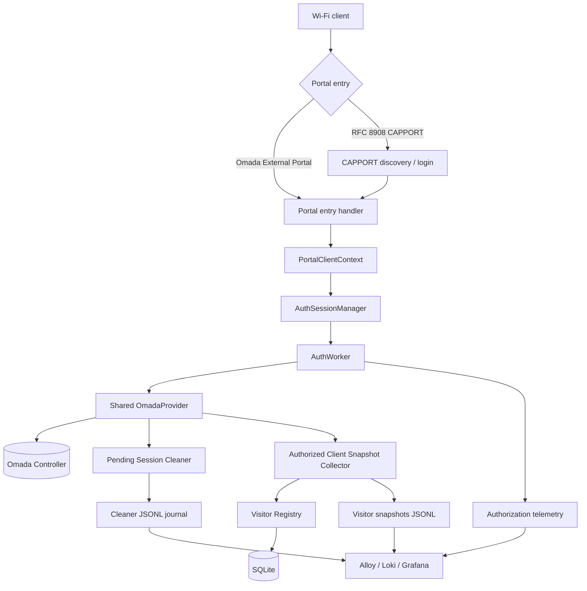
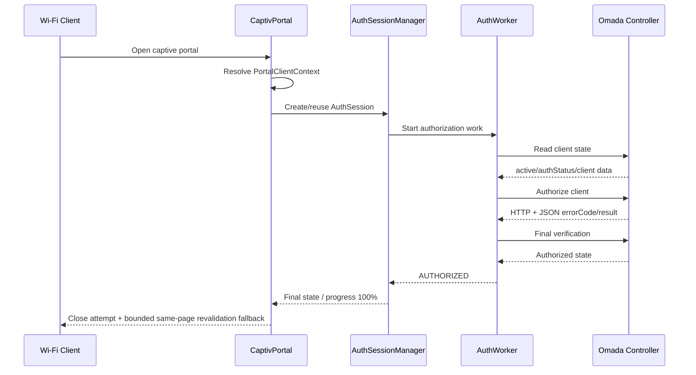
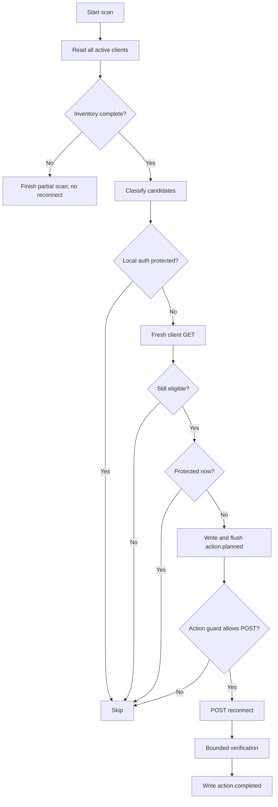

# CaptivPortal Core Platform

[Русская версия](README_RU.md)

[](LICENSE)
[](https://www.python.org/)
[]()

CaptivPortal is a Python platform for an external captive portal and related operational services for **TP-Link Omada Controller**.

The project uses one shared authorization flow, a shared `OmadaProvider`, background operational modules, structured telemetry, and persistent visitor data. Independent background components are designed to fail open: their failure must not break the core captive-portal authorization path.

## Contents

- [Overview](#overview)
- [Architecture](#architecture)
- [Main modules](#main-modules)
- [Authorization flow](#authorization-flow)
- [Pending Session Cleaner](#pending-session-cleaner)
- [Installation](#installation)
- [Configuration](#configuration)
- [Testing](#testing)
- [Project knowledge base](#project-knowledge-base)
- [Current module status](#current-module-status)
- [Security notes](#security-notes)
- [License](#license)

---

## Overview

Current platform capabilities include:

- integration with **Omada Software Controller 5.14.31** through Open API;
- external captive-portal authorization;
- RFC 8908 CAPPORT support;
- bounded client discovery before authorization;
- one shared `AuthSession` / `AuthWorker` authorization flow;
- cleanup of stale unauthorized sessions through **Pending Session Cleaner**;
- authorized-client snapshots;
- persistent **Visitor Registry** storage;
- public authorization counters;
- normalized Omada webhook processing;
- structured JSONL telemetry and journals;
- observability through Alloy, Loki, and Grafana in the production environment.

Omada API handling follows an important rule:

> HTTP 200 is not sufficient to declare success. The application also validates the JSON `errorCode` and endpoint-specific response structure.

---

## Architecture

`run.py` is the composition root: it loads settings, creates the shared `OmadaProvider`, builds the Flask application, wires authorization services and background components, and controls startup/shutdown.



### Core architectural rules

- Use the existing shared `OmadaProvider`.
- Do not create a second OAuth/token manager without a separate architectural decision.
- CAPPORT does not implement a second authorization mechanism.
- Background modules must not make a failure of an optional subsystem become a portal failure.
- Runtime configuration follows the existing `app/config.py` → `app/settings.py` → `get_settings()` pipeline.
- The current production design is **single-process**; process-local session/guard state is an accepted limitation until a future scaling/HA design is approved.

---

## Main modules

### Authorization

The core authorization path uses `AuthSessionManager` and `AuthWorker`.

Responsibilities include:

- creating and tracking authorization sessions;
- checking Omada readiness;
- performing authorization through the shared provider;
- bounded retry/verification;
- final session states such as `AUTHORIZED`, `FAILED`, `RESET`, and `EXPIRED`;
- structured authorization telemetry.

### CAPPORT

CAPPORT provides RFC 8908 integration and captive-portal client discovery.

Current behavior includes:

- source-client validation;
- bounded waiting for a client to appear in Omada;
- same-page discovery-to-authorization transition;
- monotonic connection progress;
- reuse of the common authorization flow.

After confirmed `AUTHORIZED`, the frontend attempts to close the captive window and performs at most one same-page revalidation/reload fallback. The exact behavior of captive WebViews is OS-dependent and is validated separately in production field tests.

### Pending Session Cleaner

`app/pending_sessions` handles stale unauthorized Omada sessions.

A client can be considered for cleanup only after safety checks, including:

- wireless and active client state;
- `authStatus == 1`;
- allowed SSID;
- minimum session uptime;
- local authorization protection;
- fresh preflight state;
- action rate limits;
- audit-before-action.

The verified Omada operation is:

```text
POST /openapi/v1/{omadacId}/sites/{siteId}/clients/{clientMac}/reconnect
```

The Cleaner uses bounded verification and does not use `block/unblock` as an automatic fallback.

### Authorized Client Snapshot Collector

Captures structured snapshots of authorized clients for operational history and downstream Visitor Registry processing.

### Visitor Registry

`app/visitor_registry` maintains persistent device/visit information in SQLite.

The production activation and observability stage has been accepted. Visitor snapshot events are also forwarded to Loki through a dedicated Alloy source for Grafana analysis.

A future **Visit Lifecycle** feature is a separate project stage and is not part of the already completed Visitor Registry activation.

### Public Authorization Counter

Maintains public authorization statistics without replacing the core authorization flow.

### Omada Webhook Normalizer

Normalizes Omada webhook events into the project's structured event model.

---

## Authorization flow



---

## Pending Session Cleaner

High-level flow:



---

## Installation

### Requirements

- Python 3.10+
- Linux (Ubuntu 22.04 is the current production family)
- network access to an Omada Controller
- project dependencies from `requirements.txt`

### Clone and install

```bash
git clone https://github.com/ZaurNavi/CaptivePortal.git
cd CaptivePortal
python3 -m venv .venv
source .venv/bin/activate
python -m pip install -r requirements.txt
```

### Run locally

Prepare the required process environment first, then run:

```bash
python3 run.py
```

Production uses the system service `captive-portal.service` and deployment-specific environment configuration.

---

## Configuration

Production Omada credentials are **not stored as literals in the current Git tree**.

The core Omada configuration contract uses these environment variables:

| Variable | Purpose |
|---|---|
| `OMADA_URL` | Omada Controller base URL |
| `OMADA_ID` | Omada Controller ID (`omadacId`) |
| `OMADA_CLIENT_ID` | Open API client ID |
| `OMADA_CLIENT_SECRET` | Open API client secret |
| `CAPPORT_SITE_ID` | Omada site used by CAPPORT/application flows |

Additional module settings are documented in `.env.example` and the module documentation.

> `.env.example` is a reference template. The application does **not** automatically load a local `.env` file; production configuration is supplied by the process environment / approved deployment mechanism.

Examples must use placeholders only. Never commit real controller credentials.

---

## Testing

Run targeted tests for the module being changed first.

The repository-level gate is:

```bash
python -m pytest -q -rs
python -m compileall -q app
git diff --check
```

A historical green Linux baseline exists, but release-quality status must always be tied to the exact commit being tested. Do not claim a current full gate is green unless it was actually executed on that revision.

Tests must not depend on real production Omada credentials or a real controller.

---

## Project knowledge base

The repository contains a permanent knowledge base for developers and coding agents.

Start with:

- [`AGENTS.md`](AGENTS.md) — universal repository rules;
- [`docs/README.md`](docs/README.md) — documentation index;
- [`docs/architecture.md`](docs/architecture.md) — current architecture;
- [`docs/module-index.md`](docs/module-index.md) — module map and status;
- [`docs/testing.md`](docs/testing.md) — test strategy;
- [`docs/deployment.md`](docs/deployment.md) — deployment contract;
- [`docs/security.md`](docs/security.md) — security rules.

The current TASK defines scope. Historical reports and old specifications are evidence/history, not a replacement for current code, tests, and module contracts.

---

## Current module status

| Area | Status | Notes |
|---|---|---|
| Core Flask platform | ✅ Active | Production service is deployed |
| Shared OmadaProvider | ✅ Active | OAuth `client_credentials`, shared token lifecycle |
| Authorization / AuthSession / AuthWorker | ✅ Active | Common authorization path |
| CAPPORT | ✅ Active | Bounded discovery and same-page transition |
| Pending Session Cleaner | ✅ Active | Production cleanup with safety guards and audit |
| Authorized Client Snapshot Collector | ✅ Active | Produces structured visitor snapshots |
| Visitor Registry | ✅ Active | Production/observability stage accepted |
| Public Authorization Counter | ✅ Active | Operational counter module |
| Omada Webhook Normalizer | ✅ Implemented | Structured webhook normalization |
| Visit Lifecycle | ⏳ Planned | Separate future functional stage |
| GitHub CI | ⚠️ Not yet implemented | Full gate is currently a manual Linux operation |

Operational debts and accepted limitations are tracked separately from this stable README.

---

## Security notes

- Never commit `OMADA_CLIENT_SECRET`, access tokens, cookies, or Authorization headers.
- Never log Wi-Fi passwords or complete sensitive Omada `/override` responses.
- Full MAC addresses are intentionally preserved in technical logs and operational data.
- Omada HTTP status and JSON `errorCode` are validated separately.
- The previous Omada Client Secret was removed from the current tree, but secret rotation is a separate owner-controlled security action because historical Git content may still contain old values.
- TLS verification toward Omada remains an operations/security item until a trusted certificate model is deployed.

---

## License

MIT License. See [LICENSE](LICENSE).

---

*README synchronized with the CaptivPortal project state documented in August 2026.*
