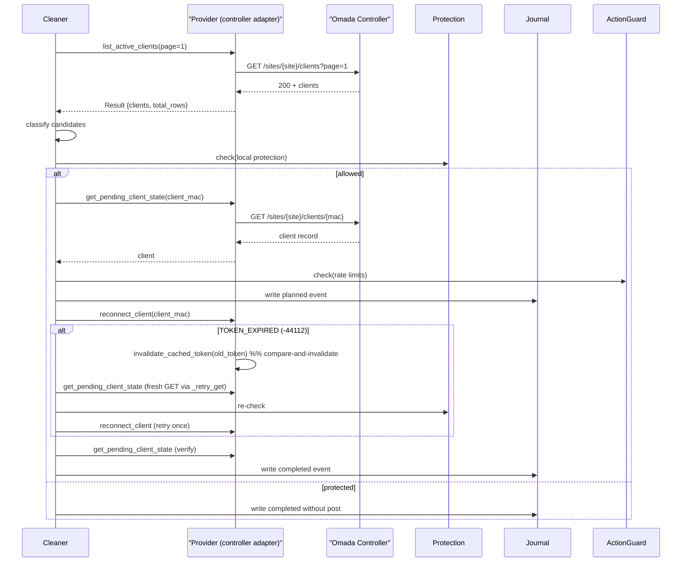

# CaptivePortal

**English** · **Русский**

A standards-based, controller-integrated captive portal platform for managed guest Wi‑Fi networks.

CaptivePortal provides a complete guest access flow: network discovery, portal presentation, client authorization, session tracking, structured telemetry, and operational monitoring.

**Project status:** Active development and field testing.

---

## Table of contents

- [Overview](#overview)
- [Current Integration](#current-integration)
- [How it works](#how-it-works)
- [Implemented features](#implemented-features)
- [Architecture](#architecture)
  - [High-level diagram](#high-level-diagram)
  - [Cleaner sequence](#cleaner-sequence)
  - [Token expiry race (problem & fix)](#token-expiry-race-problem--fix)
- [Observability](#observability)
- [Development setup](#development-setup)
- [Roadmap & Direction](#roadmap--direction)
- [Development principles & Security](#development-principles--security)
- [Testing strategy](#testing-strategy)
- [License](#license)

---

## Overview

CaptivePortal started as a custom portal for a guest Wi‑Fi network and has evolved into a modular platform adaptable to organizations that provide managed public or corporate wireless access.

Targeted deployments include:

- parks and public spaces
- hotels and hospitality
- offices and business centers
- educational institutions
- clinics and service locations
- retail spaces and event venues
- municipal guest networks

The architecture separates the user-facing portal from controller-specific authorization logic, keeping portal, session model, telemetry, and monitoring reusable across controller adapters.

See also:
- Architecture and module status: `docs/README.md`
- Developer instructions: `AGENTS.md`
- Project inventory and feature map: `docs/project-inventory.md`

---

## Current Integration

First supported adapter: **TP‑Link Omada Software Controller** (tested on 5.14.x release line).

Validated in test environment:

- client discovery via Omada Open API
- guest authorization via Omada Open API
- controller-enforced access
- CAPPORT-compatible portal discovery
- structured authorization telemetry
- integration with Grafana Alloy → Loki → Grafana dashboards

Omada is an adapter — the core supports adding other controllers later.

---

## How it works (high level)

```
Guest device connects to Wi‑Fi
        ↓
DHCP provides CAPPORT info (Option 114)
        ↓
Client queries CAPPORT API
        ↓
OS opens captive portal
        ↓
CaptivePortal creates/restores session
        ↓
Backend locates client via controller adapter
        ↓
CaptivePortal requests controller to authorize client
        ↓
Controller grants network access
        ↓
Authorization is logged to structured telemetry
```

Actual network enforcement is performed by the configured controller adapter (Omada for reference).

---

## Implemented features

- CAPPORT discovery (DHCP Option 114)
- CAPPORT API endpoint
- Responsive portal UI (`portal.html`)
- Omada Open API adapter for authorization & lookup
- Portal session management and retry flows
- ActionGuard, retry limits and auditing
- Structured JSON telemetry and journaled events
- Grafana Alloy / Loki integration for logs and dashboards
- Unit tests and CI targets (see `tests/`)

---

## Architecture

The system is logically layered:

- Portal layer — renders portal.html, handles client-side retry and discovery
- Session layer — creates/restores session state, avoids conflicting workers
- Controller integration layer — controller authentication, client discovery, authorization
- Telemetry layer — structured events, diagnostics, failure classification
- Integration layer — webhooks, controller events, traffic statistics

### High-level diagram

```mermaid
flowchart LR
  subgraph Network
    Client["Visitor device / browser"]
  end

  subgraph App ["CaptivePortal service"]
    A["Routes: /capport/api, /capport/login"]
    B["portal.html (UI)"]
    C["PortalEntryHandler → PortalClientContext"]
    D["AuthSessionManager / AuthWorker"]
    E["Pending Session Cleaner (background)"]
    F["OmadaProvider (shared token cache)"]
    G["Journal & Telemetry"]
    H["ActionGuard"]
  end

  Client -->|GET /capport/login| A
  A -->|resolve_for_login(ip)| F
  F -->|state: client_found?| A

  A -->|client found → open_portal()| C
  C -->|creates AuthSession| D
  D -->|calls Omada| F
  D -->|writes audit| G

  A -->|client not found → DISCOVERING_CLIENT (200)| B
  B -->|auto-retry (server-bounded)| A

  E -->|scans inventory| F
  E -->|classify → decide reconnect| H
  E -->|reconnect_client| F
  E -->|log actions| G
```

---

### Cleaner sequence (single candidate)



---

### Token expiry race — problem & fix

```mermaid
sequenceDiagram
  participant Cleaner
  participant Provider as "Provider (token cache)"
  participant AuthWorker
  participant Omada as "Omada Controller"

  Cleaner->>Provider: reconnect_client(token=A)  %% POST using token A
  Provider->>Omada: POST ... Authorization: AccessToken=A
  Omada-->>Provider: 401 / errorCode=-44112 (TOKEN_EXPIRED)
  Provider->>Provider: invalidate_cached_token(A)  %% compare-and-invalidate
  par concurrent
    AuthWorker->>Provider: _get_token() -> refresh -> publish token=B
  and
    Cleaner->>Provider: _recover_expired_token() does fresh GET (must NOT call unconditional invalidate)
  end

  Note right of Provider: Bug: unconditional invalidate() in Cleaner removes fresh token B.
  Note right of Provider: Fix: remove unconditional invalidate() from Cleaner; rely only on compare-and-invalidate(old_token).
```

---

## Observability

All important events are recorded as structured JSON records in a journal and emitted to the telemetry pipeline:

- session id, client IP, client MAC
- attempt number, controller lookup result, auth result
- duration, error classification, module/event names, schema version, timestamp

Pipeline:

```
App -> JSONL journal -> Grafana Alloy -> Grafana Loki -> Grafana dashboards
```

Telemetry MUST exclude secrets and credentials.

---

## Development setup

Requirements:

- Linux (or WSL/macOS), Python 3.10+
- Access to controller for integration testing
- DHCP server capable of CAPPORT Option 114 for discovery tests

Quick start:

```bash
git clone <repository-url>
cd CaptivePortal
python3 -m venv venv
source venv/bin/activate
pip install -r requirements.txt
# configure settings in app/config.py / environment variables
python run.py
```

Configuration is environment-driven — see `app/config.py` and `app/settings.py`.

---

## Testing

Unit tests are under `tests/`. Example commands:

```bash
# run all tests
python -m pytest -q

# run pending_sessions tests
python -m pytest -q tests/pending_sessions
```

If CI environment isn't available locally, run tests on the developer machine or CI.

---

## Roadmap & Direction

Planned priorities:

- portal reliability: non-blocking retry UX, reuse session during retry, avoid parallel workers
- client-side telemetry (page load, retry, visibility)
- Omada webhook receiver to enrich controller data
- traffic accounting via controller APIs
- adapter framework for other controllers (RADIUS, CoA, ACLs)

---

## Development principles & Security

- Verify controller behavior with live tests before encoding assumptions
- Build permanent modules incrementally (avoid throwaway prototypes)
- Keep controller-specific logic isolated from portal core
- Telemetry failures must not break authorization
- Never log secrets or credentials
- Defensive handling for controller responses and timeouts

---

## Testing strategy (notes)

- Validate delayed client appearances (discovery mode)
- Simulate token expiry and recovery paths
- Replay JSONL telemetry in Grafana
- Keep live tests isolated (dedicated guest VLAN)

---

## License

No public license yet. Treat repository as proprietary until a license is added.

---

## Diagrams export (optional)

To export Mermaid diagrams into SVG/PNG (local):

```bash
npm install -g @mermaid-js/mermaid-cli
# save a mermaid block into file.mmd and render:
mmdc -i file.mmd -o file.svg
mmdc -i file.mmd -o file.png
```

Or use the Mermaid Live Editor: https://mermaid.live/

---

## What changed (summary)

- Reflowed content and added TOC
- Added Quick Start and Development Setup
- Inserted three Mermaid diagrams explaining architecture, cleaner flow, and token race
- Emphasized observability and security

---

## Русская версия (сокращённо)

Ниже сокращённая русская версия основных разделов — полный перевод можно поместить в `README_RU.md`.

### Обзор

CaptivePortal — модульная платформа для гостевых Wi‑Fi сетей: обнаружение, портал, авторизация, учёт сессий и телеметрия. Адаптирована под контроллер TP‑Link Omada; архитектура позволяет добавлять другие адаптеры.

### Как это работает (коротко)

Гость подключается → DHCP CAPPORT → браузер запрашивает /capport/login → backend ищет клиента в контроллере → при успехе запускается портал/авторизация → результат журналируется.

### Надёжность и наблюдаемость

События авторизации и технические данные пишутся в структурированные JSON‑журналы и передаются в Grafana Alloy → Loki → Grafana.

### Важные принципы

- не логировать секреты;
- модульность контроллерных адаптеров;
- телеметрия не должна ломать авторизацию.
