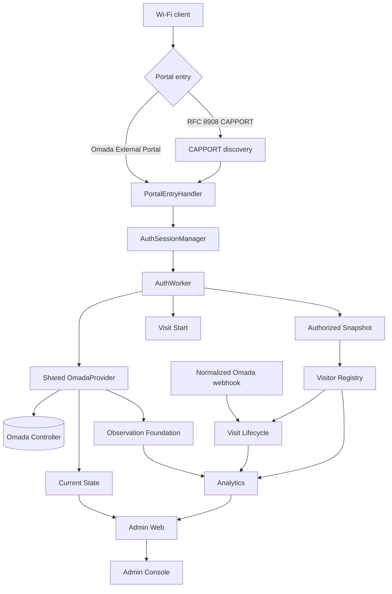

# CaptivPortal Core Platform

[Русская версия](README_RU.md)

CaptivPortal is a Python platform for TP-Link Omada external captive-portal authorization plus operational, historical, analytics, and internal admin layers.

**Current repository snapshot documented here:** `main@dfc62b43712301b05baf9f6e5dd843e13eaa9fc7`
Repository defaults, production-enabled state, and historical acceptance evidence are intentionally treated as different facts.

## Current architecture

`run.py` is the only direct process entrypoint and the top-level lifecycle/composition root.



## Current major subsystems

| Area | Repository implementation at baseline |
|---|---|
| Portal authorization / AuthSession / AuthWorker | current |
| Shared OmadaProvider | current |
| CAPPORT | current |
| Auth telemetry / public counters | current |
| Authorized Client Snapshot | current; repository default disabled |
| Visitor Registry | current; repository default disabled |
| Omada webhook receiver/normalizer | current; repository default disabled |
| Pending Session Cleaner | current; repository default disabled |
| Visit Lifecycle schema v2 | current; repository default disabled |
| Observation Foundation schema v1 | current; repository default disabled |
| Current State schema v1 | current; repository default disabled |
| Analytics + protected internal API | current; repository default disabled |
| Admin Web / Home Live / Home Traffic | current; repository defaults disabled |
| Home Activity | **not current code at this baseline; change-intent only** |
| GitHub Actions release CI | absent |

A `*_ENABLED=false` repository default does **not** prove that a feature is disabled in production.

## Critical invariants

- One shared `OmadaProvider` and one process-wide token cache.
- CAPPORT enters the same `PortalClientContext → AuthSessionManager → AuthWorker` authorization engine as Omada External Portal.
- Authorization success requires verified Omada `authStatus == 2`; HTTP success alone is not enough.
- Visitor Registry never calls Omada; it consumes `visitor_snapshots.log`.
- Analytics does not collect and does not own source persistence; it reads persisted facts through read boundaries.
- Admin browser reads only same-origin Admin HTTP/API; it does not read SQLite, Omada, Loki, Grafana, or the internal Analytics bearer API directly.
- Observation is historical authorized-population measurement; Current State is near-real-time active wireless inventory.
- Current Traffic is derived from persisted AP Observation traffic facts. It is not Internet/WAN-only traffic and not guest-only traffic.
- Independent operational/data components fail open relative to guest authorization: they become disabled/unavailable/degraded rather than inventing data or aborting the portal.
- Current supported topology is one application process. Multi-process/HA needs a separate ADR.

## Knowledge base

Start with:

- [`AGENTS.md`](AGENTS.md) — universal repository rules.
- [`docs/README.md`](docs/README.md) — knowledge map.
- [`docs/project-inventory.md`](docs/project-inventory.md) — exact current snapshot.
- [`docs/architecture.md`](docs/architecture.md) — dependency and lifecycle architecture.
- [`docs/module-index.md`](docs/module-index.md) — current module status.
- [`docs/configuration.md`](docs/configuration.md) — configuration groups and repository defaults.
- [`docs/testing.md`](docs/testing.md) — testing responsibility and gates.
- [`docs/api/omada-open-api.md`](docs/api/omada-open-api.md) — evidence-level Omada API contract.

## Testing policy

The implementation executor runs targeted tests for changed modules and relevant static checks. The full repository gate is a Reviewer / Tech Lead / owner pre-production responsibility on the exact artifact:

```bash
python -m pytest -q -rs
PYTHONPYCACHEPREFIX=/tmp/captivportal-pyc python -m compileall -q app
git diff --check
```

Do not claim a gate was executed unless evidence exists for the exact artifact.

## Security and production state

Production credentials are not inferred from Git. Omada credentials come from process environment/approved secret handling. `VERIFY_SSL=false` remains a repository-default security debt at this baseline. Admin Web is a separate operator security boundary from guest authorization.

See `docs/security.md` and `docs/deployment.md`.
