# CaptivPortal Core Platform

[Русская версия](README_RU.md)

[](LICENSE)
[](https://www.python.org/)
[]()
[]()
[]()

CaptivPortal started as an external captive-portal authorization service for **TP-Link Omada**. It has since grown into a small operational platform with its own authorization engine, visitor history, visit lifecycle, wireless observations, current network state, analytics, a protected internal API, and a native read-only Admin Web layer.

This README is intentionally written as a **human-facing project map**. It answers four questions first:

1. What is CaptivPortal?
2. How does it work?
3. What has already been built?
4. What is the next step?

For exact engineering contracts, source-of-truth rules, configuration defaults, and module-level details, use the permanent knowledge base under [`docs/`](docs/README.md).

---

## Project at a glance

| Item | Current project position |
|---|---|
| Repository / documentation checkpoint | `main@b55dcabeea22cbb802b044c263a0887123771c7d` |
| Runtime code checkpoint described by the current KB | `dfc62b43712301b05baf9f6e5dd843e13eaa9fc7` |
| Why two SHAs? | PR #63 was documentation-only; it changed no runtime code |
| Omada Controller family used by the project | Omada Software Controller 5.14.31 |
| Core guest authorization | Implemented |
| RFC 8908 CAPPORT | Implemented |
| Visitor Registry | Implemented |
| Visit Lifecycle | Implemented, schema v2 |
| Observation Foundation | Implemented, schema v1 |
| Current State | Implemented, schema v1 |
| Analytics | Implemented |
| Protected internal Analytics API | Implemented |
| Native Admin Web | Implemented |
| Home Live | Implemented |
| Home Traffic / Current Traffic | Implemented |
| Next approved change-intent | **Home Activity — Visits and Traffic** |
| Multi-Site / Tenant / RBAC | Future evolution, intentionally not prematurely implemented |
| Current topology | Single application process; HA/multi-process requires a separate ADR |

> Repository defaults, production-enabled state, and historical acceptance evidence are different facts. A feature being `*_ENABLED=false` by default does not prove that it is disabled in production.

---

## Where the project is now

The original development path was:

```text
Captive Portal
    ↓
Visitor data
    ↓
Observation Foundation
    ↓
Visit Lifecycle
    ↓
Analytics Foundation
    ↓
Web Foundation
    ↓
Admin Console
```

Most of that foundation now exists.

```mermaid
flowchart LR
    A[Portal / Auth] --> B[CAPPORT]
    B --> C[Visitor Snapshot / Registry]
    C --> D[Observation Foundation]
    D --> E[Visit Lifecycle]
    E --> F[Analytics]
    F --> G[Protected Analytics API]
    G --> H[Web Foundation / Admin Web]
    H --> I[Home Live]
    I --> J[Home Traffic]
    J --> K{{NEXT: Home Activity}}
    K --> L[Deeper product views]
    L --> M[Real Multi-Site trigger]
    M --> N[Tenant / RBAC / Entitlements]
    N --> O[Managed Captive Portal Service]
```

The project is therefore no longer “just a login page.” The current platform already separates:

- guest authorization;
- operational cleanup;
- durable device history;
- physical/logical visits;
- periodic wireless facts;
- near-real-time current state;
- read-only analytics;
- internal engineering observability;
- product-facing Admin Web.

The next increment is not another collector. It is a **human-facing use of already persisted facts**: Home Activity.

---

## What CaptivPortal does today

At the current runtime checkpoint, the repository contains these major capabilities:

- external captive-portal authorization for Omada;
- RFC 8908 CAPPORT discovery/login integration;
- one shared authorization engine for portal entry paths;
- bounded client discovery and final authorization verification;
- safe stale-pending-session cleanup;
- structured authorization telemetry;
- authorized-client snapshot capture;
- persistent Visitor Registry;
- normalized Omada webhook pipeline;
- Site-aware Visit Lifecycle with durable start/close evidence;
- periodic authorized-client and AP observations;
- near-real-time active wireless Current State;
- read-only data-quality, wireless, visit, and traffic analytics;
- protected internal Analytics HTTP API;
- native Admin Web security/session boundary;
- Home Live current client/AP summary;
- Home Traffic based on persisted AP Observation facts;
- internal Grafana/Loki observability kept separate from the product UI.

A permanent Omada rule applies across the project:

> HTTP 200 alone is not success. CaptivPortal also validates Omada JSON `errorCode` and endpoint-specific response semantics.

---

# Architecture

## Whole-platform view

The following diagram shows the platform as it exists conceptually today.

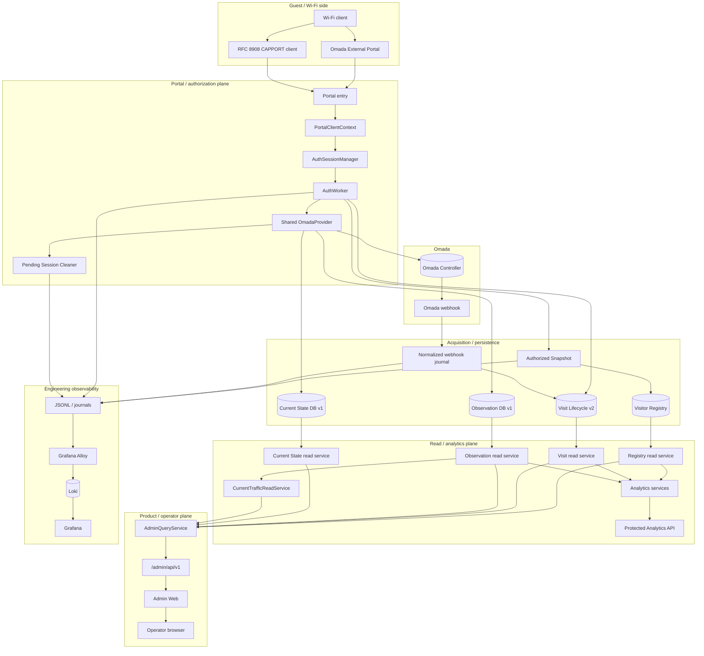

### Architectural idea in one sentence

```text
Authorization decides access.
Collectors preserve facts.
Visit Lifecycle explains sessions as visits.
Analytics reads persisted facts.
Admin Web presents safe product-facing views.
Grafana remains engineering observability.
```

---

## Process composition

`run.py` is the only direct process entrypoint and the top-level lifecycle/composition root.

A simplified startup picture:

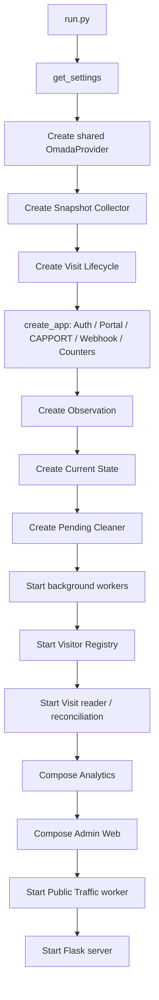

The shutdown order is intentionally controlled so that workers stop accepting work, queues drain where required, and storage-owning components close cleanly.

### Single-process assumption

Current process-local state includes:

- Auth sessions and locks;
- the Auth executor;
- CAPPORT caches;
- Cleaner action guards;
- Admin sessions and login limiter state;
- worker lifecycle state.

Therefore horizontal multi-process deployment is **not** a drop-in scaling option. A future HA design needs an ADR for shared state, worker leadership, and coordination.

---

# Guest authorization

## One authorization engine

Omada External Portal and CAPPORT are entry mechanisms, not separate authorization systems.

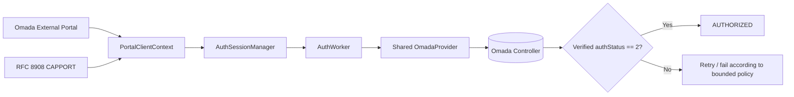

### Authorization sequence

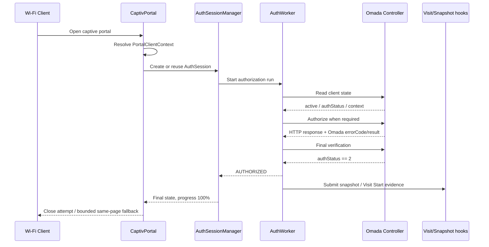

Success is based on verified controller state, not merely a successful HTTP transport call.

---

# Pending Session Cleaner

The Pending Session Cleaner handles stale unauthenticated clients without becoming a second authorization system.

Its safety philosophy is:

```text
uncertainty => no reconnect
```

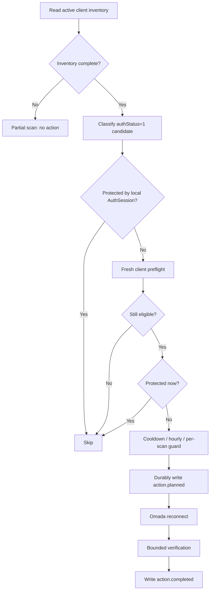

The verified control operation used by the Cleaner is the Omada client reconnect endpoint. `block/unblock` is not used as an automatic fallback.

---

# From raw events to durable product data

## The data chain

CaptivPortal deliberately separates data acquisition from analytics.

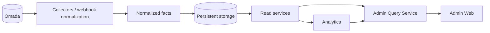

Permanent rule:

```text
Collector gathers and stores facts.
Analytics reads already persisted facts.
Analytics does not go back to Omada to manufacture missing history.
```

This matters because historical analysis should continue to work even if Omada is temporarily unavailable at query time.

---

## Snapshot vs Observation vs Current State vs Visit

These layers intentionally answer different questions.

| Layer | Question it answers | Population / meaning | Persistence |
|---|---|---|---|
| Authorized Snapshot | “What did this successfully authorized client look like at authorization time?” | One detailed start-of-history capture | JSONL |
| Visitor Registry | “What stable device/history identity do we know?” | Device card + captured history | SQLite |
| Observation | “What measurements did authorized clients/APs have over time?” | Historical authorized population + AP facts | SQLite v1 |
| Current State | “What wireless clients/APs are active now?” | Active wireless inventory, including pending clients | SQLite v1 |
| Visit Lifecycle | “What physical/logical visit did this authorization belong to, and when did it close?” | Site-aware visit entity + source events | SQLite v2 |
| Analytics | “What can be derived from the stored facts?” | Query-on-read derived results | No source persistence |
| Admin Web | “What should an operator safely see?” | Bounded, Site-scoped presentation | No business DB |

### Observation vs Current State

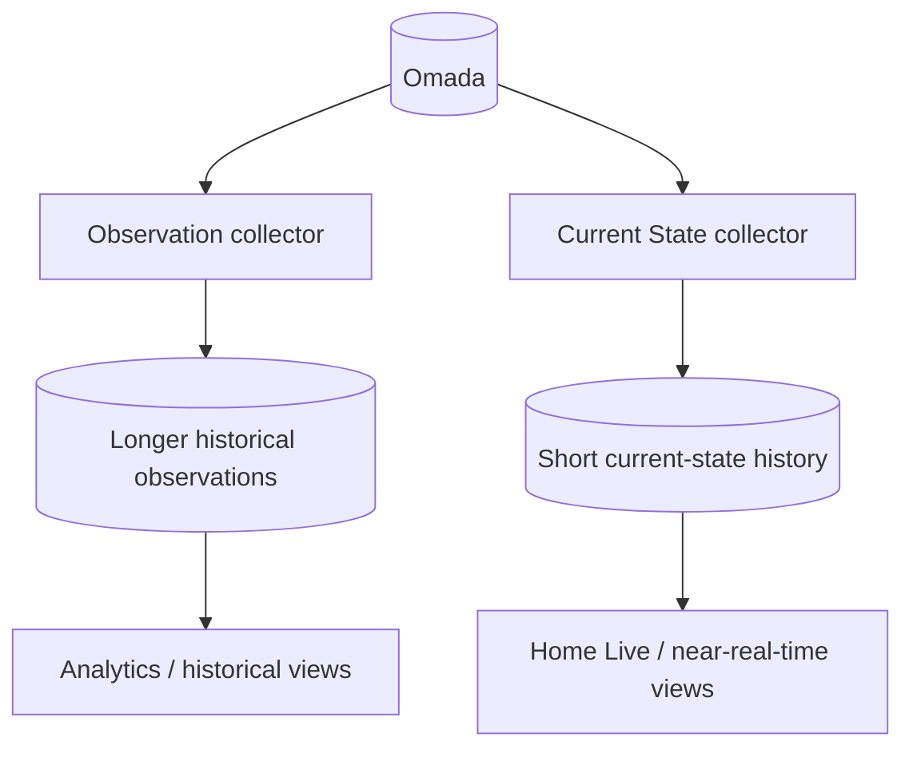

Observation clients are active + authorized within scope. Current State includes all active wireless clients in scope and classifies them as:

```text
authStatus 2      → authorized
authStatus 1      → pending
other integer     → other
missing / invalid → unknown
```

A newer failed or partial Current State collection does not silently replace the last complete-success snapshot.

---

# Visit Lifecycle

`AuthSession` is not a physical Visit.

One Visit can contain multiple authorization events. Visit Lifecycle gives the system a durable Site-aware unit for later analytics and product views.

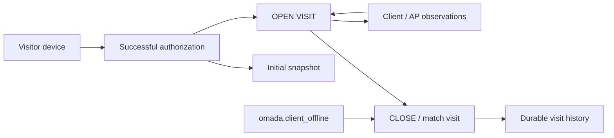

Current schema version: **2**.

Important properties:

- confirmed successful authorization creates Visit Start evidence;
- normalized offline webhook evidence closes/matches visits;
- unmatched offline evidence can remain pending for later reconciliation;
- Registry reconciliation can link device/snapshot identity later;
- durable reader checkpointing protects webhook consumption;
- foreground Visit Start writes receive priority over background reconciliation writes.

---

# Analytics

Analytics is intentionally **demand-only**.

It has:

- no background collection thread;
- no direct Omada dependency;
- no source write path;
- no ownership of Registry, Visit, Observation, or Current State schemas.

Current analytics families include:

- source/data quality;
- wireless analytics;
- visit analytics;
- Current Traffic interpretation.

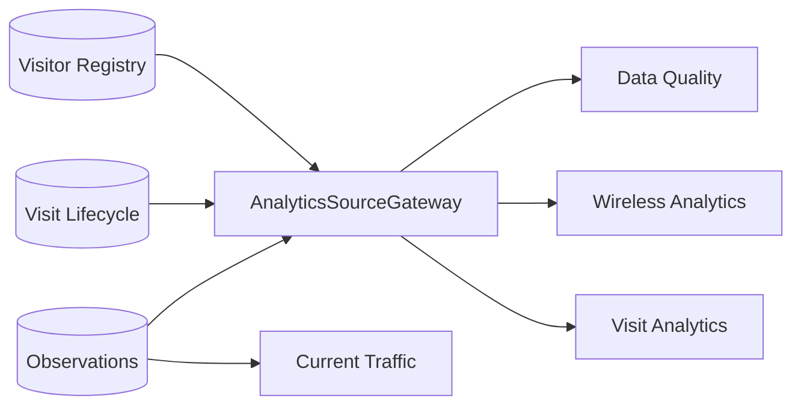

Read connections validate expected schema versions and use read-only/query-only boundaries.

---

# Current Traffic and Home Traffic

Current Traffic is derived from **persisted AP Observation traffic facts**.

That distinction is important:

```text
Current Traffic ≠ Internet/WAN traffic
Current Traffic ≠ guest-only traffic
Current Traffic ≠ SSID-only traffic
```

It is an interpretation of AP physical/network traffic evidence.

The service prefers the `wired` source family and can fall back to `lan` where permitted. It does not mix incompatible source families per AP inside one accepted Site snapshot. Integrity failures become unavailable rather than fabricated numbers.

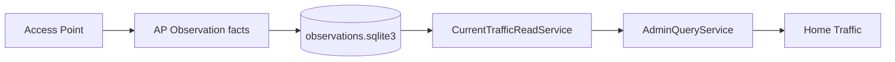

---

# Native Admin Web

The Admin Web is a product/operator boundary, not a skin over Grafana.

Current pages:

- Home;
- Devices;
- Device Detail;
- Visits;
- Observations.

Current Home can include:

- **Home Live** — current clients/APs from Current State;
- **Home Traffic** — current AP traffic interpretation from persisted Observation facts.

The browser is deliberately isolated from backend sources.

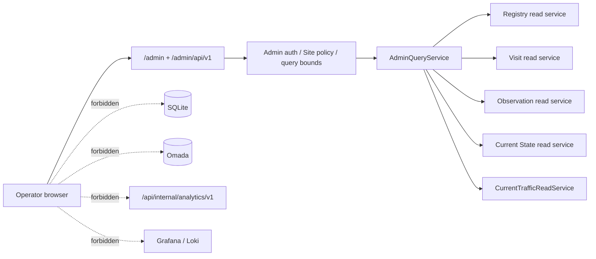

### Admin security boundary

The current design includes:

- separate Admin authentication from guest authorization;
- HTTPS requirement when configured;
- source-network allowlist;
- Site allowlist/default Site;
- password-hash based verification;
- pre-auth CSRF;
- login rate limiting;
- bounded in-memory Admin sessions;
- idle and absolute session timeouts;
- Secure / HttpOnly / SameSite cookies;
- logout CSRF;
- restrictive CSP;
- frame denial;
- nosniff;
- no-referrer;
- no-store responses;
- query-string stripping in access logs for Admin and protected Analytics namespaces.

Business/data Admin routes are read-only; POST is reserved for login/logout security flow.

---

# Home today — and the next increment

## Current Home

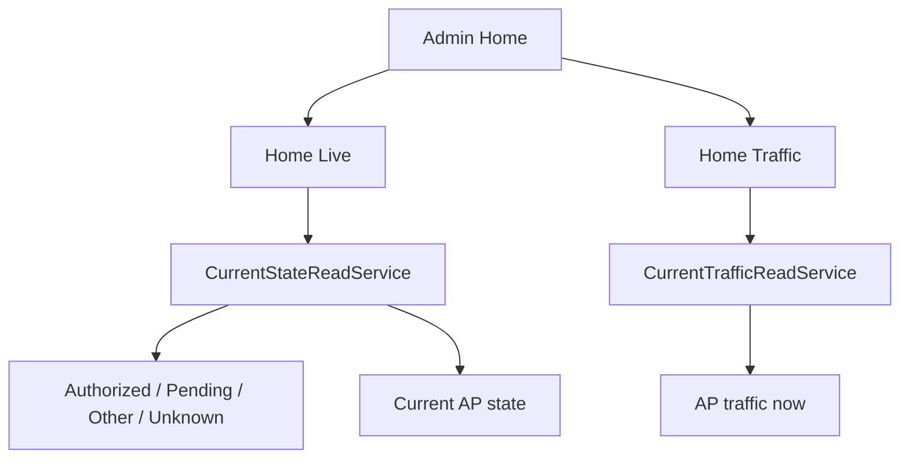

### Home Live

Human meaning:

- how many scoped wireless clients are active now;
- how they split into authorized/pending/other/unknown;
- current AP summary;
- freshness / stale / unavailable states.

No Home request polls Omada directly.

### Home Traffic

Human meaning:

- current AP network traffic derived from persisted AP observations;
- freshness and source integrity are visible;
- this metric is not relabeled as guest Internet usage.

---

## NEXT — Home Activity: Visits and Traffic

The approved next change-intent is a Home panel comparing:

```text
Today
vs
Selected period
```

with two metrics on both sides:

```text
Authorized visits
Traffic
```

At the current documented runtime checkpoint this feature is **not yet current code**. Its FINAL specification is approved and has no unresolved Owner product decision, but it must not be listed as implemented until its implementation is merged into `main`.

Conceptual architecture:

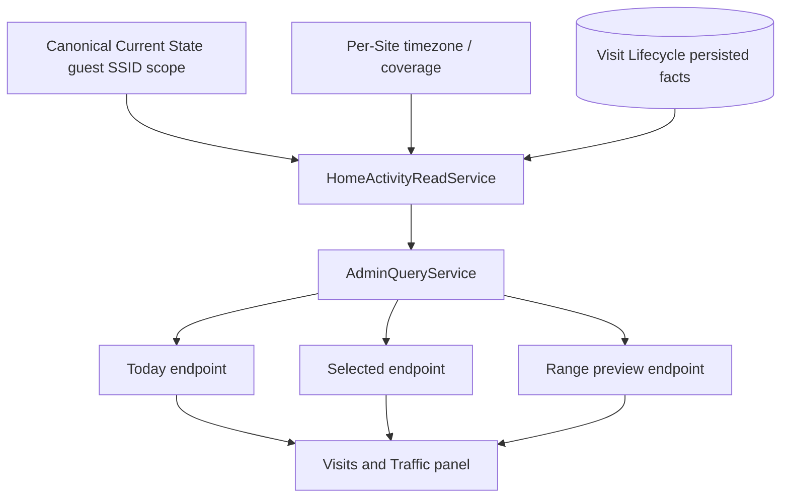

### Intended human semantics

**Authorized visits**

- one qualifying Visit opening = one unit;
- not one AuthSession;
- not one authorization row;
- later reauthorization inside the same open Visit does not create a second unit.

**Traffic**

- estimated from eligible completed guest-session offline reports;
- active sessions are not included until offline evidence is recorded;
- the whole reported volume is attributed to session end time;
- it is not WAN/Internet/billing traffic;
- no artificial 31/90-day Home Activity range cap is intended.

This panel is a good example of the project’s current maturity: it reuses stored facts rather than inventing another collector.

---

# Engineering observability vs product UI

CaptivPortal deliberately keeps two worlds separate.

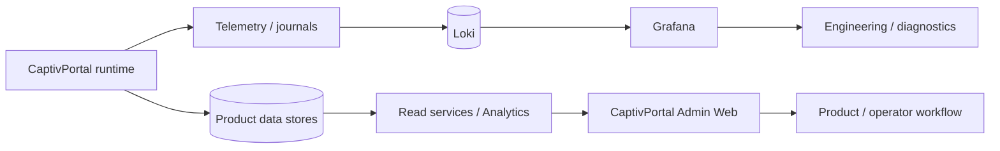

### Grafana

Used for:

- engineering observability;
- collector validation;
- diagnostics;
- investigation;
- telemetry exploration;
- platform health analysis.

### CaptivPortal Admin Web

Used for:

- operator-facing product views;
- bounded Site-aware information;
- stable application semantics;
- future customer-facing product evolution.

Grafana/Loki are not intended to become the customer product backend.

---

# Persistence map

| Store / journal | Writer | Main readers | Meaning |
|---|---|---|---|
| `auth_telemetry.log` | Auth telemetry | observability | authorization operations |
| `visitor_snapshots.log` | Snapshot Collector | Registry / observability | detailed authorized snapshots |
| `omada_webhook.log` | Webhook Receiver | processor / ops | redacted raw webhook |
| `omada_webhook_normalized.log` | Webhook Processor | Visit / Public Traffic | canonical normalized events |
| `pending_session_cleaner.log` | Pending Cleaner | ops / audit | action audit |
| `portal_counter.db` | Portal Counter | portal API | public auth counts |
| `public_traffic.sqlite3` | Public Traffic | portal API | completed-session traffic counter |
| `visitor_registry.sqlite3` | Visitor Registry | Registry reads / Analytics / Admin | durable device identity/history |
| `visits.sqlite3` | Visit Lifecycle | Visit reads / Analytics / Admin | visits, auth evidence, source events |
| `observations.sqlite3` | Observation Foundation | Observation reads / Analytics / Admin | historical client/AP facts |
| `current_state.sqlite3` | Current State | CurrentStateReadService / Admin | current snapshots + short history |

Writers own their schema and migrations. Read consumers do not mutate source stores.

---

# Current subsystem status

The table below is deliberately about **repository implementation**, not a claim about live production flags.

| Area | Repository state | Human meaning |
|---|---|---|
| Core Flask platform | ✅ Current | Main application/service |
| Shared OmadaProvider | ✅ Current | One OAuth/token lifecycle per process |
| Portal authorization | ✅ Current | Common authorization engine |
| CAPPORT | ✅ Current | RFC 8908 entry/discovery path |
| Auth telemetry | ✅ Current | Structured auth evidence |
| Portal counter | ✅ Current | Public authorization counts |
| Public traffic counter | ✅ Current | Separate completed-session counter |
| Authorized Snapshot | ✅ Current, default disabled | Detailed post-auth capture |
| Visitor Registry | ✅ Current, default disabled | Durable device/history identity |
| Omada webhook receiver/normalizer | ✅ Current, default disabled | Canonical inbound event pipeline |
| Pending Session Cleaner | ✅ Current, default disabled | Safe stale-pending cleanup |
| Visit Lifecycle | ✅ Current, default disabled | Site-aware visits, schema v2 |
| Observation Foundation | ✅ Current, default disabled | Historical authorized/AP facts, schema v1 |
| Current State | ✅ Current, default disabled | Active wireless state, schema v1 |
| Analytics | ✅ Current, default disabled | Read-only derived views |
| Protected Analytics API | ✅ Current, default disabled | Internal aggregate HTTP boundary |
| Admin Web | ✅ Current, default disabled | Native read-only operator UI |
| Home Live | ✅ Current, default disabled | Current client/AP summary |
| Current Traffic | ✅ Current when sources healthy | AP traffic interpretation |
| Home Traffic | ✅ Current, default disabled | Home presentation of Current Traffic |
| Home Activity | ⏭️ Approved change-intent | Next human-facing Home increment |
| GitHub Actions release CI | ⚠️ Not present | Release gate remains process debt |

---

# Omada Open API — what research proved

CaptivPortal maintains a curated Omada API contract rather than assuming controller behavior from names alone.

Controlled research on Omada 5.14.31 confirmed several client-control capabilities.

| Capability | Research result | Current product meaning |
|---|---|---|
| Read clients / client details | Confirmed | Used by current read/control modules where approved |
| Rename client | Public OpenAPI works | Research-proven; not automatically exposed in Admin Web |
| Per-client rate limit | Works and physically shapes traffic | Research-proven |
| Rate-limit profiles | CRUD/application works | Research-proven |
| Reconnect | Physically disconnects client | Used by Pending Cleaner under safety gates |
| Block | Removes active access | Research-proven, not Cleaner fallback |
| Unblock | Removes prohibition only | Does not reconnect by itself |
| Hotspot unauthorize | Revokes authorization record | Research-proven |
| Hotspot authorize | Can move pending → authorized | Portal-bypass semantics not generalized |
| Authentication period | Extension delta semantics confirmed | Must not be treated as an absolute timestamp |
| Lock-to-AP | Configuration/rollback works | Multi-AP roaming prevention not fully physically verified |
| Clear custom public rate limit | Unresolved through stable public contract | Private UI API is not an approved product contract |

The existence of a controller capability does **not** automatically make it a CaptivPortal product feature. Product exposure requires a separate security/UX/authorization decision.

See [`docs/api/omada-open-api.md`](docs/api/omada-open-api.md).

---

# Roadmap

## Completed platform staircase

The structural roadmap introduced the rule:

```text
Acquisition ≠ Analytics
```

and originally ordered the major layers as Observation → Visit → Analytics → Web. Those foundations are now implemented.

```mermaid
flowchart LR
    P[Portal/Auth]:::done --> S[Snapshot/Registry]:::done
    S --> O[Observation]:::done
    O --> V[Visit Lifecycle]:::done
    V --> A[Analytics]:::done
    A --> W[Web Foundation]:::done
    W --> L[Home Live]:::done
    L --> T[Home Traffic]:::done
    T --> HA[Home Activity]:::next
    HA --> D[Deeper product views]:::future
    D --> MS[Multi-Site]:::future
    MS --> TN[Tenant/RBAC]:::future
    TN --> E[Entitlements]:::future
    E --> M[Managed Service]:::future

    classDef done fill:#d9f2d9,stroke:#2e7d32,color:#000;
    classDef next fill:#fff3cd,stroke:#b8860b,color:#000;
    classDef future fill:#eeeeee,stroke:#777,color:#000;
```

## Near-term direction

After Home Activity, likely product growth can use already existing foundations instead of rebuilding them:

- richer historical Home/Visits views;
- dedicated Traffic page when a separate product contract is approved;
- wireless quality views based on persisted observations;
- clearer device/visit drill-downs;
- product reports;
- controlled administrative actions only under a separate security/access-policy design.

The exact ordering of those product increments is governed by current approved TASKs, not by this README.

---

## Real second Site as a trigger

CaptivPortal is intentionally **Site-aware before it is Multi-Site**.

A real second Site is the point where abstractions are tested against actual product need.

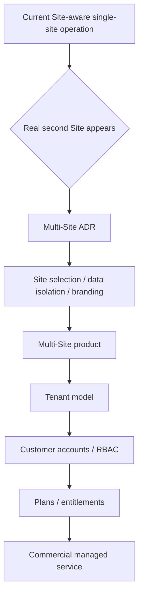

Permanent rule:

```text
Tenant != Site
```

One future Tenant may own multiple Sites.

---

## Future tenant / commercial model

A future server-side authorization model may look like:

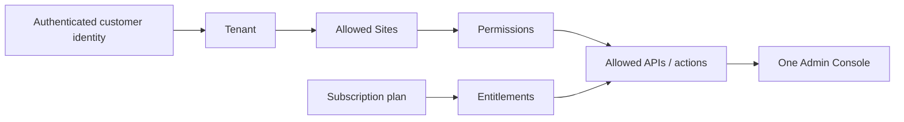

The intended commercial direction is one product with backend-enforced capabilities, not multiple forks.

A future managed-service picture:

```text
Customer side
  Internet
  compatible router/gateway
  recommended Omada APs

Provider side
  Omada Controller
  CaptivPortal
  Visitor Registry
  Visit Lifecycle
  Observation Storage
  Analytics
  Admin Console
  Monitoring
  Backups
  Updates
```

---

# Important architecture boundaries

These rules are intentionally hard to break.

### Shared Omada provider

One process → one shared `OmadaProvider` → one shared token cache.

Do not introduce a second token manager/provider without explicit architecture approval.

### Fail-open vs fail-closed

**Fail-closed:**

- required core Omada configuration;
- actual guest authorization result;
- Admin authentication/network/Site policy.

**Fail-open relative to guest authorization:**

- telemetry;
- counters;
- Snapshot / Registry;
- webhook normalization;
- Visit persistence/reconciliation;
- Observation;
- Current State;
- Analytics;
- Admin Web;
- Pending Cleaner.

Fail-open means safe degraded/unavailable/disabled behavior — never fabricated success or fabricated data.

### Admin browser isolation

The browser does not directly read:

- SQLite;
- Omada;
- Loki;
- Grafana;
- protected internal Analytics bearer API.

### Current Traffic scope

Do not call AP physical/network traffic “guest Internet traffic.”

### Visitor identity vs Site identity

Current Registry device identity is not automatically a per-Site truth. Site-scoped facts must remain Site-scoped in Visit/Observation/Admin query semantics.

---

# Testing and release discipline

The current model separates day-to-day implementation testing from the official full regression function.

```text
Coder
→ targeted / module / TASK-scoped tests

Tech Lead
→ architecture / TASK / DIFF / targeted-evidence review

Central Lab
→ Full Regression Gate
→ official current baseline
→ final Test Evidence
```

The Coder can and should rerun tests for the implemented functionality as often as development and fixes require. The Coder does not need to execute the whole CaptivPortal regression suite after every implementation.

The Tech Lead does not need to duplicate the heavy full suite for ordinary review. When an official exact-artifact baseline is required, the team consumes Central Lab evidence.

### Official Windows Local Gate

Current approved tool:

```text
C:\CaptivPortal-Lab\lab-test-v4-fixed.cmd
```

Confirmed baseline from **26 August 2026**:

```text
Strict suite: 1985 passed / 30 skipped / 0 strict regressions
Compatibility: 5 exact cases → 2 WARN / 3 PASS
compileall: PASS
git diff --check: PASS
RESULT: PASS
```

The two compatibility WARNs are the SQLite infinity edge case and Node async harness timing. The three Visitor Registry Windows thread-timing cases passed in the control run.

The compatibility allowlist stays narrow. Any new failure outside the explicitly recorded cases is a strict regression until a separate reviewed decision reclassifies it.

The Windows Local Gate does not replace Linux/production-compatible pre-production acceptance. If a release/deploy contract requires a Linux full gate, it is executed separately on the exact artifact.

Do not present an old run as the current full green baseline after runtime/test changes.

Tests must not depend on real production Omada credentials or a live production controller.

At the documented runtime checkpoint `.github/workflows` is absent, so GitHub release CI remains separate process debt.

---

# Configuration

CaptivPortal configuration is grouped by subsystem. The authoritative list/defaults live in `.env.example`, `app/config.py`, `app/settings.py`, and [`docs/configuration.md`](docs/configuration.md).

Main groups:

```text
Core / Omada
Portal / CAPPORT
Auth telemetry
Portal counter
Public traffic
Authorized Snapshot
Visitor Registry
Webhook
Pending Session Cleaner
Visit Lifecycle
Observation
Current State
Analytics
Analytics API
Admin Web
Home Live
Home Traffic
```

Production secrets are not committed to Git.

`.env.example` is a reference template; current production configuration must be verified from the approved deployment/runtime environment rather than inferred from repository defaults.

---

# Installation / local run

## Requirements

- Python 3.10+
- Linux; Ubuntu 22.04 family is the current production family documented by the project
- network reachability to Omada Controller
- dependencies from `requirements.txt`

## Clone

```bash
git clone https://github.com/ZaurNavi/CaptivePortal.git
cd CaptivePortal
python3 -m venv .venv
source .venv/bin/activate
python -m pip install -r requirements.txt
```

## Run

Supply the required process environment, then:

```bash
python3 run.py
```

Production uses a system service and deployment-specific environment configuration. See [`docs/deployment.md`](docs/deployment.md).

---

# Knowledge base

The README is the project map. The knowledge base is the engineering authority for details.

Start here:

- [`AGENTS.md`](AGENTS.md) — repository workflow and agent rules;
- [`docs/README.md`](docs/README.md) — knowledge map;
- [`docs/project-inventory.md`](docs/project-inventory.md) — exact runtime inventory;
- [`docs/architecture.md`](docs/architecture.md) — lifecycle/dependency architecture;
- [`docs/module-index.md`](docs/module-index.md) — module status map;
- [`docs/configuration.md`](docs/configuration.md) — configuration groups/defaults;
- [`docs/testing.md`](docs/testing.md) — test responsibility and gates;
- [`docs/deployment.md`](docs/deployment.md) — deployment contract;
- [`docs/security.md`](docs/security.md) — security boundaries;
- [`docs/api/omada-open-api.md`](docs/api/omada-open-api.md) — curated Omada evidence;
- [`docs/modules/visit-lifecycle.md`](docs/modules/visit-lifecycle.md);
- [`docs/modules/observations.md`](docs/modules/observations.md);
- [`docs/modules/current-state.md`](docs/modules/current-state.md);
- [`docs/modules/analytics.md`](docs/modules/analytics.md);
- [`docs/modules/admin-web.md`](docs/modules/admin-web.md).

## Truth model

For **how the system works now**:

```text
current code
    ↓
current tests
    ↓
current docs confirmed by code
```

For **a change that is not merged yet**:

```text
FINAL TASK
    ↓
PLAN
    ↓
ADR
```

A FINAL TASK is not current runtime merely because it is approved.

---

# Known limitations and technical debt

| Debt / limitation | Why it matters |
|---|---|
| Single-process topology | Multi-process/HA requires shared-state and worker-leadership design |
| `VERIFY_SSL=false` repository default | Security hardening debt; production truth must be host-verified |
| No GitHub Actions release CI | Full release gate is still procedural/manual |
| Production enabled-state not derivable from Git | Runtime flags must be verified on the host |
| Omada private UI APIs not approved product contracts | Reverse-engineered/private endpoints cannot silently become stable dependencies |
| Public full-clear of custom client rate limit unresolved | Known Omada control research gap |
| Some traffic sources are estimates / scope-specific | UI must not relabel them as billing/WAN truth |
| Registry global-by-MAC identity has Site-awareness limits | Future Multi-Site must preserve correct ownership semantics |

---

# Project philosophy

A few principles describe CaptivPortal better than any feature list:

```text
One authorization engine.
One shared Omada provider.
Store facts before interpreting them.
Do not manufacture history on demand.
Keep guest access independent from optional analytics/UI failures.
Keep engineering observability separate from the customer product.
Be Site-aware before becoming Multi-Site.
Do not confuse Tenant with Site.
Expose uncertainty instead of inventing precision.
```

That is the direction of the platform as it evolves from a captive portal into a managed, data-driven network access service.

---

## License

See [LICENSE](LICENSE).
