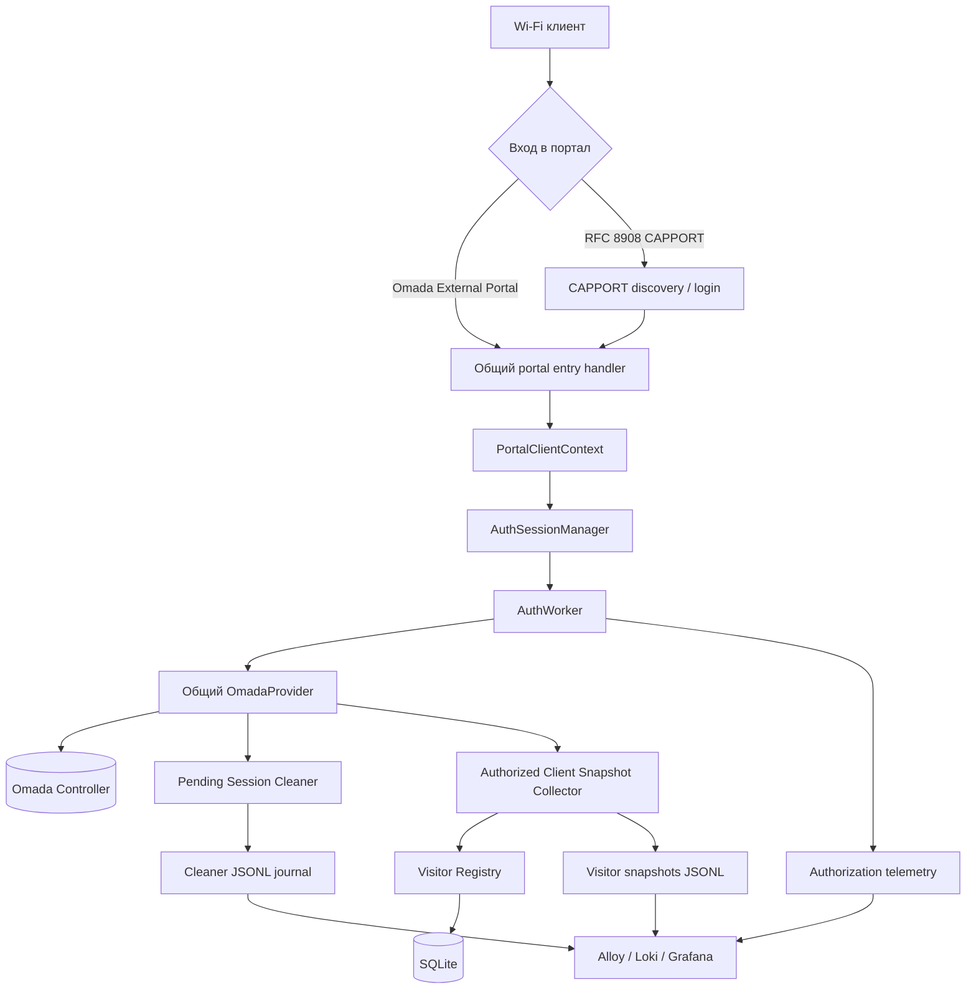
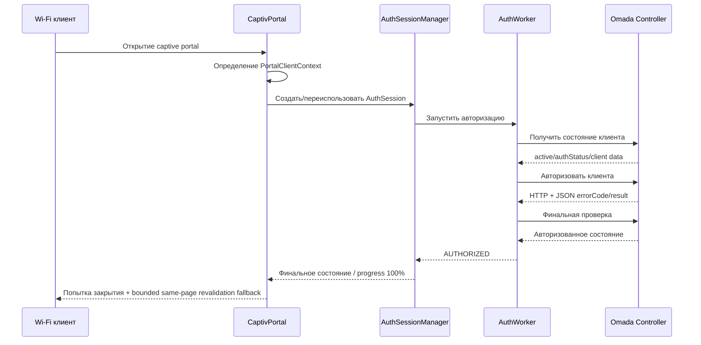
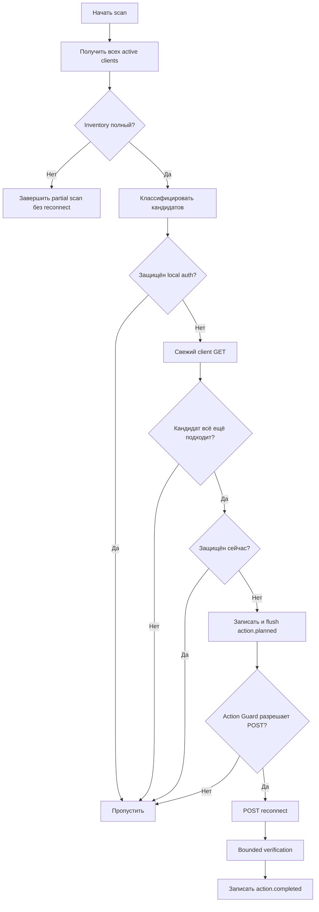

# CaptivPortal Core Platform

[English version](README.md)

[](LICENSE)
[](https://www.python.org/)
[]()

CaptivPortal — Python-платформа внешнего Captive Portal и связанных operational-сервисов для **TP-Link Omada Controller**.

Проект использует единый поток авторизации, общий `OmadaProvider`, фоновые operational-модули, структурированную телеметрию и постоянное хранилище данных посетителей. Независимые фоновые компоненты работают по принципу fail-open: их отказ не должен ломать основной путь Captive Portal-авторизации.

## Оглавление

- [Обзор](#обзор)
- [Архитектура](#архитектура)
- [Основные модули](#основные-модули)
- [Поток авторизации](#поток-авторизации)
- [Pending Session Cleaner](#pending-session-cleaner)
- [Установка](#установка)
- [Конфигурация](#конфигурация)
- [Тестирование](#тестирование)
- [База знаний проекта](#база-знаний-проекта)
- [Текущий статус модулей](#текущий-статус-модулей)
- [Безопасность](#безопасность)
- [Лицензия](#лицензия)

---

## Обзор

Текущие возможности платформы:

- интеграция с **Omada Software Controller 5.14.31** через Open API;
- внешняя Captive Portal-авторизация;
- поддержка RFC 8908 CAPPORT;
- bounded-ожидание появления клиента перед авторизацией;
- единый поток `AuthSession` / `AuthWorker`;
- очистка зависших неавторизованных сессий через **Pending Session Cleaner**;
- snapshots авторизованных клиентов;
- постоянный **Visitor Registry**;
- публичные счётчики авторизаций;
- нормализация Omada webhook-событий;
- структурированные JSONL telemetry/journals;
- production-наблюдаемость через Alloy, Loki и Grafana.

Для Omada API действует принцип:

> HTTP 200 сам по себе не означает успешный API-вызов. Приложение дополнительно проверяет JSON `errorCode` и структуру ответа конкретного endpoint.

---

## Архитектура

`run.py` является composition root: загружает настройки, создаёт общий `OmadaProvider`, собирает Flask-приложение, подключает сервисы авторизации и фоновые компоненты, управляет startup/shutdown.



### Основные архитектурные правила

- Использовать существующий общий `OmadaProvider`.
- Не создавать второй OAuth/token manager без отдельного архитектурного решения.
- CAPPORT не имеет отдельного механизма авторизации.
- Ошибка независимого фонового модуля не должна превращаться в ошибку портала.
- Runtime-конфигурация проходит через существующий pipeline `app/config.py` → `app/settings.py` → `get_settings()`.
- Текущий production рассчитан на **single-process**; process-local session/guard state является принятым ограничением до отдельного решения по scaling/HA.

---

## Основные модули

### Authorization

Основной путь авторизации использует `AuthSessionManager` и `AuthWorker`.

Ответственность:

- создание и сопровождение AuthSession;
- readiness-проверки Omada;
- авторизация через общий provider;
- bounded retry/verification;
- финальные состояния `AUTHORIZED`, `FAILED`, `RESET`, `EXPIRED`;
- структурированная authorization telemetry.

### CAPPORT

CAPPORT обеспечивает RFC 8908 и определение клиента перед входом в общий поток авторизации.

Текущее поведение:

- проверка source client;
- bounded-ожидание появления клиента в Omada;
- same-page переход discovery → authorization;
- монотонный progress;
- повторное использование общего authorization flow.

После подтверждённого `AUTHORIZED` frontend пытается закрыть captive-окно и допускает максимум одну same-page revalidation/reload как fallback. Поведение captive WebView зависит от ОС и проверяется отдельными production field tests.

### Pending Session Cleaner

`app/pending_sessions` завершает зависшие неавторизованные Omada-сессии.

Кандидат проходит набор защит:

- wireless + active;
- точный `authStatus == 1`;
- разрешённый SSID;
- минимальный uptime;
- local authorization protection;
- свежий preflight;
- rate/action limits;
- audit-before-action.

Экспериментально подтверждённая операция Omada:

```text
POST /openapi/v1/{omadacId}/sites/{siteId}/clients/{clientMac}/reconnect
```

Cleaner использует bounded verification и не применяет `block/unblock` как автоматический fallback.

### Authorized Client Snapshot Collector

Формирует структурированные snapshots авторизованных клиентов для operational-истории и последующей обработки Visitor Registry.

### Visitor Registry

`app/visitor_registry` хранит постоянные данные об устройствах/посещениях в SQLite.

Этап production activation и observability завершён с PASS. Visitor snapshots также отправляются в Loki отдельным источником Alloy для анализа в Grafana.

Будущий **Visit Lifecycle** является отдельным функциональным этапом и не входит в уже закрытый этап Visitor Registry.

### Public Authorization Counter

Поддерживает публичную статистику авторизаций, не создавая отдельный механизм авторизации.

### Omada Webhook Normalizer

Нормализует Omada webhook-события в структурированную модель проекта.

---

## Поток авторизации



---

## Pending Session Cleaner

Высокоуровневая схема:



---

## Установка

### Требования

- Python 3.10+
- Linux (семейство Ubuntu 22.04 используется в текущем production)
- сетевой доступ к Omada Controller
- зависимости из `requirements.txt`

### Клонирование и зависимости

```bash
git clone https://github.com/ZaurNavi/CaptivePortal.git
cd CaptivePortal
python3 -m venv .venv
source .venv/bin/activate
python -m pip install -r requirements.txt
```

### Локальный запуск

Сначала подготовьте обязательные переменные окружения, затем:

```bash
python3 run.py
```

В production используется systemd-сервис `captive-portal.service` и deployment-specific environment configuration.

---

## Конфигурация

Production Omada credentials **не хранятся literal-значениями в текущем дереве Git**.

Основной Omada configuration contract:

| Переменная | Назначение |
|---|---|
| `OMADA_URL` | Базовый URL Omada Controller |
| `OMADA_ID` | ID контроллера Omada (`omadacId`) |
| `OMADA_CLIENT_ID` | Open API Client ID |
| `OMADA_CLIENT_SECRET` | Open API Client Secret |
| `CAPPORT_SITE_ID` | Site Omada для CAPPORT/application flows |

Дополнительные настройки модулей перечислены в `.env.example` и документации соответствующих модулей.

> `.env.example` — только справочный шаблон. Приложение **не загружает локальный `.env` автоматически**; production-конфигурация передаётся через process environment / утверждённый deployment mechanism.

В примерах используются только placeholders. Реальные credentials нельзя коммитить в Git.

---

## Тестирование

Сначала запускаются targeted tests изменяемого модуля.

Общий repository gate:

```bash
python -m pytest -q -rs
python -m compileall -q app
git diff --check
```

В проекте есть исторически подтверждённый зелёный Linux baseline, но release-quality verdict всегда должен относиться к точному commit, на котором фактически выполнены проверки. Нельзя писать, что текущий full gate зелёный, если он реально не запускался на этой ревизии.

Тесты не должны зависеть от production credentials или реального Omada Controller.

---

## База знаний проекта

В репозитории есть постоянная база знаний для разработчиков и coding agents.

Основные точки входа:

- [`AGENTS.md`](AGENTS.md) — универсальные правила работы с репозиторием;
- [`docs/README.md`](docs/README.md) — индекс документации;
- [`docs/architecture.md`](docs/architecture.md) — текущая архитектура;
- [`docs/module-index.md`](docs/module-index.md) — карта и статусы модулей;
- [`docs/testing.md`](docs/testing.md) — стратегия тестирования;
- [`docs/deployment.md`](docs/deployment.md) — deployment contract;
- [`docs/security.md`](docs/security.md) — правила безопасности.

Текущий TASK определяет scope работы. Исторические отчёты и старые ТЗ остаются evidence/history и не заменяют актуальные код, тесты и module contracts.

---

## Текущий статус модулей

| Область | Статус | Примечание |
|---|---|---|
| Core Flask platform | ✅ Active | Production service развернут |
| Общий OmadaProvider | ✅ Active | OAuth `client_credentials`, общий token lifecycle |
| Authorization / AuthSession / AuthWorker | ✅ Active | Единый путь авторизации |
| CAPPORT | ✅ Active | Bounded discovery и same-page transition |
| Pending Session Cleaner | ✅ Active | Production cleanup с защитами и аудитом |
| Authorized Client Snapshot Collector | ✅ Active | Формирует structured visitor snapshots |
| Visitor Registry | ✅ Active | Production/observability stage принят |
| Public Authorization Counter | ✅ Active | Operational counter module |
| Omada Webhook Normalizer | ✅ Implemented | Структурированная нормализация webhook |
| Visit Lifecycle | ⏳ Planned | Отдельный будущий функциональный этап |
| GitHub CI | ⚠️ Не реализован | Full gate пока выполняется вручную на Linux |

Operational debts и принятые ограничения ведутся отдельно и не смешиваются со стабильным README.

---

## Безопасность

- Никогда не коммитить `OMADA_CLIENT_SECRET`, Access Token, cookies и значения Authorization headers.
- Не логировать Wi-Fi passwords и полные чувствительные ответы Omada `/override`.
- Полные MAC-адреса намеренно сохраняются в технических логах и operational data.
- HTTP status Omada и JSON `errorCode` проверяются раздельно.
- Старые Omada credentials удалены из текущего дерева, но rotation Client Secret остаётся отдельным owner-controlled security action, поскольку старые значения могут сохраняться в Git history.
- TLS verification к Omada остаётся отдельным security/operations debt до внедрения доверенной модели сертификата.

---

## Лицензия

MIT License. См. [LICENSE](LICENSE).

---

*README синхронизирован с состоянием проекта CaptivPortal, зафиксированным в августе 2026 года.*
