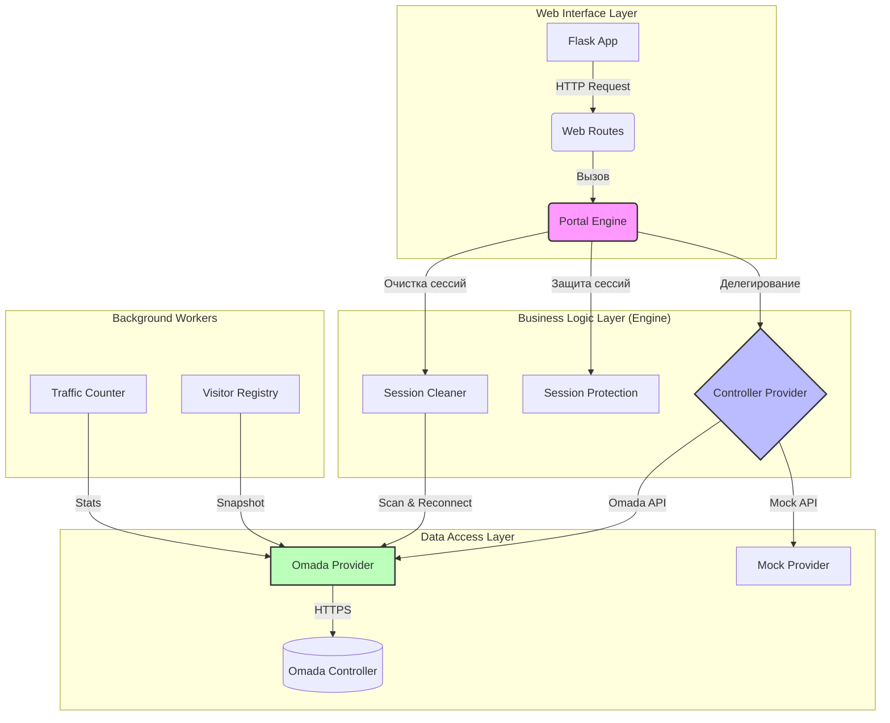
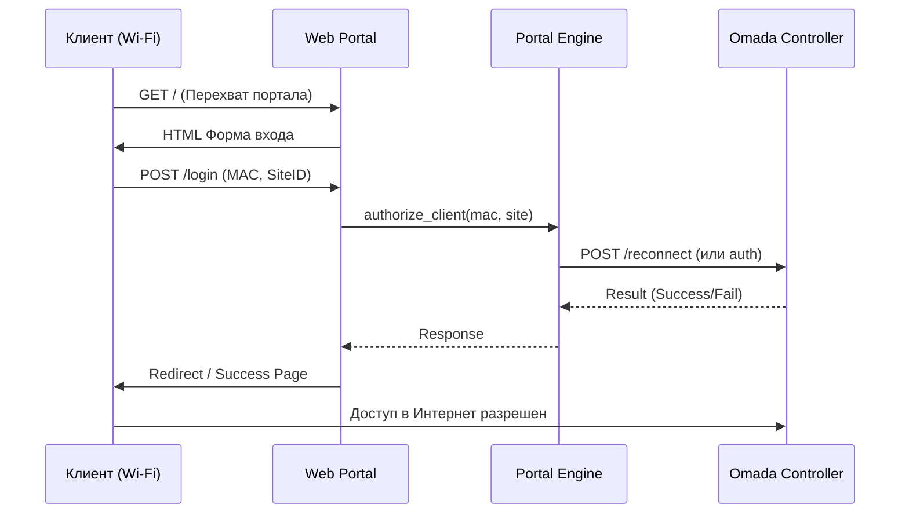
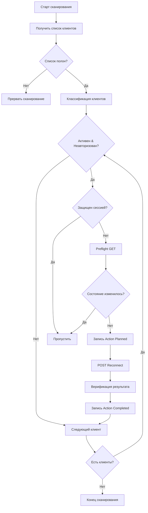

# CaptivePortal Core Platform
[](LICENSE)
[](https://www.python.org/)
[]()
Профессиональная платформа управления гостевым доступом (Captive Portal) для контроллеров TP-Link Omada. Построена на принципах чистой архитектуры, модульности и масштабируемости.
## 📖 Оглавление
- [Обзор](#обзор)
- [Архитектура системы](#архитектура-системы)
- [Модули платформы](#модули-платформы)
- [Процессы работы](#процессы-работы)
- [Установка и запуск](#установка-и-запуск)
- [Конфигурация](#конфигурация)
- [Статус функций](#статус-функций)
---
## 🌟 Обзор
CaptivePortal — это решение корпоративного уровня для организации безопасного гостевого Wi-Fi доступа. Платформа абстрагирует бизнес-логику от конкретного оборудования, позволяя легко масштабировать функционал и добавлять новые интеграции.
### Ключевые возможности
- ✅ Интеграция с **TP-Link Omada Controller** (API v1/v2)
- ✅ Автоматическая авторизация клиентов через портал
- ✅ Мониторинг и очистка "зависших" сессий (**Pending Session Cleaner**)
- ✅ Реестр устройств посетителей (**Visitor Device Registry**)
- ✅ Модульная архитектура (Clean Architecture)
- ✅ Строгая типизация и валидация данных
- ✅ Асинхронная обработка фоновых задач
---
## 🏗 Архитектура системы
Платформа построена по принципу разделения ответственности. Каждый слой знает только о слое непосредственно под ним.

### Принципы проектирования
1.  **Слабая связанность (Loose Coupling):** Модули взаимодействуют через интерфейсы.
2.  **Внедрение зависимостей (DI):** Зависимости передаются извне, а не создаются внутри.
3.  **Единый источник истины:** Конфигурация и состояние хранятся централизованно.
4.  **Fail-Open:** Ошибки второстепенных модулей (Cleaner) не должны ломать основную авторизацию.
---
## 🧩 Модули платформы
### 1. Core Platform (`app/core`)
Фундамент системы. Отвечает за базовые функции:
- Загрузка конфигурации
- Единая система логирования
- Управление исключениями
- Точка входа (`run.py`)
### 2. Controller Providers (`app/controllers`)
Адаптеры для работы с оборудованием.
- **OmadaProvider:** Реализация API для контроллеров TP-Link Omada.
- **Interface:** Базовый контракт для будущих провайдеров (UniFi, MikroTik).
### 3. Portal Engine (`app/engine`)
Центральный мозг системы. Обрабатывает бизнес-логику авторизации:
- Валидация запросов
- Управление состояниями сессий
- Координация между Web и Контроллером
### 4. Web Interface (`app/web`)
HTTP-сервер на базе Flask.
- Отдача страниц портала (HTML/CSS)
- Обработка CAPPORT запросов (RFC 8908)
- REST API для внешних систем
### 5. Pending Session Cleaner (`app/pending_sessions`) ⚡
Фоновый сервис для поддержания чистоты сети.
- Сканирование активных клиентов
- Выявление неавторизованных "зависших" сессий
- Автоматический реконнект (разрыв) проблемных клиентов
- Журналирование всех действий (Audit Log)
### 6. Visitor Registry (`app/visitor_registry`)
Реестр устройств и истории посещений.
- Снимки состояния клиентов (Snapshots)
- Привязка MAC-адресов к устройствам
- Хранение истории подключений
---
## 🔄 Процессы работы
### Сценарий авторизации клиента

### Алгоритм работы Session Cleaner

---
## 🚀 Установка и запуск
### Требования
- Python 3.10+
- Linux OS (рекомендуется Ubuntu 22.04+)
- Доступ к Omada Controller (API v1/v2)
### Быстрый старт
1.  **Клонирование репозитория:**
    ```bash
    git clone https://github.com/ZaurNavi/CaptivePortal.git
    cd CaptivePortal
    ```
2.  **Установка зависимостей:**
    ```bash
    pip install -r requirements.txt
    ```
3.  **Настройка окружения:**
    Скопируйте `.env.example` в `.env` и заполните параметрами вашего контроллера:
    ```bash
    cp .env.example .env
    nano .env
    ```
4.  **Запуск:**
    ```bash
    python3 run.py
    ```
---
## ⚙️ Конфигурация
Основные параметры настраиваются через переменные окружения или файл `.env`.
| Параметр | Описание | По умолчанию |
| :--- | :--- | :--- |
| `OMADA_HOST` | IP или домен контроллера Omada | `localhost` |
| `OMADA_PORT` | Порт API контроллера | `8043` |
| `OMADA_USER` | Имя пользователя API | `admin` |
| `OMADA_PASSWORD` | Пароль пользователя API | - |
| `CAPPORT_SITE_ID` | ID сайта в Omada | - |
| `PENDING_SESSION_CLEANER_ENABLED` | Включить очистку сессий | `false` |
| `PENDING_SESSION_CLEANER_SSIDS` | Список SSID для мониторинга | `Zefer_Parki` |
| `LOG_LEVEL` | Уровень логирования | `INFO` |
---
## 📊 Статус функций
| Модуль | Статус | Версия | Описание |
| :--- | :---: | :---: | :--- |
| **Core Platform** | ✅ Готово | v1.0 | Фундамент, логи, конфиг |
| **Controller Provider** | ✅ Готово | v1.1 | Интерфейс и Omada реализация |
| **Result Model** | ✅ Готово | v1.2 | Унифицированные ответы |
| **Portal Engine** | ✅ Готово | v1.0 | Бизнес-логика авторизации |
| **Web Interface** | ✅ Готово | v1.0 | Минимальный портал |
| **Session Cleaner** | ✅ Готово | v1.0 | Очистка зависших сессий |
| **Visitor Registry** | 🚧 В работе | v0.9 | Реестр устройств |
---
## 📄 Лицензия
MIT License. См. файл [LICENSE](LICENSE) для деталей.
---
*Документация актуальна для версии проекта от августа 2026 года.*
EOF
echo "README_RU.md создан успешно."
cat > /workspace/README_RU.md << 'EOF'
# CaptivePortal Core Platform
[](LICENSE)
[](https://www.python.org/)
[]()
Профессиональная платформа управления гостевым доступом (Captive Portal) для контроллеров TP-Link Omada. Построена на принципах чистой архитектуры, модульности и масштабируемости.
## 📖 Оглавление
- [Обзор](#обзор)
- [Архитектура системы](#архитектура-системы)
- [Модули платформы](#модули-платформы)
- [Процессы работы](#процессы-работы)
- [Установка и запуск](#установка-и-запуск)
- [Конфигурация](#конфигурация)
- [Статус функций](#статус-функций)
---
## 🌟 Обзор
CaptivePortal — это решение корпоративного уровня для организации безопасного гостевого Wi-Fi доступа. Платформа абстрагирует бизнес-логику от конкретного оборудования, позволяя легко масштабировать функционал и добавлять новые интеграции.
### Ключевые возможности
- ✅ Интеграция с **TP-Link Omada Controller** (API v1/v2)
- ✅ Автоматическая авторизация клиентов через портал
- ✅ Мониторинг и очистка "зависших" сессий (**Pending Session Cleaner**)
- ✅ Реестр устройств посетителей (**Visitor Device Registry**)
- ✅ Модульная архитектура (Clean Architecture)
- ✅ Строгая типизация и валидация данных
- ✅ Асинхронная обработка фоновых задач
---
## 🏗 Архитектура системы
Платформа построена по принципу разделения ответственности. Каждый слой знает только о слое непосредственно под ним.

### Принципы проектирования
1.  **Слабая связанность (Loose Coupling):** Модули взаимодействуют через интерфейсы.
2.  **Внедрение зависимостей (DI):** Зависимости передаются извне, а не создаются внутри.
3.  **Единый источник истины:** Конфигурация и состояние хранятся централизованно.
4.  **Fail-Open:** Ошибки второстепенных модулей (Cleaner) не должны ломать основную авторизацию.
---
## 🧩 Модули платформы
### 1. Core Platform (`app/core`)
Фундамент системы. Отвечает за базовые функции:
- Загрузка конфигурации
- Единая система логирования
- Управление исключениями
- Точка входа (`run.py`)
### 2. Controller Providers (`app/controllers`)
Адаптеры для работы с оборудованием.
- **OmadaProvider:** Реализация API для контроллеров TP-Link Omada.
- **Interface:** Базовый контракт для будущих провайдеров (UniFi, MikroTik).
### 3. Portal Engine (`app/engine`)
Центральный мозг системы. Обрабатывает бизнес-логику авторизации:
- Валидация запросов
- Управление состояниями сессий
- Координация между Web и Контроллером
### 4. Web Interface (`app/web`)
HTTP-сервер на базе Flask.
- Отдача страниц портала (HTML/CSS)
- Обработка CAPPORT запросов (RFC 8908)
- REST API для внешних систем
### 5. Pending Session Cleaner (`app/pending_sessions`) ⚡
Фоновый сервис для поддержания чистоты сети.
- Сканирование активных клиентов
- Выявление неавторизованных "зависших" сессий
- Автоматический реконнект (разрыв) проблемных клиентов
- Журналирование всех действий (Audit Log)
### 6. Visitor Registry (`app/visitor_registry`)
Реестр устройств и истории посещений.
- Снимки состояния клиентов (Snapshots)
- Привязка MAC-адресов к устройствам
- Хранение истории подключений
---
## 🔄 Процессы работы
### Сценарий авторизации клиента

### Алгоритм работы Session Cleaner

---
## 🚀 Установка и запуск
### Требования
- Python 3.10+
- Linux OS (рекомендуется Ubuntu 22.04+)
- Доступ к Omada Controller (API v1/v2)
### Быстрый старт
1.  **Клонирование репозитория:**
    ```bash
    git clone https://github.com/ZaurNavi/CaptivePortal.git
    cd CaptivePortal
    ```
2.  **Установка зависимостей:**
    ```bash
    pip install -r requirements.txt
    ```
3.  **Настройка окружения:**
    Скопируйте `.env.example` в `.env` и заполните параметрами вашего контроллера:
    ```bash
    cp .env.example .env
    nano .env
    ```
4.  **Запуск:**
    ```bash
    python3 run.py
    ```
---
## ⚙️ Конфигурация
Основные параметры настраиваются через переменные окружения или файл `.env`.
| Параметр | Описание | По умолчанию |
| :--- | :--- | :--- |
| `OMADA_HOST` | IP или домен контроллера Omada | `localhost` |
| `OMADA_PORT` | Порт API контроллера | `8043` |
| `OMADA_USER` | Имя пользователя API | `admin` |
| `OMADA_PASSWORD` | Пароль пользователя API | - |
| `CAPPORT_SITE_ID` | ID сайта в Omada | - |
| `PENDING_SESSION_CLEANER_ENABLED` | Включить очистку сессий | `false` |
| `PENDING_SESSION_CLEANER_SSIDS` | Список SSID для мониторинга | `Zefer_Parki` |
| `LOG_LEVEL` | Уровень логирования | `INFO` |
---
## 📊 Статус функций
| Модуль | Статус | Версия | Описание |
| :--- | :---: | :---: | :--- |
| **Core Platform** | ✅ Готово | v1.0 | Фундамент, логи, конфиг |
| **Controller Provider** | ✅ Готово | v1.1 | Интерфейс и Omada реализация |
| **Result Model** | ✅ Готово | v1.2 | Унифицированные ответы |
| **Portal Engine** | ✅ Готово | v1.0 | Бизнес-логика авторизации |
| **Web Interface** | ✅ Готово | v1.0 | Минимальный портал |
| **Session Cleaner** | ✅ Готово | v1.0 | Очистка зависших сессий |
| **Visitor Registry** | 🚧 В работе | v0.9 | Реестр устройств |
---
## 📄 Лицензия
MIT License. См. файл [LICENSE](LICENSE) для деталей.
---
*Документация актуальна для версии проекта от августа 2026 года.*
