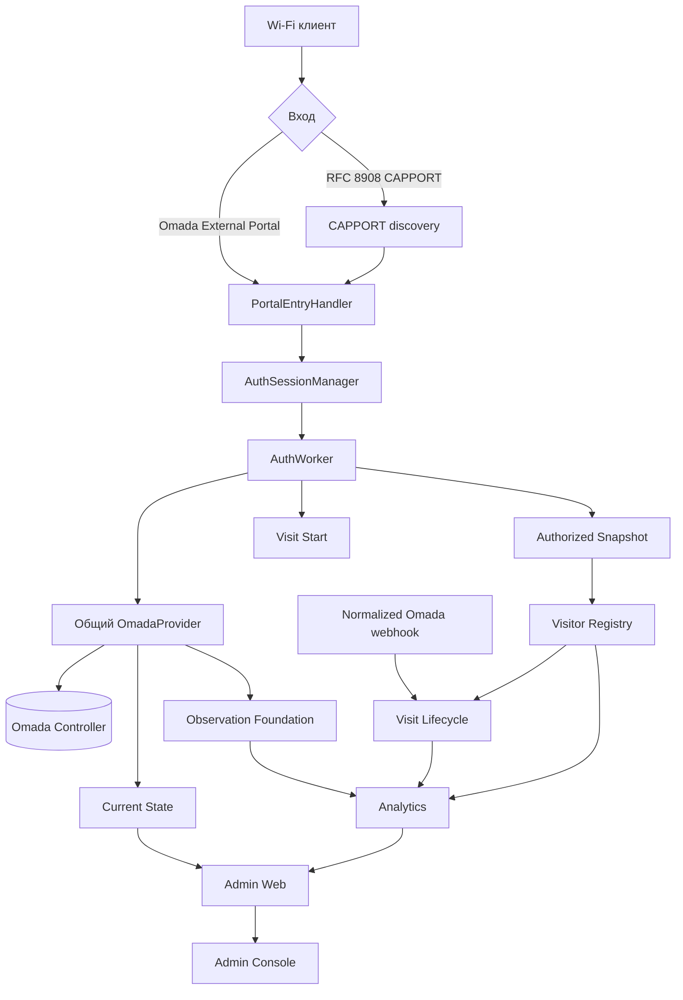

# CaptivPortal Core Platform

[English version](README.md)

CaptivPortal — Python-платформа внешней Captive Portal-авторизации TP-Link Omada и связанных operational, historical, analytics и внутренних Admin-слоёв.

**Current repository snapshot:** `main@dfc62b43712301b05baf9f6e5dd843e13eaa9fc7`.
Repository defaults, фактическое production enabled-state и historical acceptance — разные типы доказательств и не смешиваются.

## Текущая архитектура

`run.py` — единственный прямой process entrypoint и верхнеуровневый lifecycle/composition root.



## Current major subsystems

| Область | Repository implementation |
|---|---|
| Portal authorization / AuthSession / AuthWorker | current |
| Shared OmadaProvider | current |
| CAPPORT | current |
| Auth telemetry / public counters | current |
| Authorized Client Snapshot | current; repository default disabled |
| Visitor Registry | current; repository default disabled |
| Omada webhook receiver/normalizer | current; repository default disabled |
| Pending Session Cleaner | current; repository default disabled |
| Visit Lifecycle schema v2 | current; repository default disabled |
| Observation Foundation schema v1 | current; repository default disabled |
| Current State schema v1 | current; repository default disabled |
| Analytics + protected internal API | current; repository default disabled |
| Admin Web / Home Live / Home Traffic | current; repository defaults disabled |
| Home Activity | **не находится в current code этого baseline; только change-intent** |
| GitHub Actions release CI | отсутствует |

`*_ENABLED=false` в repository default не доказывает, что feature выключен в production.

## Ключевые инварианты

- Один shared `OmadaProvider` и один process-wide token cache.
- CAPPORT входит в тот же `PortalClientContext → AuthSessionManager → AuthWorker`, что и Omada External Portal.
- Успешная авторизация подтверждается только после Omada `authStatus == 2`.
- Visitor Registry не обращается к Omada; его источник — `visitor_snapshots.log`.
- Analytics не собирает данные и не пишет в source DB; он читает persisted facts через read boundaries.
- Admin browser не читает SQLite/Omada/Loki/Grafana и не использует internal Analytics bearer API напрямую.
- Observation — historical measurement авторизованной population; Current State — near-real-time inventory всех active wireless clients в configured scope.
- Current Traffic строится из persisted AP Observation facts; это не Internet/WAN-only и не guest-only traffic.
- Независимые operational/data modules fail-open относительно guest authorization: становятся disabled/unavailable/degraded, но не выдумывают данные и не ломают портал.
- Поддерживаемая topology — один application process. Multi-process/HA требует отдельного ADR.

## База знаний

Начинать с:

- [`AGENTS.md`](AGENTS.md)
- [`docs/README.md`](docs/README.md)
- [`docs/project-inventory.md`](docs/project-inventory.md)
- [`docs/architecture.md`](docs/architecture.md)
- [`docs/module-index.md`](docs/module-index.md)
- [`docs/configuration.md`](docs/configuration.md)
- [`docs/testing.md`](docs/testing.md)
- [`docs/api/omada-open-api.md`](docs/api/omada-open-api.md)

## Политика тестирования

Исполнитель запускает targeted tests изменённых модулей и релевантные static checks. Full repository gate выполняет Reviewer / Tech Lead / owner на exact artifact перед production deployment/activation:

```bash
python -m pytest -q -rs
PYTHONPYCACHEPREFIX=/tmp/captivportal-pyc python -m compileall -q app
git diff --check
```

Нельзя заявлять о запуске gate без фактического evidence.

## Security и production

Production credentials не восстанавливаются из Git. Omada credentials приходят через process environment/approved secret handling. `VERIFY_SSL=false` остаётся repository-default security debt. Admin Web имеет отдельную security boundary от guest authorization.

См. `docs/security.md` и `docs/deployment.md`.
