# CaptivPortal Core Platform

В репозитории также находится по умолчанию выключенная основа пассивного сбора
Device Fingerprint Evidence. Она запускается только отдельным разрешённым
composition root `python3 -m app.device_fingerprint.cli run` и не регистрируется
в основном runtime портала. Контракт: `docs/modules/device-fingerprint.md`.

[English version](README.md)

[](LICENSE)
[](https://www.python.org/)
[]()
[]()
[]()

CaptivPortal начинался как внешний Captive Portal для авторизации гостей через **TP-Link Omada**. Сейчас это уже небольшая operational-платформа со своим движком авторизации, историей устройств, Visit Lifecycle, периодическими wireless observations, Current State, Analytics, защищённым внутренним API и собственным read-only Admin Web.

Этот README намеренно написан **для человека, который открыл GitHub глазами**, а не как индекс для coding agent. Он в первую очередь отвечает на четыре вопроса:

1. Что такое CaptivPortal?
2. Как он работает?
3. Что уже построено?
4. Какой следующий шаг?

Точные инженерные контракты, source-of-truth, configuration defaults и подробности модулей находятся в постоянной базе знаний [`docs/`](docs/README.md).

---

## Проект одним взглядом

| Пункт | Текущее положение |
|---|---|
| Repository implementation checkpoint | `main@3dc85735ddf5d05dd20733d15dfe1c22c9c4fde5` |
| Repository tree | `8312658be3ba272998f46212d9bad76950e3867e` |
| Production deployed HEAD | `3dc85735ddf5d05dd20733d15dfe1c22c9c4fde5` |
| Production tree | `8312658be3ba272998f46212d9bad76950e3867e` |
| Current Network Throughput | **Production active** |
| Network Traffic History | **Production active** |
| Period Statistics | **Production active** |
| Peak Load | **Production active** |
| Traffic by AP | **Production active** |
| Independent historical ranges | **Production active / acceptance PASS** |
| AP Traffic Share | **Production active / acceptance PASS** |
| Online Guests Traffic | **COMPLETE / PRODUCTION ACTIVE** |
| Completed Guest Session Traffic | **CLOSED / DEPLOYED / ACTIVE / PRODUCTION VERIFIED** |
| Traffic Evidence | **TASK-TRAFFIC-09 — COMPLETED / PRODUCTION ACTIVE** |
| Traffic Projection lifecycle P0 | **CLOSED / PRODUCTION ACCEPTANCE PASS** |
| DB baseline gate | `TASK-DB-BASELINE-SYNC-01` — **CLOSED / PASS** |
| Windows Central Lab | **V7 STRICT — CURRENT**; V6 historical/audit only |
| Windows compatibility cleanup | `TASK-TEST-BASELINE-CLEANUP-01` — **FINAL ACCEPTED / MERGED / DEPLOYED / PRODUCTION PASS** |
| Следующий Traffic TASK | **ПОКА НЕ НАЗНАЧЕН** |
| Omada Controller family | Omada Software Controller 5.14.x |
| Core guest authorization | Реализован |
| RFC 8908 CAPPORT | Реализован |
| Visitor Registry | Реализован |
| Visit Lifecycle | Реализован, schema v2 |
| Observation Foundation | Реализован, schema v1 |
| Current State | Реализован, schema v1 |
| Current Device Context | **TASK-DEVICE-CARD-01 — COMPLETE / PRODUCTION ACTIVE** |
| Home Online Devices presentation | **TASK-WEB-HOME-ONLINE-DEVICE-PRESENTATION-01 — CLOSED / PRODUCTION CURRENT** |
| Canonical Device Type foundation | **TASK-DEVICE-TYPE-NORMALIZATION-01 — CLOSED / PRODUCTION ACTIVE** |
| Device Type + SNR presentation | **TASK-WEB-DEVICE-TYPE-PRESENTATION-01 — CLOSED / PRODUCTION ACCEPTANCE PASS** |
| Analytics / Admin Web | Реализованы |
| Multi-Site / Tenant / RBAC | Future evolution |

> Repository defaults, production enabled-state и dated acceptance evidence — разные факты.

## Где проект находится сейчас

Traffic production-active до `TASK-TRAFFIC-09 — Consolidated Traffic Evidence` включительно.

Восемь существующих Traffic products остаются самостоятельными продуктами.
После них в Admin → Traffic находится отдельная область `TRAFFIC EVIDENCE`,
которая консолидирует существующие evidence/status/freshness/coverage/
source-health/reason/provenance факты без новой quality-метрики или нового
источника данных.

Текущая functional layout production-current, но не финальный визуальный дизайн.

## Что CaptivPortal умеет сегодня

Current Traffic surface:

- Current Network Throughput;
- Online Guests Traffic;
- Completed Guest Session Traffic;
- Network Traffic History;
- Period Statistics;
- Peak Load;
- Traffic by AP;
- AP Traffic Share.

Traffic Evidence имеет собственный независимый `24h | 7d` range (default
`24h`) и не меняет functional ranges восьми существующих Traffic products.

Постоянный evidence invariant:

```text
missing / unknown / stale / insufficient / unavailable != 0
```

Traffic Evidence не является synthetic GOOD/BAD score или normalized quality
algorithm.

Historical Traffic panels сохраняют независимый page-local `24h | 7d` range
state. Online Guests Traffic читает persisted Current State через
`CurrentGuestTrafficReadService`, range-insensitive и не делает query-time Omada
calls.

Это product evidence, а не WAN/Internet billing counter.

## Device Detail — Current Device Context

`TASK-DEVICE-CARD-01` завершён и production-active.

Device Detail теперь явно разделяет два evidence domain:

```text
Historical Device Context
!=
Current Device Context
```

Historical часть сохраняет Identity, Latest Site Snapshot, Latest Client
Observation и Recent Visits.

Отдельный read-only блок `Current Device Context` показывает:

```text
Presence
Authorization
Network
Radio
Controller
Current Guest Traffic
Evidence / Freshness
```

Канонические current-state правила:

```text
fresh + complete scope + присутствует → online
fresh + complete scope + отсутствует  → offline
stale/unavailable/untrusted           → unknown

stale != offline
unavailable != offline
0 Mbps != unknown/unavailable
```

Device Detail читает persisted application evidence и не добавляет query-time
Omada, Loki, Grafana или external Analytics calls.

Presentation-layer задача `TASK-WEB-DEVICE-UI-01` теперь **CLOSED / PRODUCTION ACTIVE** через PR #110. Локальная библиотека Admin Web assets и Android presentation FIX также **CLOSED / PRODUCTION PASS**.

## Admin Web local asset library — current production

```text
TASK-WEB-ASSET-LIBRARY-01=CLOSED / PRODUCTION PASS
TASK-WEB-ASSET-LIBRARY-01-FIX-ANDROID-PRESENTATION=CLOSED / PRODUCTION PASS
PR #113=MERGED
PR #114=MERGED / PRODUCTION VERIFIED
current production HEAD=3dc85735ddf5d05dd20733d15dfe1c22c9c4fde5
current production tree=8312658be3ba272998f46212d9bad76950e3867e
```

The repository-local Android asset remains:

```text
app/admin_web/static/icons/platforms/android.svg
SHA256=2f2411f1f05522e90049f8cbb06105fb553057efeadf772cdcc3ae24bbc8a6cc
```

The Asset Library tasks remain valid provenance/history for introducing and
fixing that asset. Their former raw browser predicate is historical acceptance
evidence only.

Current machine decision after PR #119/#120:

```javascript
device_type_key === "android"
```

Raw `device_type` remains source/display evidence. Current Admin Web does not
trim/lower/casefold/Unicode-normalize or infer Device Type in the browser.

## Canonical Device Type contract — current production

```text
TASK-DEVICE-TYPE-NORMALIZATION-01=CLOSED / MERGED / DEPLOYED / PRODUCTION ACTIVE
TASK-WEB-DEVICE-TYPE-PRESENTATION-01=CLOSED / MERGED / DEPLOYED / PRODUCTION ACCEPTANCE PASS
PR #119=MERGED
PR #120=MERGED
current production HEAD=3dc85735ddf5d05dd20733d15dfe1c22c9c4fde5
current production tree=8312658be3ba272998f46212d9bad76950e3867e
```

Canonical ownership:

```text
raw/source/display value = device_type
machine/presentation key = device_type_key
normalization owner       = app/common/device_type.py
```

`device_type_key` is a bounded lexical key derived with `strip()` + `casefold()`
and strict UTF-8 validation. It does not perform Unicode normalization, semantic
mapping, inference, separator collapsing or truncation.

The browser consumes the server-provided key. It must not derive a Device Type
key from raw `device_type`.

Android presentation is therefore strictly:

```javascript
device_type_key === "android"
```

The earlier browser-owned `trim().toLowerCase()` Android predicate remains
historical evidence of TASK-WEB-ASSET-LIBRARY-01/FIX and is **superseded as a
current contract** by PR #119/#120.

The Android SVG remains repository-local:

```text
app/admin_web/static/icons/platforms/android.svg
SHA256=2f2411f1f05522e90049f8cbb06105fb553057efeadf772cdcc3ae24bbc8a6cc
```


## Home Online Devices — current presentation

The current production Home table presents:

```text
Device / MAC
Type
Auth
IP
AP
Band
RSSI
SNR
Uptime
Traffic
```

The `Type` column is immediately after `Device / MAC`.

Type presentation:

```text
device_type_key == "android" -> Android SVG cue
device_type_key == null AND device_type == null -> NULL
otherwise -> raw device_type
```

No Device Type inference is performed from hostname, system name, MAC, vendor,
SSID, AP, IP or history.

SNR is presentation-only:

```text
>=25      good    #10b956
15..24    warning #f2c20d
<15       danger  #ed3038
null      neutral / —
```

RSSI and SNR are independent. No combined score or backend quality
classification exists.

Home-specific geometry and tones are scoped to:

```css
.live-section[aria-labelledby="devices-now-title"]
```

and do not redefine unrelated `.live-table` surfaces.


## Device Card Device Type — current presentation

Device Card keeps raw and canonical roles separate:

```text
device_type     -> source/display text
device_type_key -> machine/presentation decision
```

The frontend does not trim, lowercase, casefold, Unicode-normalize or infer
Device Type.

A detail object that contains its own `device_type_key` owns that presentation
decision. `Latest Site snapshot` may use `identity.device_type_key` when the
snapshot raw type and identity raw type belong to the same Device record.

`device_type_key` itself is not rendered as a separate user-facing field.

## Home operational read models — current repository contracts

Two implemented Home subsystems were underrepresented in the previous current KB
inventory and are explicitly restored here.

### Home System Health

```text
TASK-HOME-HEALTH-01 implementation=MERGED
PR #74 merge=f458df3b360bba89e9965a1edfdcc0d3af2f201c
repository default WEB_ADMIN_HOME_HEALTH_ENABLED=false
```

Home System Health is a read-only Admin composition over existing bounded
runtime/read evidence. It has no request-time Omada probe, Health DB, repair
worker or log scan. Its top-level product states are `operational`, `degraded`,
`unavailable`, `unknown`; `initializing`/`stale` are reason semantics.

This KB sync does **not** infer the current production value of
`WEB_ADMIN_HOME_HEALTH_ENABLED`; production enabled-state remains host-verified
unless separately evidenced.

### Home AP-24H

```text
TASK-HOME-AP-24H-01 implementation=MERGED
PR #78 merge=042f8e4c5f3c6205cec1823322688e1bf3805a57
PR #79 duration-partition fix=MERGED
PR #80 frontend dataset activation fix=MERGED
TASK-HOME-AP-24H-TELEMETRY-01 / PR #81=MERGED
repository default WEB_ADMIN_HOME_AP_24H_ENABLED=false
repository default WEB_ADMIN_HOME_AP_24H_TELEMETRY_ENABLED=false
```

Home AP-24H is a Site-scoped rolling 24-hour read model over persisted Current
State + Observation evidence: 96 x 15-minute buckets, no query-time Omada and no
new persistence owner. Operational telemetry reuses the existing Authorization
Telemetry sink and is separately feature-gated/fail-open.

Historical PR evidence shows production-acceptance work occurred during AP-24H
fixes, but this KB sync does not invent a current host flag value. Current
production enablement must be asserted only from host/Owner evidence.

## Windows strict baseline cleanup

`TASK-TEST-BASELINE-CLEANUP-01` принят и находится в production.

```text
PR #116=MERGED
current production HEAD=c1dc3344bc778a32cdc6b0edce278ee40b287c29
current production tree=0563f58cf2a5c961e1dedb52cfa2b4b298dd2c1c
Windows Central Lab current runner=V7 strict
V6=historical / audit only
former six Windows compatibility exclusions=ordinary strict tests
compatibility WARN escape for former six=removed
```

Accepted V7 run дал `3129 passed / 30 skipped / 0 failed / 0 deselected`.
Это evidence конкретного принятого прогона, а не вечный hardcoded test-count
invariant.

## Traffic Projection lifecycle P0 — закрыт

`TASK-TRAFFIC-PROJECTION-LIFECYCLE-CONSISTENCY-01` полностью принят в production.

```text
root cause=RETENTION CLEANUP / FROZEN RECONCILE WINDOW RACE
accepted implementation=FINAL-R5 + FIX-1
PR #111=merged
production artifact=7472d67274ea5aaea2a20df6b613b78d5bb70f42
production tree=3950df6d400049ed16a823032c6740396cd61137
Projection health=healthy
Historical Traffic=restored
traffic-projection.service=active + enabled
P0 incident=closed
```

Архитектурный принцип не изменился:

```text
Observation = authoritative source
Traffic Projection = derived/rebuildable read model
divergence = fail-closed
```

Старые `repair/rebuild HOLD` и `STOPPED + DISABLED / CONTAINED` сохраняются
только как историческое состояние containment, а не current production status.

# Архитектура

## Общая схема платформы

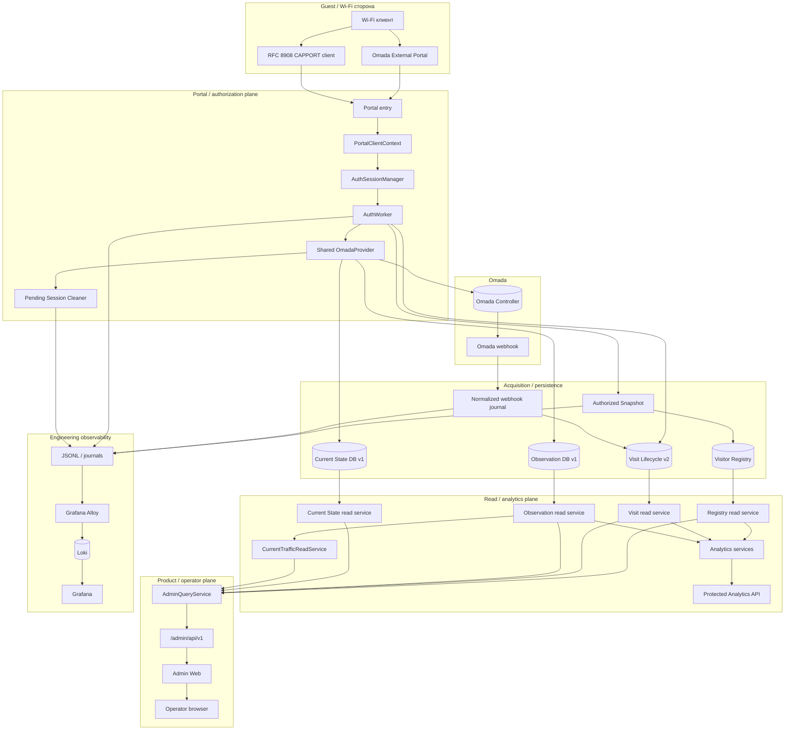

### Смысл архитектуры одной строкой

```text
Authorization решает доступ.
Collectors сохраняют факты.
Visit Lifecycle превращает события в Visits.
Analytics читает сохранённые факты.
Admin Web безопасно показывает их человеку.
Grafana остаётся инженерной observability.
```

---

## Process composition

`run.py` — process entrypoint и верхнеуровневый lifecycle/composition root для
основного `captive-portal.service`. Единственное Task-01 auxiliary-исключение —
отдельный composition root `python3 -m app.device_fingerprint.cli run`; он не
регистрируется в основном runtime.

Упрощённая схема startup:

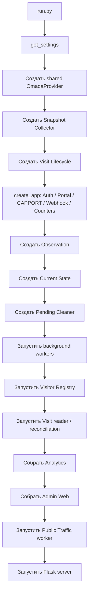

Shutdown также управляемый: фоновые компоненты перестают принимать работу, необходимые очереди bounded-drain, storage-owning modules закрываются в контролируемой последовательности.

### Single-process assumption

Process-local сегодня:

- Auth sessions и locks;
- Auth executor;
- CAPPORT caches;
- Cleaner ActionGuard;
- Admin sessions/login limiter;
- worker lifecycle state.

Поэтому горизонтальный multi-process — **не просто смена WSGI-параметра**. Для HA требуется отдельный ADR по shared state, leader election/worker ownership и coordination.

---

# Гостевая авторизация

## Один authorization engine

Omada External Portal и CAPPORT — разные входы в одну систему, а не две независимые авторизации.

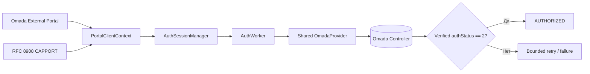

### Последовательность авторизации

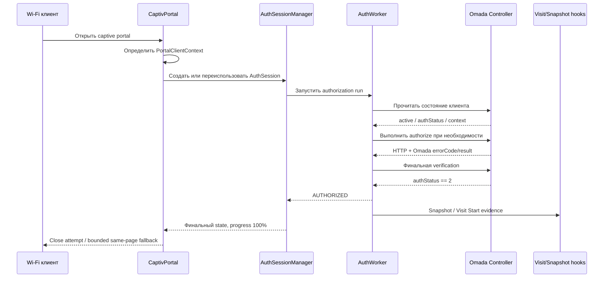

Успех определяется подтверждённым состоянием контроллера, а не просто успешным HTTP transport.

---

# Pending Session Cleaner

Pending Session Cleaner занимается зависшими неавторизованными клиентами и не превращается во второй authorization engine.

Его safety philosophy:

```text
uncertainty => no reconnect
```

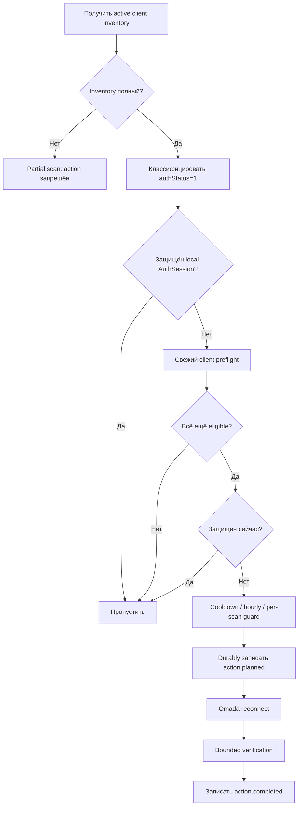

Подтверждённая операция Cleaner — Omada client reconnect. `block/unblock` не используется как автоматический fallback.

---

# Как события превращаются в данные продукта

## Общая data chain

CaptivPortal специально разделяет acquisition и analytics.

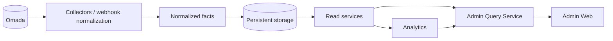

Постоянный принцип:

```text
Collector собирает и сохраняет факты.
Analytics читает уже сохранённые факты.
Analytics не идёт обратно в Omada, чтобы "дорисовать" отсутствующую историю.
```

Поэтому историческая аналитика должна оставаться доступной по persisted history даже при временной недоступности Omada во время запроса.

---

## Snapshot vs Observation vs Current State vs Visit

Эти слои отвечают на разные вопросы и не заменяют друг друга.

| Слой | Какой вопрос решает | Population / смысл | Persistence |
|---|---|---|---|
| Authorized Snapshot | «Как выглядел успешно авторизованный клиент в момент авторизации?» | Один подробный start-of-history capture | JSONL |
| Visitor Registry | «Какое стабильное устройство и его историю мы знаем?» | Device card + captured history | SQLite |
| Observation | «Какие measurements были у authorized clients/AP во времени?» | Historical authorized population + AP facts | SQLite v1 |
| Current State | «Какие wireless clients/AP активны прямо сейчас?» | Active wireless inventory, включая pending | SQLite v1 |
| Visit Lifecycle | «К какому Visit относилась авторизация и когда Visit закончился?» | Site-aware Visit + source events | SQLite v2 |
| Analytics | «Какие выводы можно получить из сохранённых фактов?» | Query-on-read derived results | Без source persistence |
| Admin Web | «Что оператор должен безопасно увидеть?» | Bounded Site-scoped presentation | Без business DB |

### Observation и Current State

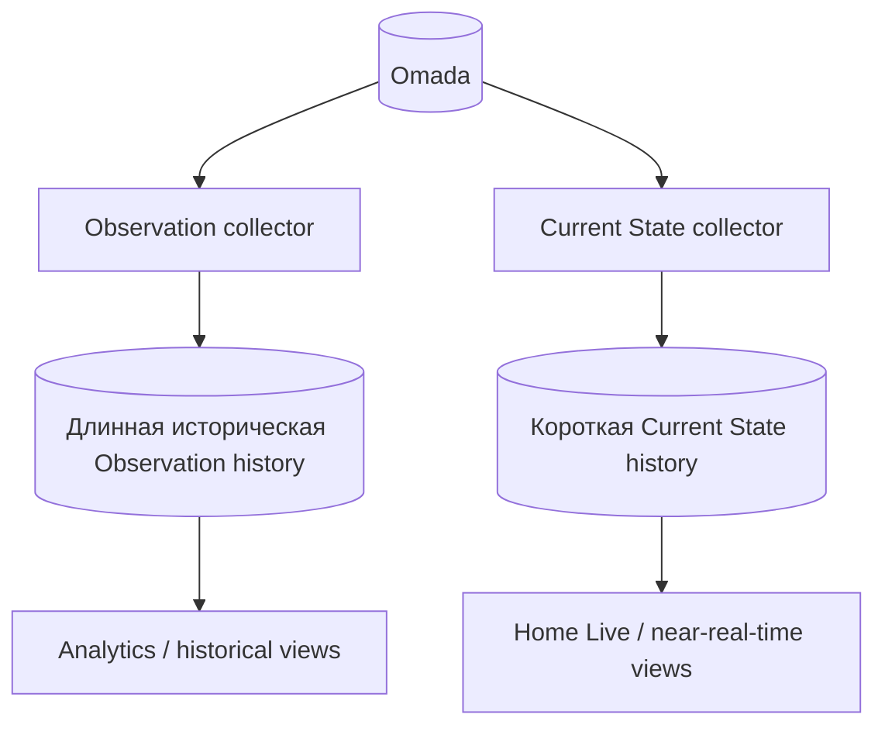

Observation client population: active + authorized в configured scope.

Current State включает **всех active wireless clients в scope** и классифицирует:

```text
authStatus 2      → authorized
authStatus 1      → pending
other integer     → other
missing / invalid → unknown
```

Новый failed/partial Current State cycle не подменяет last complete-success snapshot.

---

# Visit Lifecycle

`AuthSession` не равен физическому Visit.

Один Visit может содержать несколько authorization events. Visit Lifecycle даёт платформе durable Site-aware сущность для истории, analytics и UI.

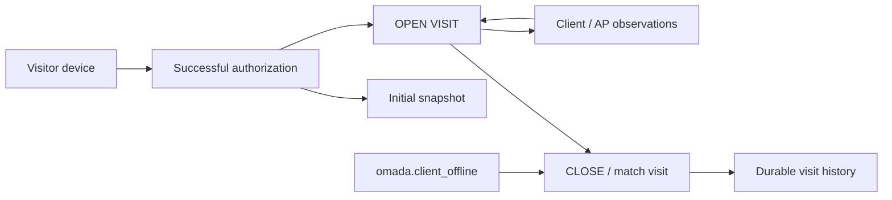

Current schema version: **2**.

Ключевые свойства:

- подтверждённый successful authorization создаёт Visit Start evidence;
- normalized offline webhook закрывает/матчит Visit;
- unmatched offline evidence может ожидать позднего reconciliation;
- Registry reconciliation может позже связать device/snapshot identity;
- webhook reader имеет durable checkpoint;
- foreground Visit Start writes имеют приоритет над background reconciliation writes.

---

# Analytics

Analytics намеренно **demand-only**.

У неё нет:

- отдельного collector thread;
- direct Omada dependency;
- source write path;
- ownership schema Registry/Visit/Observation/Current State.

Current analytics families:

- source/data quality;
- wireless analytics;
- visit analytics;
- Current Traffic interpretation.

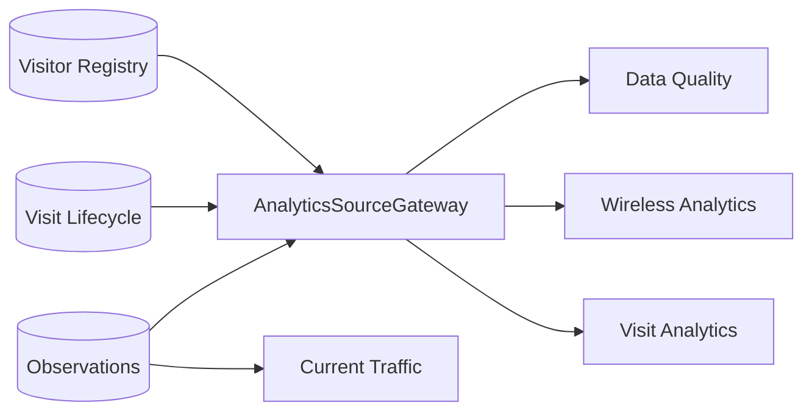

Read connections проверяют ожидаемую schema version и работают через read-only/query-only boundaries.

---

# Current Traffic и Home Traffic

Current Traffic строится из **persisted AP Observation traffic facts**.

Это принципиальное различие:

```text
Current Traffic ≠ Internet/WAN traffic
Current Traffic ≠ guest-only traffic
Current Traffic ≠ SSID-only traffic
```

Это интерпретация физической/network traffic evidence точки доступа.

Сервис предпочитает source family `wired`, с допустимым fallback на `lan`; несовместимые source families не смешиваются по AP внутри одного accepted Site snapshot. Integrity problem даёт unavailable, а не выдуманное число.

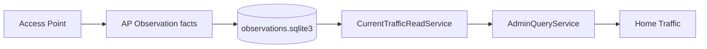

---

# Native Admin Web

Admin Web — это product/operator boundary, а не оболочка над Grafana.

Current pages:

- Home;
- Devices;
- Device Detail;
- Visits;
- Observations.

На Home уже могут находиться:

- **Home Live** — текущие clients/AP из Current State;
- **Home Traffic** — текущая AP traffic interpretation из persisted Observation facts.

Browser намеренно изолирован от backend source systems.

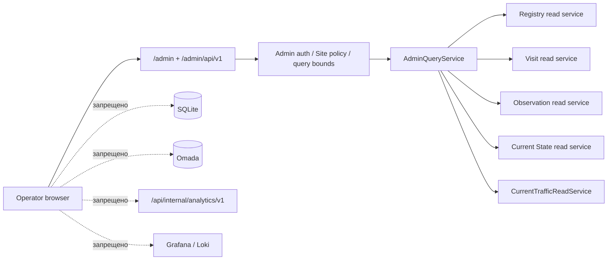

### Admin security boundary

Текущая модель включает:

- отдельную Admin authentication, не guest auth;
- HTTPS requirement, когда включено соответствующей конфигурацией;
- source-network allowlist;
- Site allowlist/default Site;
- password-hash verification;
- pre-auth CSRF;
- login rate limiting;
- bounded in-memory sessions;
- idle и absolute session timeout;
- Secure / HttpOnly / SameSite cookies;
- logout CSRF;
- restrictive CSP;
- `X-Frame-Options: DENY`;
- nosniff;
- no-referrer;
- no-store;
- удаление query string из access-log request line для `/admin` и protected Analytics namespaces.

Business/data Admin API остаётся read-only; POST используется для login/logout security flow.

---

# Home сегодня — и следующий шаг

## Current Home

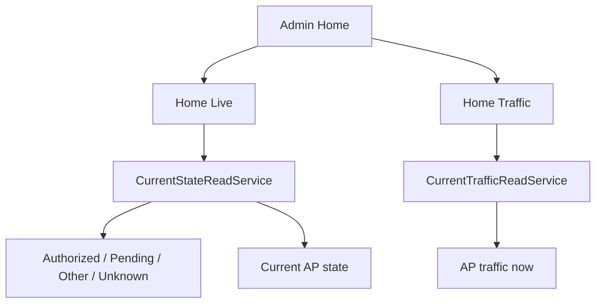

### Home Live

Для человека это:

- сколько scoped wireless clients активно сейчас;
- сколько authorized/pending/other/unknown;
- summary текущих AP;
- freshness / stale / unavailable state.

Home request не делает direct Omada polling.

### Home Traffic

Для человека это:

- текущая AP network traffic interpretation по persisted observations;
- видимая freshness/integrity;
- без ложного переименования в guest Internet usage.

---

## Home Activity: Visits and Traffic

Home Activity реализован, merged и deployed. Home panel:

```text
Today
vs
Selected period
```

с двумя одинаковыми metrics на обеих сторонах:

```text
Authorized visits
Traffic
```

Current implementation checkpoint: `main@53f617b3ac0155d0d647e58e98309927f9a4d318`.

Production evidence 26.08.2026 подтверждает Visit source chain после
`2026-08-26T17:46:55.982Z` (`21:46:55.982 +04`, Asia/Baku). В проверенном
диапазоне 14 из 14 Visits были guest-scope verified, без opening-evidence
integrity anomalies и без unproven-scope rows. `traffic_coverage_from_utc`
остаётся `null`; Traffic нельзя объявлять Complete только из-за течения времени.

Current architecture:

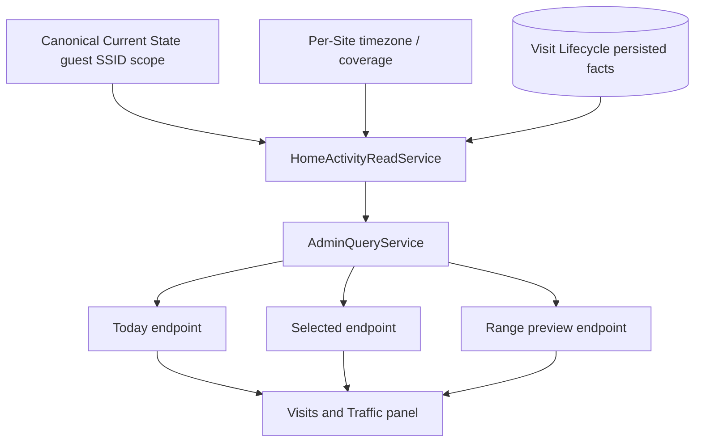

### Human semantics

**Authorized visits**

- один qualifying Visit opening = одна единица;
- не один AuthSession;
- не одна authorization row;
- повторная авторизация внутри того же открытого Visit не увеличивает count.

**Traffic**

- estimate из eligible completed guest-session offline reports;
- active session не появляется до offline evidence;
- весь reported volume относится к моменту завершения session;
- это не WAN/Internet/billing traffic;
- искусственный 31/90-day Home Activity range cap не предполагается.

Этот panel хорошо показывает текущую зрелость архитектуры: он переиспользует persisted facts и не создаёт ещё один collector.

---

# Engineering observability и product UI

CaptivPortal намеренно разделяет два мира.

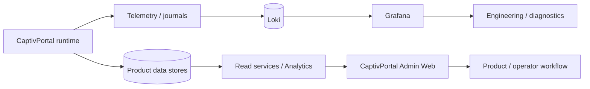

### Grafana

Для:

- engineering observability;
- collector validation;
- diagnostics;
- investigation;
- telemetry exploration;
- анализа health платформы.

### CaptivPortal Admin Web

Для:

- operator/customer-facing product views;
- bounded Site-aware information;
- стабильной product semantics;
- дальнейшей customer-facing эволюции.

Grafana/Loki не должны становиться backend'ом коммерческого product UI.

---

# Карта persistence

| Store / journal | Writer | Основные readers | Смысл |
|---|---|---|---|
| `auth_telemetry.log` | Auth telemetry | observability | authorization operations |
| `visitor_snapshots.log` | Snapshot Collector | Registry / observability | detailed authorized snapshots |
| `omada_webhook.log` | Webhook Receiver | processor / ops | redacted raw webhook |
| `omada_webhook_normalized.log` | Webhook Processor | Visit / Public Traffic | canonical normalized events |
| `pending_session_cleaner.log` | Pending Cleaner | ops / audit | action audit |
| `portal_counter.db` | Portal Counter | portal API | public auth counts |
| `public_traffic.sqlite3` | Public Traffic | portal API | completed-session traffic counter |
| `visitor_registry.sqlite3` | Visitor Registry | Registry reads / Analytics / Admin | durable device identity/history |
| `visits.sqlite3` | Visit Lifecycle | Visit reads / Analytics / Admin | visits, auth evidence, source events |
| `observations.sqlite3` | Observation Foundation | Observation reads / Analytics / Admin | historical client/AP facts |
| `current_state.sqlite3` | Current State | CurrentStateReadService / Admin | current snapshots + short history |

Writer владеет schema/migrations. Read consumers не изменяют source storage.

---

# Текущий статус subsystem'ов

Таблица ниже говорит о **repository implementation**, а не утверждает текущие production flags.

| Область | Repository state | Человеческий смысл |
|---|---|---|
| Core Flask platform | ✅ Current | Основное приложение/service |
| Shared OmadaProvider | ✅ Current | Один OAuth/token lifecycle на process |
| Portal authorization | ✅ Current | Общий authorization engine |
| CAPPORT | ✅ Current | RFC 8908 entry/discovery |
| Auth telemetry | ✅ Current | Структурированное auth evidence |
| Portal counter | ✅ Current | Public authorization counts |
| Public traffic counter | ✅ Current | Отдельный completed-session counter |
| Authorized Snapshot | ✅ Current, default disabled | Detailed post-auth capture |
| Visitor Registry | ✅ Current, default disabled | Durable device/history identity |
| Omada webhook receiver/normalizer | ✅ Current, default disabled | Canonical inbound event pipeline |
| Pending Session Cleaner | ✅ Current, default disabled | Safe stale-pending cleanup |
| Visit Lifecycle | ✅ Current, default disabled | Site-aware visits, schema v2 |
| Observation Foundation | ✅ Current, default disabled | Historical authorized/AP facts, schema v1 |
| Current State | ✅ Current, default disabled | Active wireless state, schema v1 |
| Analytics | ✅ Current, default disabled | Read-only derived views |
| Protected Analytics API | ✅ Current, default disabled | Internal aggregate HTTP boundary |
| Admin Web | ✅ Current, default disabled | Native read-only operator UI |
| Home Live | ✅ Current, default disabled | Current client/AP summary |
| Current Traffic | ✅ Current при healthy sources | AP traffic interpretation |
| Home Traffic | ✅ Current, default disabled | Home presentation Current Traffic |
| Home Activity | ✅ Current, default disabled | Visits и completed-session Traffic с independent coverage |
| Home System Health | ✅ Current, default disabled | Product-safe system health read model; production flag host-verified |
| Home AP-24H | ✅ Current, default disabled | Rolling 24h AP state/quality read model |
| Home AP-24H telemetry | ✅ Current, default disabled | Structured operational telemetry over the AP-24H read contract |
| Traffic Section Foundation | ✅ Current, default disabled | Отдельный Site-scoped Traffic product shell/coordinator |
| Current Network Throughput | ✅ Current, default disabled | Persisted AP/network Mbps через CurrentTrafficReadService |
| GitHub Actions release CI | ⚠️ Отсутствует | Process debt |

---

# Omada Open API — что реально подтверждено исследованием

CaptivPortal использует curated Omada API contract и не делает выводы только по названию endpoint.

Controlled research на Omada 5.14.31 подтвердил:

| Capability | Research result | Current product meaning |
|---|---|---|
| Read clients / client details | Confirmed | Используется approved read/control modules |
| Rename client | Public OpenAPI работает | Research-proven; не значит, что кнопка есть в Admin |
| Per-client rate limit | Работает и физически ограничивает | Research-proven |
| Rate-limit profiles | CRUD/application работает | Research-proven |
| Reconnect | Физически разрывает connection | Используется Cleaner под safety gates |
| Block | Удаляет active access | Research-proven; не Cleaner fallback |
| Unblock | Снимает запрет | Сам по себе не reconnect |
| Hotspot unauthorize | Удаляет authorization record | Research-proven |
| Hotspot authorize | Может pending → authorized | Portal-bypass semantics не обобщены |
| Authentication period | Подтверждена extension-delta semantics | Не absolute timestamp |
| Lock-to-AP | Config/rollback работает | Physical multi-AP roaming prevention не закрыт полностью |
| Full clear custom public rate limit | Не закрыт stable public contract | Private UI API не approved product contract |

Наличие Omada capability **не означает**, что это уже product feature CaptivPortal. Для product exposure требуется отдельное security/UX/authorization решение.

См. [`docs/api/omada-open-api.md`](docs/api/omada-open-api.md).

---

# Roadmap

## Уже пройденная лестница

```mermaid
flowchart LR
    T0[Traffic Foundation]:::done --> T1[Current]:::done --> T2[History]:::done --> T3[Statistics]:::done --> T4[Peak]:::done --> T5[Traffic by AP]:::done --> R[Independent ranges]:::done --> T6[AP Traffic Share]:::done --> T7[Online Guests Traffic]:::done --> DB[DB Baseline Sync]:::next --> T8[Traffic 0.8]:::next
    classDef done fill:#d9f2d9,stroke:#2e7d32,color:#000;
    classDef next fill:#fff3cd,stroke:#b8860b,color:#000;
```

## Near-term direction

```text
TRAFFIC-00         DONE
TRAFFIC-01         DONE / PRODUCTION ACTIVE
TRAFFIC-02-READ    DONE
TRAFFIC-02         DONE / PRODUCTION ACTIVE
TRAFFIC-02-PERF-01 DONE
TRAFFIC-03         DONE / PRODUCTION ACTIVE
TRAFFIC-04         DONE / PRODUCTION ACTIVE
TRAFFIC-05         DONE / PRODUCTION ACTIVE
TRAFFIC-RANGE-01   DONE / PRODUCTION ACTIVE / PRODUCTION ACCEPTANCE PASS
TRAFFIC-06         DONE / PRODUCTION ACTIVE
TRAFFIC-07-READ    DONE / READ FOUNDATION IMPLEMENTED
TRAFFIC-07         COMPLETE / PRODUCTION ACTIVE
DB-BASELINE-SYNC   CLOSED / PASS
TRAFFIC-08          CLOSED / DEPLOYED / ACTIVE / PRODUCTION VERIFIED
TRAFFIC-09          COMPLETED / PRODUCTION ACTIVE
next Traffic TASK   NOT YET ASSIGNED
```

TASK-TRAFFIC-09 завершён и production-active. Следующий Traffic TASK не считается каноническим до отдельного утверждения Owner / Tech Lead.

## Реальный второй Site как trigger

CaptivPortal намеренно **Site-aware до Multi-Site**.

Реальный второй Site — момент, когда abstractions должны пройти проверку живым requirement.

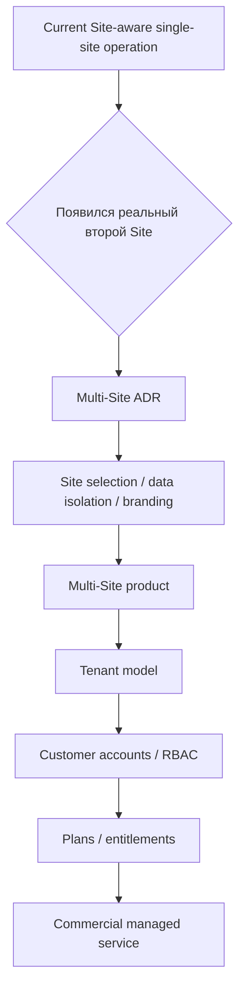

Постоянное правило:

```text
Tenant != Site
```

Один Tenant в будущем может иметь несколько Sites.

---

## Future Tenant / commercial model

Будущая server-side authorization model:

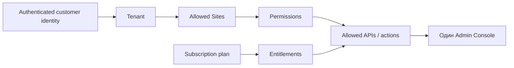

Коммерческое направление — один product с backend-enforced capabilities, а не отдельные forks.

Будущая managed-service модель:

```text
На стороне клиента
  Internet
  compatible router/gateway
  recommended Omada APs

На нашей стороне
  Omada Controller
  CaptivPortal
  Visitor Registry
  Visit Lifecycle
  Observation Storage
  Analytics
  Admin Console
  Monitoring
  Backups
  Updates
```

---

# Важные архитектурные границы

### Shared Omada provider

Один process → один shared `OmadaProvider` → один shared token cache.

Второй provider/token manager без отдельного архитектурного решения запрещён.

### Fail-open и fail-closed

**Fail-closed:**

- обязательная core Omada configuration;
- фактический guest authorization result;
- Admin authentication/network/Site policy.

**Fail-open относительно guest authorization:**

- telemetry;
- counters;
- Snapshot / Registry;
- webhook normalization;
- Visit persistence/reconciliation;
- Observation;
- Current State;
- Analytics;
- Admin Web;
- Pending Cleaner.

Fail-open означает safe degraded/unavailable/disabled, а не fabricated success/data.

### Admin browser isolation

Browser напрямую не читает:

- SQLite;
- Omada;
- Loki;
- Grafana;
- protected internal Analytics bearer API.

### Current Traffic scope

AP physical/network traffic нельзя называть «guest Internet traffic».

### Visitor identity и Site identity

Registry device identity сегодня не является автоматически Site-specific truth. Site-scoped facts должны оставаться Site-scoped в Visit/Observation/Admin semantics.

---

# Testing и release discipline

Detailed authority: [`docs/testing.md`](docs/testing.md).

Coder выполняет только focused/minimal TASK/module tests. Broader/full/official
acceptance принадлежит Owner + Tech Lead/Central Lab.

Permanent promotion rule:

```text
Patch → Lab.
All mandatory gates → PASS.
Accepted candidate → Git.
Git → Production.
Activation → separate step.
```

V6/full PASS недостаточен для publication, если TASK/FINAL ещё требует
PERF/Linux/security/browser/etc. gate.

Production application code штатно доставляется только из Git по verified
SHA/tree. Patch — Lab/handoff artifact, а не production code identity.

# Configuration

CaptivPortal группирует настройки по subsystem. Authoritative list/defaults находятся в `.env.example`, `app/config.py`, `app/settings.py` и [`docs/configuration.md`](docs/configuration.md).

Основные группы:

```text
Core / Omada
Portal / CAPPORT
Auth telemetry
Portal counter
Public traffic
Authorized Snapshot
Visitor Registry
Webhook
Pending Session Cleaner
Visit Lifecycle
Observation
Current State
Analytics
Analytics API
Admin Web
Home Live
Home Traffic
Traffic Section
```

Production secrets не коммитятся в Git.

`.env.example` — reference template. Реальный production state проверяется в approved runtime/deployment environment, а не выводится из repository defaults.

---

# Installation / local run

## Требования

- Python 3.10+
- Linux; Ubuntu 22.04 family — current production family, зафиксированная проектом
- network reachability к Omada Controller
- dependencies из `requirements.txt`

## Clone

```bash
git clone https://github.com/ZaurNavi/CaptivePortal.git
cd CaptivePortal
python3 -m venv .venv
source .venv/bin/activate
python -m pip install -r requirements.txt
```

## Run

Передать required process environment, затем:

```bash
python3 run.py
```

Production использует system service и deployment-specific environment configuration. См. [`docs/deployment.md`](docs/deployment.md).

---

# База знаний

README — это карта проекта для человека. KB — инженерный authority для подробностей.

Основные документы:

- [`AGENTS.md`](AGENTS.md) — workflow и правила работы с repository;
- [`docs/README.md`](docs/README.md) — knowledge map;
- [`docs/project-inventory.md`](docs/project-inventory.md) — exact runtime inventory;
- [`docs/architecture.md`](docs/architecture.md) — lifecycle/dependency architecture;
- [`docs/module-index.md`](docs/module-index.md) — module status map;
- [`docs/configuration.md`](docs/configuration.md) — configuration groups/defaults;
- [`docs/testing.md`](docs/testing.md) — test responsibility/gates;
- [`docs/deployment.md`](docs/deployment.md) — deployment contract;
- [`docs/security.md`](docs/security.md) — security boundaries;
- [`docs/api/omada-open-api.md`](docs/api/omada-open-api.md) — curated Omada evidence;
- [`docs/modules/visit-lifecycle.md`](docs/modules/visit-lifecycle.md);
- [`docs/modules/observations.md`](docs/modules/observations.md);
- [`docs/modules/current-state.md`](docs/modules/current-state.md);
- [`docs/modules/analytics.md`](docs/modules/analytics.md);
- [`docs/modules/admin-web.md`](docs/modules/admin-web.md).

## Truth model

Для **того, как система работает сейчас**:

```text
current code
    ↓
current tests
    ↓
current docs, подтверждённые кодом
```

Для **ещё не merged change**:

```text
FINAL TASK
    ↓
PLAN
    ↓
ADR
```

FINAL TASK не становится current runtime только потому, что он утверждён.

---

# Known limitations и technical debt

| Debt / limitation | Почему важно |
|---|---|
| Single-process topology | Multi-process/HA требует shared-state и worker-leadership design |
| `VERIFY_SSL=false` repository default | Security-hardening debt; production truth host-verified |
| Нет GitHub Actions release CI | Full release gate остаётся procedural/manual |
| Production enabled-state нельзя доказать Git'ом | Runtime flags проверяются на host |
| Omada private UI APIs не approved product contracts | Private/reverse-engineered endpoints нельзя незаметно превращать в stable dependency |
| Public full-clear custom client rate limit unresolved | Известный пробел Omada control research |
| Часть traffic sources — estimates/scope-specific | UI не должен выдавать их за billing/WAN truth |
| Registry global-by-MAC имеет Site-awareness limits | Future Multi-Site должен сохранить правильную ownership semantics |

---

# Философия проекта

Несколько принципов описывают CaptivPortal лучше, чем простой список features:

```text
Один authorization engine.
Один shared Omada provider.
Сначала сохранить факт — потом интерпретировать.
Не дорисовывать исторические данные по запросу.
Optional analytics/UI failure не должен ломать guest access.
Engineering observability и customer product — разные boundaries.
Сначала Site-aware, потом Multi-Site.
Tenant не равен Site.
Показывать uncertainty, а не выдумывать precision.
```

Именно в эту сторону CaptivPortal развивается: от Captive Portal к управляемому, data-driven network access service.

---

## Пассивный Device Fingerprint sensor

`TASK-DEVICE-FINGERPRINT-02` добавляет отдельный opt-in sensor для
нормализованных DHCP, TCP SYN, TLS JA4 и QUIC JA4 evidence. Sensor не участвует
в Authorization, не выполняет active probing, не сохраняет PCAP или полный EVE
и по умолчанию выключен. Deployment и activation выполняются Owner отдельно.

---

## License

См. [LICENSE](LICENSE).
