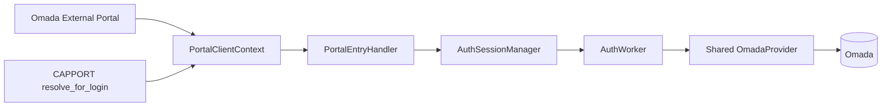
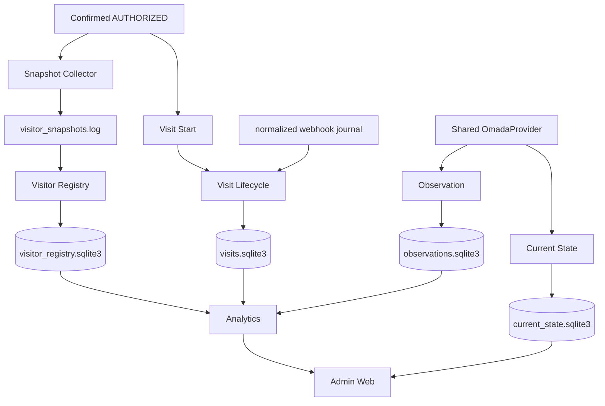

# Архитектура CaptivPortal

Status: current
Updated: 2026-09-03
Runtime implementation baseline: `main@6425988b5b4ec5ff38bf9c67c74846c3806f668f`
Runtime tree: `b669f368b0062fcb100b24758cf05e2c4b500144`

## 1. Mental model

CaptivPortal — один Python process, в котором guest authorization остаётся критическим ядром, а operational/data/product слои подключаются вокруг него с ограниченной связанностью.

```text
Authorization / Identity
        ↓
Snapshots / Webhook evidence
        ↓
Registry + Visit Lifecycle
        ↓
Observation + Current State
        ↓
Analytics
        ↓
Admin Web
```

## 2. Composition boundaries

`run.py`:
- process lifecycle;
- shared provider;
- storage/worker composition outside Flask;
- startup/shutdown order.

`app/web/web.py:create_app()`:
- Flask app;
- process-local Auth manager/executor;
- Portal/CAPPORT;
- webhook receiver/normalizer;
- portal/public traffic services and routes.

`run.py` remains the only direct executable entrypoint.

## 3. Authorization architecture



CAPPORT is discovery/identity resolution, not a second auth engine.

Ingress SSID evidence has one no-guess contract:
- CAPPORT preserves Omada `/clients` `ssid` through `CapportClient.ssid → PortalClientContext.ssid → AuthSession.ssid → VisitStartRequest.portal_ssid`;
- External Portal uses canonical `ssidName`, with legacy `ssid` fallback;
- conflicting non-empty `ssidName` and `ssid` produce unproven SSID rather than a silent choice.

Auth success is verified state, not successful POST:
`authorize → read-back verification → authStatus==2`.

The Auth layer tracks run number/token, stale-run ownership, retry, expiration and monotonic progress in process memory.

## 4. Data architecture



### Observation vs Current State

Observation answers: **what happened historically to the authorized measured population?**

Current State answers: **what active wireless clients/APs are present now in configured scope?**

Do not merge their semantics or populations.

## 5. Visit Lifecycle

`AuthSession` is not a physical Visit.

Start:
`confirmed AuthRun → VisitStartRequest → LocalVisitStartSubmitter → VisitLifecycleService → visits.sqlite3`

Close:
`normalized Omada offline journal → webhook reader → OfflineEvidence → service → match/close`.

Current schema: v2.

Write concurrency is explicit: `PriorityWriteCoordinator` serializes writers, gives Visit Start foreground priority, and queues background reader/reconciliation writers FIFO.

Reader/reconciliation health influences runtime `active/degraded`.

## 6. Analytics

Analytics remains read-only over persisted facts.

Observation / Visit / Registry analytics continue through their existing
read-service / `AnalyticsSourceGateway` boundaries.

Current State has a separate persisted read boundary:

```text
current_state.sqlite3
→ CurrentStateReadService
```

Analytics does not call Omada at query time and does not write/migrate source
databases.

## 7. Traffic analytics

### Observation-backed Network Traffic

`CurrentTrafficReadService` owns Current Network Throughput.

`HistoricalTrafficReadService` remains the single historical semantic owner for:

- Network Traffic History;
- Period Statistics;
- Peak Load;
- Traffic by AP;
- AP Traffic Share.

### Current State-backed Online Guests Traffic

`CurrentGuestTrafficReadService` is the semantic owner for Online Guests Traffic.

```text
Current State
→ CurrentStateReadService
→ CurrentGuestTrafficReadService
→ AdminQueryService
→ /admin/api/v1/sites/<site_id>/traffic/online-guests/current
→ Admin Console / Traffic
```

Canonical metric:

```text
network_traffic_online_guest_current_rate.v1
```

The module does not use Observation, Visit, Visitor Registry, AuthSession,
query-time Omada calls, or browser-side traffic calculations.

No separate collector or database was introduced.

## 8. Admin Web

Admin Web remains a read-only product surface over bounded read/query services.

Traffic now contains both:
- Observation-backed Network Traffic products;
- Current State-backed Online Guests Traffic.

Online Guests Traffic requires `admin.read.devices`, uses bounded
`limit/cursor` pagination and is not part of the historical range broker /
10-second admission path.

## 9. Shared OmadaProvider invariant

Exactly one provider per process.

The provider owns the shared OAuth token cache. `Condition(RLock)` prevents concurrent refresh storms; compare-and-invalidate prevents stale failures from deleting a newer token.

New independent provider/token manager/cache requires explicit change intent.

## 10. Dependency invariants

| From | Forbidden direct dependency |
|---|---|
| Visitor Registry | Omada API |
| Analytics | Omada API / source writes |
| Admin browser | SQLite / Omada / Loki / Grafana / internal Analytics bearer API |
| CAPPORT | separate AuthWorker/provider |
| Pending Cleaner | Registry DB |
| background worker | Flask `current_app` |
| new subsystem | independent OmadaProvider without approval |

Additional rules:
- worker creation happens in composition, not import side effects;
- writer owns its persistence schema;
- normalized webhook is canonical interpretation boundary for Visit Lifecycle.

## 11. Fail-open matrix

Core fail-closed:
- required Omada configuration/provider construction;
- final client authorization result;
- Admin authentication/network/Site policy.

Independent fail-open relative to guest auth:
- telemetry/counters;
- Snapshot/Registry;
- webhook processing;
- Visit;
- Observation;
- Current State;
- Analytics;
- Admin Web;
- Cleaner.

Fail-open means explicit `disabled`, `unavailable` or `degraded`, never invented values.

## 12. Process/thread model

Supported: one application process.

Process-local:
- AuthSessionManager;
- Auth locks/run ownership;
- auth executor;
- CAPPORT caches;
- Cleaner guard counters/cooldowns;
- Admin sessions, pre-auth CSRF and rate limiter.

Background categories:
Snapshot executor, Registry, Visit reader/reconciler, Observation client/AP/cleanup/integrity, Current State client/AP/cleanup, Cleaner, Public Traffic.

Horizontal HA/multi-process requires shared state plus leader election/inter-process coordination and therefore a separate ADR.

## 13. Startup/shutdown

Startup and shutdown order is normative in `docs/project-inventory.md` and must match current `run.py`.

A key shutdown rule is to stop Visit scheduling before draining Auth, then stop Visit accepting only after Auth executor has drained, so no accepted Auth job can enqueue a Visit start after Visit closes.

## 14. Security boundary

Current Flask proxy trust: exactly one trusted local reverse-proxy hop.

`SecretSafeRequestHandler` strips query strings from access log lines for `/admin...` and `/api/internal/analytics/v1...`.

Admin Web applies HTTPS/source allowlist/session/CSRF/rate-limit/security-header policy separately from guest authorization.

## 15. Infrastructure boundary

Repository code/docs do not own production systemd, reverse proxy, Alloy, Loki or Grafana configuration unless a separate infrastructure/deploy TASK explicitly changes them.
