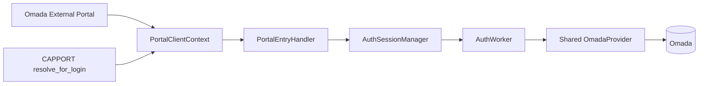
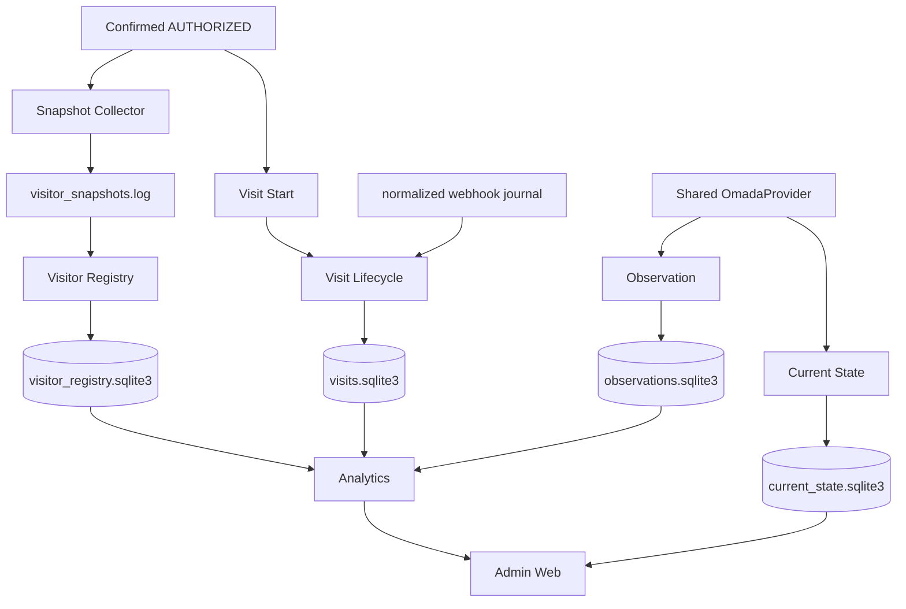

# Архитектура CaptivPortal

Status: current
Updated: 2026-09-13
Runtime implementation baseline: `main@3dc85735ddf5d05dd20733d15dfe1c22c9c4fde5`
Runtime tree: `8312658be3ba272998f46212d9bad76950e3867e`

## 1. Mental model

CaptivPortal — один Python process, в котором guest authorization остаётся критическим ядром, а operational/data/product слои подключаются вокруг него с ограниченной связанностью.

```text
Authorization / Identity
        ↓
Snapshots / Webhook evidence
        ↓
Registry + Visit Lifecycle
        ↓
Observation + Current State
        ↓
Analytics
        ↓
Admin Web
```

## 2. Composition boundaries

`run.py`:
- process lifecycle;
- shared provider;
- storage/worker composition outside Flask;
- startup/shutdown order.

`app/web/web.py:create_app()`:
- Flask app;
- process-local Auth manager/executor;
- Portal/CAPPORT;
- webhook receiver/normalizer;
- portal/public traffic services and routes.

`run.py` remains the only direct executable entrypoint.

## 3. Authorization architecture



CAPPORT is discovery/identity resolution, not a second auth engine.

Ingress SSID evidence has one no-guess contract:
- CAPPORT preserves Omada `/clients` `ssid` through `CapportClient.ssid → PortalClientContext.ssid → AuthSession.ssid → VisitStartRequest.portal_ssid`;
- External Portal uses canonical `ssidName`, with legacy `ssid` fallback;
- conflicting non-empty `ssidName` and `ssid` produce unproven SSID rather than a silent choice.

Auth success is verified state, not successful POST:
`authorize → read-back verification → authStatus==2`.

The Auth layer tracks run number/token, stale-run ownership, retry, expiration and monotonic progress in process memory.

## 4. Data architecture



### Observation vs Current State

Observation answers: **what happened historically to the authorized measured population?**

Current State answers: **what active wireless clients/APs are present now in configured scope?**

Do not merge their semantics or populations.

## 5. Visit Lifecycle

`AuthSession` is not a physical Visit.

Start:
`confirmed AuthRun → VisitStartRequest → LocalVisitStartSubmitter → VisitLifecycleService → visits.sqlite3`

Close:
`normalized Omada offline journal → webhook reader → OfflineEvidence → service → match/close`.

Current schema: v2.

Write concurrency is explicit: `PriorityWriteCoordinator` serializes writers, gives Visit Start foreground priority, and queues background reader/reconciliation writers FIFO.

Reader/reconciliation health influences runtime `active/degraded`.

## 6. Analytics

Analytics reads persisted source facts only.

```text
Observation / Visit / Registry read boundaries
        ↓
AnalyticsSourceGateway
        ↓
Quality / Wireless / Visit /
CurrentTraffic / CurrentGuestTraffic / CompletedGuestSessionTraffic /
HistoricalTraffic / HomeActivity services
```

Source boundaries require read-only SQLite/query-only contracts.

Prohibited:
- Analytics → Omada;
- Analytics → source writes/migrations;
- Admin/browser → direct raw source persistence.

### Analytics numeric portability invariant

Analytics source validation for current and historical rate evidence must be
portable across supported SQLite/Windows/Linux environments and fail closed for
non-finite values.

Canonical finite/nonnegative shape:

```text
typeof(value) IN ('integer','real')
AND value >= 0
AND COALESCE((value - value) = 0, 0)
```

Do not reintroduce a platform-sensitive max-double literal as the finite-value
authority.

## 7. Traffic analytics

### Current

`CurrentTrafficReadService` owns current Site Network Throughput semantics.

Current Network Throughput is range-insensitive.

### Historical

`HistoricalTrafficReadService` is the single historical Network Traffic semantic
owner for:

- Network Traffic History;
- Period Statistics;
- Peak Load;
- Traffic by AP;
- AP Traffic Share.

Canonical path:

```text
persisted Observation AP history
→ HistoricalTrafficReadService
→ AdminQueryService
→ product-scoped historical API projection
→ Traffic historical frontend orchestration
```

`TRAFFIC-02-PERF-01` requested-range bounded validation remains an architectural
performance invariant.

Canonical product projection order:

```text
history,statistics,peak,aps,apshare
```

Product-scoped reads execute only requested product-specific calculations while
reusing common range/integrity/source facts.

Traffic by AP and AP Traffic Share use the same Historical Traffic semantic foundation and do not introduce a second collector/database/semantic owner.

AP Traffic Share uses interval-integrated accepted AP contribution evidence (`network_traffic_ap_share.v1`), not sample counts. Internal unit is fraction and display unit is percent.

### Independent historical panel ranges

`TASK-TRAFFIC-RANGE-01` moves range intent to each historical product panel.

Each panel owns page-local:

```text
selected_range
applied_range
phase
last successful payload
error
intent generation
```

Failed selection preserves prior successful payload.

The page-local `TrafficHistoricalRequestBroker` owns intent/coalescing/response
mapping. It is **not** scheduler owner.

`CaptivPortalTrafficCoordinator` remains the sole page scheduler/lifecycle owner.

Permanent invariant:

```text
max historical HTTP requests in flight from one page = 1
```

Admission guard:

```text
HISTORICAL_TRAFFIC_REQUEST_ADMISSION_GUARD_SECONDS = 3
```

No QueryDeadline, browser-timeout or Admin-concurrency increase is part of this
architecture.

Current production baseline after `TASK-ADMIN-PROD-BASELINE-01` (2026-09-05):

```text
Admin concurrency=4
Admin query deadline=25s
dependent request timeouts=30s
historical admission guard=3s
```

### Online Guests Traffic

`TASK-TRAFFIC-07` adds a separate near-current Current State-backed Traffic
product without changing the historical Network Traffic semantic owner.

```text
Current State
→ CurrentStateReadService
→ CurrentGuestTrafficReadService
→ AdminQueryService
→ Admin API
→ Admin Console / Traffic / Online Guests Traffic
```

Semantic owner:

```text
CurrentGuestTrafficReadService
```

The calculation source is persisted Current State only. Observation, Visit,
Visitor Registry, AuthSession, query-time Omada calls and browser-side traffic
calculations are not sources for this product.

No separate collector or database was added.

### Completed Guest Session Traffic

`TASK-TRAFFIC-08` adds a separate closed-Visit historical product. It does not
change the Network Traffic historical semantic owner and does not use
`historical_traffic_projection.v1`.

Canonical read path:

```text
Visit Lifecycle DB + persisted Client Observation evidence
→ CompletedGuestSessionTrafficReadService
→ AdminQueryService
→ GET /admin/api/v1/sites/<site_id>/traffic/completed-sessions
→ Admin Console / Traffic / Completed Guest Session Traffic
```

Canonical session identity is `visit_id`. Only `status=closed` Visits enter the
population. The selected `24h | 7d` range defines the cohort by `closed_at`;
traffic attribution uses the Visit's full `[started_at, closed_at)` window and
is not clipped to the selected UI range.

The read path performs no Omada/provider polling and adds no source DB,
projection DB, schema or index.

Permanent evidence boundaries include:

```text
maximum attribution window = 86400s
maximum accepted Observation interval = 180s
AP roaming allowed
uptime continuity required
numeric 0 = evidence
null = unknown/unavailable
```

Visits longer than 24 hours remain visible but return unavailable traffic
evidence with `attribution_window_exceeds_supported_max`.

### Consolidated Traffic Evidence

`TASK-TRAFFIC-09` adds a standalone Admin Traffic evidence area after the eight
existing Traffic products.

It does **not** add a ninth business metric and does not become a new semantic
owner.

Composition path:

```text
accepted semantic owners
→ TrafficEvidenceAggregator
→ bounded Admin application aggregation
→ safe Admin serialization
→ admin.read.v1
→ Admin Traffic Evidence UI
```

`TrafficEvidenceAggregator` is composition-only. Canonical semantic owners remain:

```text
current            → CurrentTrafficReadService
history            → HistoricalTrafficReadService
statistics         → HistoricalTrafficReadService
peak               → HistoricalTrafficReadService
aps                → HistoricalTrafficReadService
apshare            → HistoricalTrafficReadService
online_guests      → CurrentGuestTrafficReadService
completed_sessions → CompletedGuestSessionTrafficReadService
```

Maximum read groups per Evidence request:

```text
1. Current
2. Historical
3. Online Guests
4. Completed Sessions
```

The five Historical evidence products share one bounded Historical read.
Completed Sessions Evidence reads only the first page (`limit=100`,
`cursor=None`) and must expose truthful `returned_count` / `has_more` scope.

Permanent boundaries:

```text
no N+1
no query-time Omada/provider polling
no new collector
no new polling loop
no new DB/persistence/schema
no new acquisition process
no new worker
no new scheduler
no synthetic overall score / GOOD-BAD / normalized quality algorithm
```

Permanent evidence rule:

```text
missing / unknown / stale / insufficient / unavailable != 0
```

Traffic Evidence has an independent `24h | 7d` selector, default `24h`; it does
not mutate any existing Traffic product's selected/applied range.

### Device Current Context

`TASK-DEVICE-CARD-01` adds a separate current evidence read path to the existing
Device Detail page without changing the historical Device Card contract.

Permanent semantic split:

```text
Historical Device Context
- Identity
- Latest Site Snapshot
- Latest Client Observation
- Recent Visits

Current Device Context
- Presence
- Authorization
- Network
- Radio
- Controller
- Current Guest Traffic
- Evidence / Freshness
```

Canonical read path:

```text
Site-safe Device boundary
→ server-side canonical MAC
→ CurrentStateReadService.get_current_client(...)
→ optional exact-client CurrentGuestTrafficReadService projection
→ AdminQueryService.device_current_context(...)
→ admin.device.current.v1
→ Device Detail
```

Endpoint:

```text
GET /admin/api/v1/sites/<site_id>/devices/<device_id>/current
capability = admin.read.device
contract = admin.device.current.v1
```

Current evidence is not reconstructed from historical Device/Visit/Observation
facts.

Presence semantics:

```text
fresh + complete managed scope + client present
→ online

fresh + complete managed scope + client absent
→ offline

stale / unavailable / invalid timestamp / untrusted current evidence
→ unknown
```

Permanent:

```text
stale != offline
unavailable != offline
invalid timestamp != offline
```

Authorization is current-state evidence (`authorized | pending | other |
unknown`).

Current Guest Traffic is applicable only to a current authorized guest. Traffic
projection failure is local to Traffic evidence and does not erase Presence,
Authorization, Network or Radio. Numeric zero is valid evidence.

```text
0 Mbps != null
0 Mbps != unavailable
```

If Current State itself cannot be read, the Current endpoint fails in a controlled
way; historical Device Detail remains a separate read path.

Invalid timestamp evidence is sanitized to semantic Unknown rather than exposed
as unsafe timestamp data.

This feature adds:

```text
no query-time Omada/provider call
no Loki/Grafana/external Analytics browser call
no DB/schema/index/migration
no write path
no worker/scheduler/polling loop
```

### Traffic Projection lifecycle consistency — accepted production architecture

The P0 lifecycle incident is closed.

Canonical root-cause class remains:

```text
RETENTION CLEANUP / FROZEN RECONCILE WINDOW RACE
```

Permanent architecture:

```text
Observation
→ authoritative Historical Traffic evidence

Traffic Projection
→ derived / rebuildable read model
```

A frozen reconcile proof window must be protected from moving retention cleanup.
Divergence remains fail-closed; inconsistent Projection is not served merely to
restore availability.

Accepted `FINAL-R5 + FIX-1` adds/hardens:

```text
durable cleanup fence
durable repair continuation
health observer / telemetry
immutable loaded artifact identity
bounded shutdown
```

Persisted `rebuilding + repair_delete` is active durable repair lineage. After a
restart/interruption, the normal Projection worker continues the accepted
`repair_site()` lifecycle rather than losing the repair and returning to normal
incremental maintenance.

Production repair must use the canonical repair lifecycle. Manual Projection
row insertion, manual healthy reset and authoritative Observation mutation
remain forbidden.

Production acceptance proved:

```text
fixed artifact=7472d67274ea5aaea2a20df6b613b78d5bb70f42
tree=3950df6d400049ed16a823032c6740396cd61137
durable repair continuation=PASS
full reconcile=PASS
deep audit=PASS
health=healthy
backlog=0
Historical Traffic Web path=PASS
worker=active + enabled
```

## Canonical Device Type lexical key

Device Type keeps two deliberately different representations:

```text
device_type     = raw/source/display evidence
device_type_key = canonical machine/presentation key
```

Canonical normalization owner:

```text
app/common/device_type.py
normalize_device_type_key()
DEVICE_TYPE_KEY_MAX_UTF8_BYTES=128
```

The key is read-time lexical normalization of one source value: trim, strict
UTF-8 validation, bounded length, then `casefold()` and the same validation
again.

Permanent exclusions:

```text
Unicode normalization=NO
semantic mapping=NO
inference from other facts=NO
separator collapsing=NO
truncation=NO
```

The canonical key is additive. It does not replace stored/raw `device_type` and
does not create a device-classification layer.

Admin/Web consumers must use the server-provided key for machine decisions.
Browser-owned trim/lower/casefold/Unicode normalization/inference is forbidden.

## Home operational read models

Home contains multiple independent product-safe read models; they are not a
second acquisition plane.

```text
Home System Health
→ Admin composition of existing bounded runtime/read evidence
→ no request-time Omada probe / Health DB / repair worker

Home AP-24H
→ Current State + Observation persisted evidence
→ rolling 24h / 96 x 15-minute buckets
→ no new persistence or query-time Omada

Home AP-24H telemetry
→ existing AP-24H read contract
→ existing Authorization Telemetry sink
→ separately feature-gated / fail-open
```

Repository defaults keep these optional Home surfaces disabled. Production
feature-state is operational evidence, not inferred from repository defaults.

## 8. Admin Web

Guest auth and Admin auth remain separate.

Current pages:
Home, Devices, Device Detail, Visits, Observations, Traffic.

Traffic production-current functional surface:
- Current Network Throughput;
- Online Guests Traffic;
- Completed Guest Session Traffic;
- Network Traffic History;
- Period Statistics;
- Peak Load;
- Traffic by AP;
- AP Traffic Share.

After these eight product surfaces, Admin Traffic contains the standalone
`TRAFFIC EVIDENCE` area from TASK-TRAFFIC-09.

Network History, Statistics, Peak, Traffic by AP and AP Share have independent
`24h | 7d` selectors. Completed Guest Session Traffic also supports `24h | 7d`
for its closed-at cohort. Current Network Throughput and Online Guests Traffic
remain range-insensitive.

Canonical historical API remains:

```text
GET /admin/api/v1/sites/<site_id>/traffic/history
```

Canonical projection is `products=`; legacy `include=` remains temporary
backward compatibility. AP-only response uses `ap_bucket_axis`.

The current Traffic visual arrangement is not a final design invariant; later
UI/design work may rearrange/polish cards without changing semantic owners.

Forbidden browser paths:
- direct SQLite;
- Omada;
- Loki/Grafana;
- internal Analytics bearer API.

## 9. Shared OmadaProvider invariant

Exactly one provider per process.

The provider owns the shared OAuth token cache. `Condition(RLock)` prevents concurrent refresh storms; compare-and-invalidate prevents stale failures from deleting a newer token.

New independent provider/token manager/cache requires explicit change intent.

## 10. Dependency invariants

| From | Forbidden direct dependency |
|---|---|
| Visitor Registry | Omada API |
| Analytics | Omada API / source writes |
| Admin browser | SQLite / Omada / Loki / Grafana / internal Analytics bearer API |
| CAPPORT | separate AuthWorker/provider |
| Pending Cleaner | Registry DB |
| background worker | Flask `current_app` |
| new subsystem | independent OmadaProvider without approval |

Additional rules:
- worker creation happens in composition, not import side effects;
- writer owns its persistence schema;
- normalized webhook is canonical interpretation boundary for Visit Lifecycle.

## 11. Fail-open matrix

Core fail-closed:
- required Omada configuration/provider construction;
- final client authorization result;
- Admin authentication/network/Site policy.

Independent fail-open relative to guest auth:
- telemetry/counters;
- Snapshot/Registry;
- webhook processing;
- Visit;
- Observation;
- Current State;
- Analytics;
- Admin Web;
- Cleaner.

Fail-open means explicit `disabled`, `unavailable` or `degraded`, never invented values.

## 12. Process/thread model

Supported: one application process.

Process-local:
- AuthSessionManager;
- Auth locks/run ownership;
- auth executor;
- CAPPORT caches;
- Cleaner guard counters/cooldowns;
- Admin sessions, pre-auth CSRF and rate limiter.

Background categories:
Snapshot executor, Registry, Visit reader/reconciler, Observation client/AP/cleanup/integrity, Current State client/AP/cleanup, Cleaner, Public Traffic.

Horizontal HA/multi-process requires shared state plus leader election/inter-process coordination and therefore a separate ADR.

## 13. Startup/shutdown

Startup and shutdown order is normative in `docs/project-inventory.md` and must match current `run.py`.

A key shutdown rule is to stop Visit scheduling before draining Auth, then stop Visit accepting only after Auth executor has drained, so no accepted Auth job can enqueue a Visit start after Visit closes.

## 14. Security boundary

Current Flask proxy trust: exactly one trusted local reverse-proxy hop.

`SecretSafeRequestHandler` strips query strings from access log lines for `/admin...` and `/api/internal/analytics/v1...`.

Admin Web applies HTTPS/source allowlist/session/CSRF/rate-limit/security-header policy separately from guest authorization.

## 15. Infrastructure boundary

Repository code/docs do not own production systemd, reverse proxy, Alloy, Loki or Grafana configuration unless a separate infrastructure/deploy TASK explicitly changes them.
