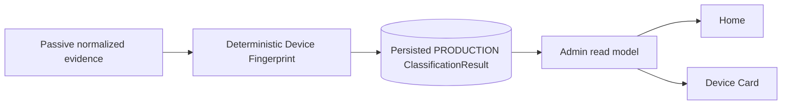

# Admin Web

Status: current module contract
Updated: 2026-10-04
Baseline: `main@7c7c0919c3e546f499b5252ea9479d32c8f494d7`

## Boundary

Admin authentication is separate from guest Portal authentication.

Current UI pages:
Home, Devices, Device Detail, Visits, Observations, Traffic.

## Browser data path

```text
browser
→ same-origin /admin + /admin/api/v1
→ AdminQueryService/read gateways
→ persisted read services
```

Forbidden: direct SQLite, Omada, Loki, Grafana or internal Analytics bearer API.

## Security

When enabled: HTTPS/source network/Site allowlist, external password hash,
pre-auth CSRF, login limits, bounded process-local sessions, idle/absolute timeout,
secure cookies, CSP/security headers and no-store.

## Query boundary

`AdminQueryService` owns Site authorization, bounded concurrency/deadline and safe
error mapping.

## Task-06 — advisory Device Fingerprint presentation

Home Online Devices keeps controller `device_type` / `device_type_key` evidence
unchanged. **Platform** is Controller-first, with resolved PRODUCTION Fingerprint
fallback only when the Controller key is null or `unknown`.
The separate **Type** column comes only from persisted PRODUCTION fingerprint
`device_class_result`. Controller Platform never backfills fingerprint Type.
Home exposes compact Type and Platform projections from the same batch, not
diagnostics; effective Platform precedence is composed on the server.

Device Card labels controller/source data **Controller Platform** and adds a
separate **Fingerprint Information** card: Status, Classified at, Type,
Fingerprint Platform, Manufacturer and Model Family. Resolved dimensions show
their unchanged support level. Expandable Fingerprint details preserve canonical
values, real dimension status/support, supporting/contradicting/not-evaluable
origin groups, out-of-scope references, explanation codes and knowledge refs.
Controller Platform and Fingerprint Platform may disagree; no reconciliation is
performed and no raw JSON/internal runtime identifiers appear in the summary.

The authoritative source is persisted PRODUCTION `ClassificationResult`, read
through `DeviceFingerprintClassificationReadService` and the shared typed
presentation adapter. A newer PRE_ACCEPTANCE_CANDIDATE cannot shadow production.
Home uses one bounded batch (at most 250 input MACs), one read-only connection
and transaction, and two bounded SELECTs rather than individual device reads.
All access remains within existing Site-authorized Admin APIs.

No authoritative result is shown as `—`; a completed unresolved dimension is
shown as `Unknown`, with its exact status retained in details. Fingerprint is
advisory: an unavailable/corrupt classification DB yields Home Type `—`, preserves
usable Controller Platform (otherwise honest `Unknown` / `—`), and
Device Card fingerprint Status `Unavailable`, without failing core page data.
The UI does not classify, query integration jobs, mutate persistence or trigger
production activation.

## Device Detail — Historical vs Current

Device Detail keeps two independent evidence domains.

Historical Device context remains:

```text
Identity
Latest Site Snapshot
Latest Client Observation
Recent Visits
```

`TASK-DEVICE-CARD-01` adds the separate read-only:

```text
Current Device Context
```

with:

```text
Presence
Authorization
Network
Radio
Controller
Current Guest Traffic
Evidence / Freshness
```

Feature state:

```text
repository default:
WEB_ADMIN_DEVICE_CURRENT_CONTEXT_ENABLED=false

Owner-confirmed production:
WEB_ADMIN_DEVICE_CURRENT_CONTEXT_ENABLED=true
```

Endpoint:

```text
GET /admin/api/v1/sites/<site_id>/devices/<device_id>/current
```

Security / contract:

```text
capability=admin.read.device
DTO=admin.device.current.v1
Device is resolved through existing Site-safe Device boundary
canonical MAC is resolved server-side
query parameters=none
```

Canonical path:

```text
persisted Site-safe Device identity
→ canonical MAC
→ CurrentStateReadService exact current client
→ optional pinned exact-client CurrentGuestTrafficReadService
→ AdminQueryService
→ strict Admin serializer
→ same-origin Device Detail
```

No browser/API request calls Omada, Loki, Grafana or the internal Analytics
Bearer API.

Presence:

```text
online  = present in fresh + complete managed Current State scope
offline = absent from fresh + complete managed Current State scope
unknown = stale/unavailable/untrusted/invalid current evidence
```

Historical evidence alone never proves `offline`.

```text
stale != offline
unavailable != offline
invalid timestamp != offline
```

Authorization values are current evidence:

```text
authorized
pending
other
unknown
```

Current Guest Traffic is only applicable to a current authorized guest. Pending
or other current clients do not receive fabricated rate data.

Traffic failure is isolated:

```text
Traffic technical failure
→ endpoint remains a valid Current response
→ Presence/Authorization/Network/Radio remain available
→ failure_reason is local to current_guest_traffic
```

A Current State execution/read failure is different and maps to the controlled
Current endpoint failure path (`503` where source/query availability fails).
Historical Device Card loading remains independent.

Numeric zero is a valid value:

```text
0 Mbps != —
0 Mbps != missing
0 Mbps != unavailable
```

Invalid Current State timestamps are sanitized to safe semantics:

```text
HTTP success for semantic evidence
Presence=unknown
Observed=null/—
Age=null/—
Freshness=unavailable
Reason=invalid_timestamp
```

Frontend lifecycle:

```text
one Current load when Device Detail opens
manual Refresh supported
automatic Current polling absent
no overlapping Current request
Historical and Current load independently
Current failure does not erase Historical
```

## Devices / Device Type / Home presentation — current state

```text
TASK-DEVICE-LIST-CONTEXT-01=CLOSED / PRODUCTION ACTIVE
TASK-WEB-DEVICE-UI-01=CLOSED / PRODUCTION ACTIVE
TASK-WEB-HOME-ONLINE-DEVICE-PRESENTATION-01=CLOSED / PRODUCTION CURRENT
TASK-DEVICE-TYPE-NORMALIZATION-01=CLOSED / PRODUCTION ACTIVE
TASK-WEB-DEVICE-TYPE-PRESENTATION-01=CLOSED / PRODUCTION ACCEPTANCE PASS
PR #110 / #118 / #119 / #120=MERGED
```

Global Online-first remains backend-owned before pagination.

<!-- DEVICE-FINGERPRINT-PRODUCTION-KB:BEGIN -->
## Device Fingerprint — current production

Device Fingerprint is now a production-active passive/advisory classification
capability, not only an evidence foundation.

```text
repository / production HEAD = 7c7c0919c3e546f499b5252ea9479d32c8f494d7
repository / production tree = dbf3e3804931d637ef1ec569128746ebce5c141a
PR #178 = MERGED
TASK-DEVICE-FINGERPRINT-04 = CLOSED / ACCEPTED
TASK-DEVICE-FINGERPRINT-05 = CLOSED / INTEGRATED
TASK-DEVICE-FINGERPRINT-05-PERF-01 = CLOSED
TASK-DEVICE-FINGERPRINT-06 = PRODUCTION PASS / DEPLOYED
captive-portal.service = active
fingerprint-classification.service = active
```

High-level flow:



Current Home product terminology:

```text
Type     = fingerprint device_class
Platform = Controller-first; resolved PRODUCTION Fingerprint fallback only
```

Controller Platform never backfills fingerprint Type. Device Card keeps
**Controller Platform** separate from **Fingerprint Information**. No-result is
`—`, a completed unresolved dimension is `Unknown`, and a fingerprint read failure
is `Unavailable`/`—` without failing core Admin data.

Detailed architecture and all engineering diagrams:
`docs/modules/device-fingerprint.md`.
<!-- DEVICE-FINGERPRINT-PRODUCTION-KB:END -->

## Admin Web local asset library — historical production provenance

```text
TASK-WEB-ASSET-LIBRARY-01=CLOSED / PRODUCTION PASS
TASK-WEB-ASSET-LIBRARY-01-FIX-ANDROID-PRESENTATION=CLOSED / PRODUCTION PASS
PR #113=MERGED
PR #114=MERGED / PRODUCTION VERIFIED
historical production checkpoint HEAD=3dc85735ddf5d05dd20733d15dfe1c22c9c4fde5
historical production checkpoint tree=8312658be3ba272998f46212d9bad76950e3867e
```

The repository-local Android asset remains:

```text
app/admin_web/static/icons/platforms/android.svg
SHA256=2f2411f1f05522e90049f8cbb06105fb553057efeadf772cdcc3ae24bbc8a6cc
```

The Asset Library tasks remain valid provenance/history for introducing and
fixing that asset. Their former raw browser predicate is historical acceptance
evidence only.

Current machine decision after PR #119/#120:

```javascript
device_type_key === "android"
```

Raw `device_type` remains source/display evidence. Current Admin Web does not
trim/lower/casefold/Unicode-normalize or infer Device Type in the browser.

## Controller Platform lexical contract — current production compatibility

```text
TASK-DEVICE-TYPE-NORMALIZATION-01=CLOSED / MERGED / DEPLOYED / PRODUCTION ACTIVE
TASK-WEB-DEVICE-TYPE-PRESENTATION-01=CLOSED / MERGED / DEPLOYED / PRODUCTION ACCEPTANCE PASS
PR #119=MERGED
PR #120=MERGED
historical production checkpoint HEAD=3dc85735ddf5d05dd20733d15dfe1c22c9c4fde5
historical production checkpoint tree=8312658be3ba272998f46212d9bad76950e3867e
```

Canonical ownership:

```text
raw/source/display value = device_type
machine/presentation key = device_type_key
normalization owner       = app/common/device_type.py
```

`device_type_key` is a bounded lexical key derived with `strip()` + `casefold()`
and strict UTF-8 validation. It does not perform Unicode normalization, semantic
mapping, inference, separator collapsing or truncation.

The browser consumes the server-provided key. It must not derive a Device Type
key from raw `device_type`.

Controller-only Android presentation (including Device Card) remains strictly:

```javascript
device_type_key === "android"
```

Home instead uses the server-composed effective key (exact comparison
`platform_presentation.key === "android"`), including resolved Fingerprint
fallback. Controller lexical normalization itself is unchanged.

The earlier browser-owned `trim().toLowerCase()` Android predicate remains
historical evidence of TASK-WEB-ASSET-LIBRARY-01/FIX and is **superseded as a
current contract** by PR #119/#120.

The Android SVG remains repository-local:

```text
app/admin_web/static/icons/platforms/android.svg
SHA256=2f2411f1f05522e90049f8cbb06105fb553057efeadf772cdcc3ae24bbc8a6cc
```


## Device Card Controller Platform — current presentation

Device Card keeps raw and canonical roles separate:

```text
device_type     -> source/display text
device_type_key -> machine/presentation decision
```

The frontend does not trim, lowercase, casefold, Unicode-normalize or infer
Device Type.

A detail object that contains its own `device_type_key` owns that presentation
decision. `Latest Site snapshot` may use `identity.device_type_key` when the
snapshot raw type and identity raw type belong to the same Device record.

`device_type_key` itself is not rendered as a separate user-facing field.


## Home Online Devices — current presentation

Current repository Home columns (deployment is separately authorized):

```text
Device / MAC
Type
Platform
Auth
IP
AP
Band
RSSI
SNR
Uptime
Traffic
```

`Type` is the compact Device Fingerprint `device_class` presentation from the
latest authoritative PRODUCTION `ClassificationResult`.

`Platform` uses Controller first when `device_type_key` is neither null nor
`unknown`. Otherwise only a resolved authoritative PRODUCTION Fingerprint
platform may supply the value. Raw `device_type` and canonical `device_type_key`
are unchanged; no other controller keys are reinterpreted. The server returns
`platform_presentation = {source, value, key}` with source `controller`,
`fingerprint` or `none`. Home renders that value and uses only exact effective
key `android` for the existing icon, without a visible provenance badge or
browser normalization.

Explicit Controller Unknown or completed unresolved Fingerprint renders
`Unknown`; absent Controller plus no-result/unavailable Fingerprint renders
`—`. Type never falls back to Controller. Both compact Fingerprint projections
come from the same bounded, Site-scoped PRODUCTION batch; no second query or
per-device read is added. Device Card continues to show Controller Platform and
Fingerprint Platform separately, even when they disagree.

`HOME-UX-REFINEMENT-01` moves Online Devices, including filters and pagination,
before Traffic Now; the remaining panels keep their relative order. Only Home
`.live-metrics` summary cards have denser spacing and aligned values; responsive
breakpoints and table scrolling remain. Traffic Now adds `↓`, `↑`, `↓↑` and
independent numeric tones: <=50 Mbps green, >50 through 70 yellow, >70 red.
Unavailable `—` is neutral. Traffic by AP, source/freshness/coverage and Traffic
page semantics are unchanged. This describes repository implementation, not a
new production deployment or visual-acceptance claim.

```text
Type != Platform
Controller Platform NEVER backfills Fingerprint Type
```

Fingerprint no-result is `—`; a completed unresolved device class is `Unknown`.
A fingerprint read failure remains fail-soft and does not remove the rest of the
Home row.

SNR is presentation-only:

```text
>=25      good    #10b956
15..24    warning #f2c20d
<15       danger  #ed3038
null      neutral / —
```

RSSI and SNR are independent. No combined score or backend quality
classification exists.

Home-specific geometry and tones are scoped to:

```css
.live-section[aria-labelledby="devices-now-title"]
```

and do not redefine unrelated `.live-table` surfaces.

## Home

Home Live reads Current State. Home Traffic reads Current Traffic. Home Activity
reads Visit Lifecycle analytics.

### System Health

Home System Health is implemented through the Admin read/composition boundary and
uses existing runtime/read evidence only. Repository default is disabled; this
document does not infer the current production flag value.

### Home AP-24H

Home AP-24H is implemented as a rolling 24-hour read model over Current State +
Observation evidence (96 x 15-minute buckets). AP-24H telemetry is separately
feature-gated and uses existing Authorization Telemetry. Repository defaults for
both AP-24H and its telemetry are disabled; production flags remain host-verified.

## Traffic Section

Repository defaults:

```text
WEB_ADMIN_TRAFFIC_ENABLED=false
WEB_ADMIN_TRAFFIC_HISTORY_ENABLED=false
WEB_ADMIN_TRAFFIC_STATISTICS_ENABLED=false
WEB_ADMIN_TRAFFIC_PEAK_ENABLED=false
WEB_ADMIN_TRAFFIC_BY_AP_ENABLED=false
WEB_ADMIN_TRAFFIC_INDEPENDENT_RANGES_ENABLED=false
WEB_ADMIN_TRAFFIC_AP_SHARE_ENABLED=false
WEB_ADMIN_TRAFFIC_ONLINE_GUESTS_ENABLED=false
WEB_ADMIN_TRAFFIC_COMPLETED_SESSIONS_ENABLED=false
WEB_ADMIN_TRAFFIC_EVIDENCE_ENABLED=false
```

Owner-confirmed production state:

```text
WEB_ADMIN_TRAFFIC_ENABLED=true
WEB_ADMIN_TRAFFIC_HISTORY_ENABLED=true
WEB_ADMIN_TRAFFIC_STATISTICS_ENABLED=true
WEB_ADMIN_TRAFFIC_PEAK_ENABLED=true
WEB_ADMIN_TRAFFIC_BY_AP_ENABLED=true
WEB_ADMIN_TRAFFIC_INDEPENDENT_RANGES_ENABLED=true
WEB_ADMIN_TRAFFIC_AP_SHARE_ENABLED=true
WEB_ADMIN_TRAFFIC_ONLINE_GUESTS_ENABLED=true
WEB_ADMIN_TRAFFIC_COMPLETED_SESSIONS_ENABLED=true
WEB_ADMIN_TRAFFIC_EVIDENCE_ENABLED=true
```

Current functional panels:

1. Current Network Throughput;
2. Online Guests Traffic;
3. Completed Guest Session Traffic;
4. Network Traffic History;
5. Period Statistics;
6. Peak Load;
7. Traffic by AP;
8. AP Traffic Share.

After these eight products, the page contains the standalone `TRAFFIC EVIDENCE`
area from TASK-TRAFFIC-09.

Current Network Throughput is range-insensitive.

History, Statistics, Peak, Traffic by AP and AP Traffic Share each own an independent `24h | 7d`
selected/applied range when independent ranges are active.

## Historical endpoint

Canonical endpoint:

```text
GET /admin/api/v1/sites/<site_id>/traffic/history
```

Canonical projection:

```text
products=history,statistics,peak,aps,apshare
```

Tokens are optional by product but must remain in canonical order. Invalid,
duplicate, out-of-order, unknown, empty/whitespace projections return `400`.
`include + products` returns `400`.

Legacy `include=` remains temporary backward compatibility.

Product-scoped requests must not calculate unrelated product-specific projections.

AP-only requests use compact self-contained `ap_bucket_axis`.

## Historical frontend ownership

Canonical page-local mapping layer:

```text
TrafficHistoricalRequestBroker
```

It owns historical panel intents, coalescing, selected/applied state coordination,
generation checks and response mapping.

It is **not** scheduler owner.

Canonical scheduler/lifecycle owner:

```text
CaptivPortalTrafficCoordinator
```

Permanent invariant:

```text
max historical HTTP requests in flight from one page = 1
```

Dispatch behavior:
- initial all-24h products may coalesce;
- one panel click queues only its product;
- same-panel pending intents collapse to latest;
- same-range products may coalesce;
- explicit panel intent outranks queued Global Refresh;
- Global Refresh groups selected ranges and historical work is sequential;
- superseding one panel does not abort a shared in-flight batch;
- response applies only if generation and selected range are still current.

## Per-panel state

Every historical panel owns:

```text
selected_range
applied_range
phase
last successful payload
error
intent generation
```

Failed range switches preserve the last successful payload/applied range.

Reload defaults every historical panel to `24h`.

Range state is page-local only; no localStorage, sessionStorage, cookie, URL or
server persistence exists.

## Admission guard

Current invariant:

```text
HISTORICAL_TRAFFIC_REQUEST_ADMISSION_GUARD_SECONDS = 3
```

Eligibility:

```text
next_dispatch >= max(
    previous_request_completion,
    previous_dispatch + 3s,
    coordinator backoff / Retry-After / lifecycle eligibility
)
```

`waiting` means queued/admission-blocked. `loading` means an actual historical
HTTP request is in flight.

Manual retry, Global Refresh and 503 do not bypass the guard.

## Traffic by AP

Current production Traffic by AP uses `network_traffic_by_ap.v1` in Mbps and shares the historical Network Traffic semantic foundation.

## AP Traffic Share

Current production AP Traffic Share uses `network_traffic_ap_share.v1`; internal unit is `fraction`, display unit is `percent`, and product token is `apshare`.

AP Share requires Admin + Traffic + History + Independent Ranges. It has its own page-local `24h | 7d` selected/applied range and uses the existing broker/coordinator/admission path.

## Online Guests Traffic

Canonical endpoint:

```text
GET /admin/api/v1/sites/<site_id>/traffic/online-guests/current
```

Query contract:

```text
limit default=50
limit max=200
cursor=opaque continuation cursor
capability=admin.read.devices
```

Canonical path:

```text
Current State
→ CurrentStateReadService
→ CurrentGuestTrafficReadService
→ AdminQueryService
→ Admin API
```

`CurrentGuestTrafficReadService` is the semantic owner. The browser validates and
renders payloads; it does not calculate current guest rates.

Online Guests Traffic is range-insensitive and does not use the historical
`TrafficHistoricalRequestBroker` / 3-second admission guard.

Online Guest means controller-reported active authorized wireless guest in the
latest accepted Current State guest scope, not independent proof of
instantaneous physical RF presence.

## Completed Guest Session Traffic

Canonical endpoint:

```text
GET /admin/api/v1/sites/<site_id>/traffic/completed-sessions
```

Query contract:

```text
range=24h|7d
default range=24h
limit default=100
limit max=100
cursor=opaque keyset cursor
sort=closed_at DESC, visit_id DESC
sort contract=closed_at_desc_visit_id_desc.v1
```

Canonical path:

```text
persisted Visit Lifecycle + Client Observation evidence
→ CompletedGuestSessionTrafficReadService
→ AdminQueryService
→ Admin API
```

Only closed Visits are returned; cohort selection is by `closed_at`. The browser
does not calculate session traffic. `0 B` is rendered for numeric zero and `—`
for unknown/null evidence.

Public evidence labels:

```text
Complete sampled evidence
Partial evidence
Insufficient data
Unavailable
```

The product does not poll Omada/provider at query time and does not read
`historical_traffic_projection.v1`.

## Consolidated Traffic Evidence

Canonical endpoint:

```text
GET /admin/api/v1/sites/<site_id>/traffic/evidence?range=24h|7d
```

Contracts:

```text
outer API = admin.read.v1
inner Evidence = admin.traffic.evidence.v1
required capabilities = admin.read.overview + admin.read.devices
```

Feature flag:

```text
repository default: WEB_ADMIN_TRAFFIC_EVIDENCE_ENABLED=false
production:         WEB_ADMIN_TRAFFIC_EVIDENCE_ENABLED=true
```

When feature OFF, the Evidence feature route is unavailable.

Canonical product IDs, in order:

```text
current
history
statistics
peak
aps
apshare
online_guests
completed_sessions
```

Evidence has its own independent `24h | 7d` range, default `24h`; it does not
change existing panel ranges.

`TrafficEvidenceAggregator` is composition-only and performs at most four
canonical read groups: Current, Historical, Online Guests, Completed Sessions.
Historical evidence shares one bounded Historical read. Completed Sessions uses
only first page `limit=100, cursor=None` and serializes truthful
`returned_count` / `has_more`.

The aggregator does not define product semantics. It reuses the existing semantic
owners and adds no N+1, query-time Omada polling, collector, worker, polling
loop, scheduler, DB, persistence, schema or acquisition process.

Traffic Evidence introduces no synthetic overall score, universal GOOD/BAD or
normalized quality metric.

```text
missing / unknown / stale / insufficient / unavailable != 0
```

## UI/design status

Current functional Device Detail / Traffic presentation is production-current,
but presentation is not permanently frozen.

Separate follow-on work:

```text
TASK-WEB-DEVICE-UI-01
STATUS=CLOSED / PRODUCTION ACTIVE
MERGED=YES / PR #110
DEPLOYED=YES / PRODUCTION ACTIVE
```

That task is historical/current production foundation for the Devices presentation. Later Home and Device Type presentation work is tracked separately by PR #118/#120 and is also production-current.

Current Traffic panel placement also remains production-current functional
composition, not a permanently frozen final Traffic visual design.

## Semantic restrictions

Network Throughput/History/Statistics/Peak/Traffic by AP/AP Traffic Share are
AP/network evidence and must not be relabelled as guest/WAN/billing traffic.
Completed Guest Session Traffic is a separate Visit-scoped guest-session domain.

## Lifecycle

Admin Web has no business-write worker. Failure of Admin Web remains fail-open
relative to guest authorization.
