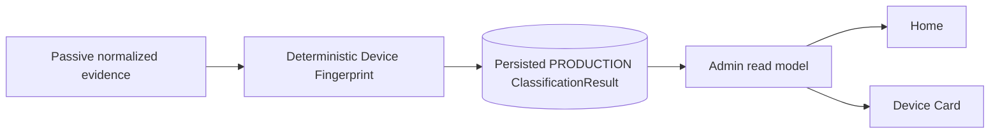

# Admin Web

Status: current module contract
Updated: 2026-10-04
Baseline: `main@7c7c0919c3e546f499b5252ea9479d32c8f494d7`

## Boundary

Admin authentication is separate from guest Portal authentication.

Current UI pages:
Home, Devices, Device Detail, Visits, Observations, Traffic.

## Browser data path

```text
browser
→ same-origin /admin + /admin/api/v1
→ AdminQueryService/read gateways
→ persisted read services
```

Forbidden: direct SQLite, Omada, Loki, Grafana or internal Analytics bearer API.

## Security

When enabled: HTTPS/source network/Site allowlist, external password hash,
pre-auth CSRF, login limits, bounded process-local sessions, idle/absolute timeout,
secure cookies, CSP/security headers and no-store.

## Query boundary

`AdminQueryService` owns Site authorization, bounded concurrency/deadline and safe
error mapping.

## Task-06 — advisory Device Fingerprint presentation

Home Online Devices keeps controller `device_type` / `device_type_key` evidence
unchanged. **Platform** is Controller-first, with resolved PRODUCTION Fingerprint
fallback only when the Controller key is null or `unknown`.
The separate **Type** column comes only from persisted PRODUCTION fingerprint
`device_class_result`. Controller Platform never backfills fingerprint Type.
Home exposes compact Type and Platform projections from the same batch, not
diagnostics; effective Platform precedence is composed on the server.

Device Card labels controller/source data **Controller Platform** and adds a
separate **Fingerprint Information** card: Status, Classified at, Type,
Fingerprint Platform, Manufacturer and Model Family. Resolved dimensions show
their unchanged support level. Expandable Fingerprint details preserve canonical
values, real dimension status/support, supporting/contradicting/not-evaluable
origin groups, out-of-scope references, explanation codes and knowledge refs.
Controller Platform and Fingerprint Platform may disagree; no reconciliation is
performed and no raw JSON/internal runtime identifiers appear in the summary.

The authoritative source is persisted PRODUCTION `ClassificationResult`, read
through `DeviceFingerprintClassificationReadService` and the shared typed
presentation adapter. A newer PRE_ACCEPTANCE_CANDIDATE cannot shadow production.
Home uses one bounded batch (at most 250 input MACs), one read-only connection
and transaction, and two bounded SELECTs rather than individual device reads.
All access remains within existing Site-authorized Admin APIs.

No authoritative result is shown as `—`; a completed unresolved dimension is
shown as `Unknown`, with its exact status retained in details. Fingerprint is
advisory: an unavailable/corrupt classification DB yields Home Type `—`, preserves
usable Controller Platform (otherwise honest `Unknown` / `—`), and
Device Card fingerprint Status `Unavailable`, without failing core page data.
The UI does not classify, query integration jobs, mutate persistence or trigger
production activation.

## Device Detail — Historical vs Current

Device Detail keeps two independent evidence domains.

Historical Device context remains:

```text
Identity
Latest Site Snapshot
Latest Client Observation
Recent Visits
```

`TASK-DEVICE-CARD-01` adds the separate read-only:

```text
Current Device Context
```

with:

```text
Presence
Authorization
Network
Radio
Controller
Current Guest Traffic
Evidence / Freshness
```

Feature state:

```text
repository default:
WEB_ADMIN_DEVICE_CURRENT_CONTEXT_ENABLED=false

Owner-confirmed production:
WEB_ADMIN_DEVICE_CURRENT_CONTEXT_ENABLED=true
```

Endpoint:

```text
GET /admin/api/v1/sites/<site_id>/devices/<device_id>/current
```

Security / contract:

```text
capability=admin.read.device
DTO=admin.device.current.v1
Device is resolved through existing Site-safe Device boundary
canonical MAC is resolved server-side
query parameters=none
```

Canonical path:

```text
persisted Site-safe Device identity
→ canonical MAC
→ CurrentStateReadService exact current client
→ optional pinned exact-client CurrentGuestTrafficReadService
→ AdminQueryService
→ strict Admin serializer
→ same-origin Device Detail
```

No browser/API request calls Omada, Loki, Grafana or the internal Analytics
Bearer API.

Presence:

```text
online  = present in fresh + complete managed Current State scope
offline = absent from fresh + complete managed Current State scope
unknown = stale/unavailable/untrusted/invalid current evidence
```

Historical evidence alone never proves `offline`.

```text
stale != offline
unavailable != offline
invalid timestamp != offline
```

Authorization values are current evidence:

```text
authorized
pending
other
unknown
```

Current Guest Traffic is only applicable to a current authorized guest. Pending
or other current clients do not receive fabricated rate data.

Traffic failure is isolated:

```text
Traffic technical failure
→ endpoint remains a valid Current response
→ Presence/Authorization/Network/Radio remain available
→ failure_reason is local to current_guest_traffic
```

A Current State execution/read failure is different and maps to the controlled
Current endpoint failure path (`503` where source/query availability fails).
Historical Device Card loading remains independent.

Numeric zero is a valid value:

```text
0 Mbps != —
0 Mbps != missing
0 Mbps != unavailable
```

Invalid Current State timestamps are sanitized to safe semantics:

```text
HTTP success for semantic evidence
Presence=unknown
Observed=null/—
Age=null/—
Freshness=unavailable
Reason=invalid_timestamp
```

Frontend lifecycle:

```text
one Current load when Device Detail opens
manual Refresh supported
automatic Current polling absent
no overlapping Current request
Historical and Current load independently
Current failure does not erase Historical
```

## Devices / Device Type / Home presentation — current state

```text
TASK-DEVICE-LIST-CONTEXT-01=CLOSED / PRODUCTION ACTIVE
TASK-WEB-DEVICE-UI-01=CLOSED / PRODUCTION ACTIVE
TASK-WEB-HOME-ONLINE-DEVICE-PRESENTATION-01=CLOSED / PRODUCTION CURRENT
TASK-DEVICE-TYPE-NORMALIZATION-01=CLOSED / PRODUCTION ACTIVE
TASK-WEB-DEVICE-TYPE-PRESENTATION-01=CLOSED / PRODUCTION ACCEPTANCE PASS
PR #110 / #118 / #119 / #120=MERGED
```

Global Online-first remains backend-owned before pagination.

<!-- DEVICE-FINGERPRINT-PRODUCTION-KB:BEGIN -->
## Device Fingerprint — current production

Device Fingerprint is now a production-active passive/advisory classification
capability, not only an evidence foundation.

```text
repository / production HEAD = 7c7c0919c3e546f499b5252ea9479d32c8f494d7
repository / production tree = dbf3e3804931d637ef1ec569128746ebce5c141a
PR #178 = MERGED
TASK-DEVICE-FINGERPRINT-04 = CLOSED / ACCEPTED
TASK-DEVICE-FINGERPRINT-05 = CLOSED / INTEGRATED
TASK-DEVICE-FINGERPRINT-05-PERF-01 = CLOSED
TASK-DEVICE-FINGERPRINT-06 = PRODUCTION PASS / DEPLOYED
captive-portal.service = active
fingerprint-classification.service = active
```

High-level flow:



Current Home product terminology:

```text
Type     = fingerprint device_class
Platform = Controller-first; resolved PRODUCTION Fingerprint fallback only
```

Controller Platform never backfills fingerprint Type. Device Card keeps
**Controller Platform** separate from **Fingerprint Information**. No-result is
`—`, a completed unresolved dimension is `Unknown`, and a fingerprint read failure
is `Unavailable`/`—` without failing core Admin data.

Detailed architecture and all engineering diagrams:
`docs/modules/device-fingerprint.md`.
<!-- DEVICE-FINGERPRINT-PRODUCTION-KB:END -->

## Admin Web local asset library — historical production provenance

```text
TASK-WEB-ASSET-LIBRARY-01=CLOSED / PRODUCTION PASS
TASK-WEB-ASSET-LIBRARY-01-FIX-ANDROID-PRESENTATION=CLOSED / PRODUCTION PASS
PR #113=MERGED
PR #114=MERGED / PRODUCTION VERIFIED
historical production checkpoint HEAD=3dc85735ddf5d05dd20733d15dfe1c22c9c4fde5
historical production checkpoint tree=8312658be3ba272998f46212d9bad76950e3867e
```

The repository-local Android asset remains:

```text
app/admin_web/static/icons/platforms/android.svg
SHA256=2f2411f1f05522e90049f8cbb06105fb553057efeadf772cdcc3ae24bbc8a6cc
```

The Asset Library tasks remain valid provenance/history for introducing and
fixing that asset. Their former raw browser predicate is historical acceptance
evidence only.

Current machine decision after PR #119/#120:

```javascript
device_type_key === "android"
```

Raw `device_type` remains source/display evidence. Current Admin Web does not
trim/lower/casefold/Unicode-normalize or infer Device Type in the browser.

## Controller Platform lexical contract — current production compatibility

```text
TASK-DEVICE-TYPE-NORMALIZATION-01=CLOSED / MERGED / DEPLOYED / PRODUCTION ACTIVE
TASK-WEB-DEVICE-TYPE-PRESENTATION-01=CLOSED / MERGED / DEPLOYED / PRODUCTION ACCEPTANCE PASS
PR #119=MERGED
PR #120=MERGED
historical production checkpoint HEAD=3dc85735ddf5d05dd20733d15dfe1c22c9c4fde5
historical production checkpoint tree=8312658be3ba272998f46212d9bad76950e3867e
```

Canonical ownership:

```text
raw/source/display value = device_type
machine/presentation key = device_type_key
normalization owner       = app/common/device_type.py
```

`device_type_key` is a bounded lexical key derived with `strip()` + `casefold()`
and strict UTF-8 validation. It does not perform Unicode normalization, semantic
mapping, inference, separator collapsing or truncation.

The browser consumes the server-provided key. It must not derive a Device Type
key from raw `device_type`.

Controller-only Android presentation (including Device Card) remains strictly:

```javascript
device_type_key === "android"
```

Home instead uses the server-composed effective key (exact comparison
`platform_presentation.key === "android"`), including resolved Fingerprint
fallback. Controller lexical normalization itself is unchanged.

The earlier browser-owned `trim().toLowerCase()` Android predicate remains
historical evidence of TASK-WEB-ASSET-LIBRARY-01/FIX and is **superseded as a
current contract** by PR #119/#120.

The Android SVG remains repository-local:

```text
app/admin_web/static/icons/platforms/android.svg
SHA256=2f2411f1f05522e90049f8cbb06105fb553057efeadf772cdcc3ae24bbc8a6cc
```


## Device Card Controller Platform — current presentation

Device Card keeps raw and canonical roles separate:

```text
device_type     -> source/display text
device_type_key -> machine/presentation decision
```

The frontend does not trim, lowercase, casefold, Unicode-normalize or infer
Device Type.

A detail object that contains its own `device_type_key` owns that presentation
decision. `Latest Site snapshot` may use `identity.device_type_key` when the
snapshot raw type and identity raw type belong to the same Device record.

`device_type_key` itself is not rendered as a separate user-facing field.


## Home Online Devices — current presentation

### WEB-UX-PACK-02 / R2 repository candidate

Home and Devices share `effective_platform_presentation()` without changing
Controller-first precedence. Devices adds Fingerprint Type before Platform;
the original Controller fields remain unchanged. Home Android is icon-only;
Devices Android retains its exact Platform text beside the existing Android
asset. Device Card remains a separate, unchanged presentation surface.

Compact Type has exactly `{state, status, canonical_value_id, value}`. The browser
chooses only from machine fields: resolved smartphone/tablet/laptop, completed
unresolved, no_result and unavailable use the six approved local v2 SVGs. Icons
are 22×22, with wrapper-owned title/aria-label and decorative nested images.
Malformed machine projections are rejected; Controller never backfills Type.

Devices enrichment keeps the existing page/cursor/filter contract. Per the
TechLead R2 refinement, pages of up to 250 MACs use one bounded production batch;
pages up to the existing 500-row maximum use at most two batches of 250. The
production read limit is unchanged; there are no individual reads or synthetic
unavailable results caused only by page size.

`GET /admin/api/v1/sites/<site_id>/devices/inventory-summary` requires
`admin.read.devices`, accepts **no query arguments**, and uses the existing
Admin deadline/concurrency/response controls. Its result contains exactly
`total_devices`, `new_devices_today`, `timezone`, `evaluated_at_utc`. Population
is the existing Site snapshot/visit union grouped by device_id, not the global
Registry; first evidence is MIN across both sources. New Today includes first
evidence from local midnight through evaluation, inclusively, using the existing
validated Registry `PORTAL_COUNTER_TIMEZONE` IANA zone (including DST). Invalid
source identity fails closed rather than producing a numeric zero.

The Device Inventory card refreshes independently on page load/manual Refresh;
search, Clear and Load more do not refetch it. Its isolated failure shows two
neutral dashes and Unavailable, without clearing the list or changing page state.

Home Access Points Now is the sole current AP identity owner. Client buckets
and persisted per-AP traffic join by exact ap_mac. Device bars scale against all
client buckets, not only loaded APs; missing buckets mean zero only with an
available client summary. Unavailable sources are neutral, and AP Unknown is
one footer above the existing AP pagination. Traffic cursor pages are drained
sequentially into a generation-bound map; no visible Traffic pagination or
duplicate identity card remains. Traffic-disabled Home makes no traffic request.
Traffic Now aggregate rates, arrows, colors, coverage and freshness stay intact.

This is repository candidate work only, not a deployment/production claim.

Current repository Home columns (deployment is separately authorized):

```text
Device / MAC
Type
Platform
Auth
IP
AP
Band
RSSI
SNR
Uptime
Traffic
```

`Type` is the compact Device Fingerprint `device_class` presentation from the
latest authoritative PRODUCTION `ClassificationResult`.

`Platform` uses Controller first when `device_type_key` is neither null nor
`unknown`. Otherwise only a resolved authoritative PRODUCTION Fingerprint
platform may supply the value. Raw `device_type` and canonical `device_type_key`
are unchanged; no other controller keys are reinterpreted. The server returns
`platform_presentation = {source, value, key}` with source `controller`,
`fingerprint` or `none`. Home renders that value and uses only exact effective
key `android` for the existing icon, without a visible provenance badge or
browser normalization.

Explicit Controller Unknown or completed unresolved Fingerprint renders
`Unknown`; absent Controller plus no-result/unavailable Fingerprint renders
`—`. Type never falls back to Controller. Both compact Fingerprint projections
come from the same bounded, Site-scoped PRODUCTION batch; no second query or
per-device read is added. Device Card continues to show Controller Platform and
Fingerprint Platform separately, even when they disagree.

`HOME-UX-REFINEMENT-01` moves Online Devices, including filters and pagination,
before Traffic Now; the remaining panels keep their relative order. Only Home
`.live-metrics` summary cards have denser spacing and aligned values; responsive
breakpoints and table scrolling remain. Traffic Now adds `↓`, `↑`, `↓↑` and
independent numeric tones: <=50 Mbps green, >50 through 70 yellow, >70 red.
Unavailable `—` is neutral. Per-AP traffic is now joined into Access Points Now; source/freshness/coverage and Traffic
page semantics are unchanged. This describes repository implementation, not a
new production deployment or visual-acceptance claim.

```text
Type != Platform
Controller Platform NEVER backfills Fingerprint Type
```

Fingerprint no-result is `—`; a completed unresolved device class is `Unknown`.
A fingerprint read failure remains fail-soft and does not remove the rest of the
Home row.

SNR is presentation-only:

```text
>=25      good    #10b956
15..24    warning #f2c20d
<15       danger  #ed3038
null      neutral / —
```

RSSI and SNR are independent. No combined score or backend quality
classification exists.

Home-specific geometry and tones are scoped to:

```css
.live-section[aria-labelledby="devices-now-title"]
```

and do not redefine unrelated `.live-table` surfaces.

## Home

Home Live reads Current State. Home Traffic reads Current Traffic. Home Activity
reads Visit Lifecycle analytics.

### System Health

Home System Health is implemented through the Admin read/composition boundary and
uses existing runtime/read evidence only. Repository default is disabled; this
document does not infer the current production flag value.

### Home AP-24H

Home AP-24H is implemented as a rolling 24-hour read model over Current State +
Observation evidence (96 x 15-minute buckets). AP-24H telemetry is separately
feature-gated and uses existing Authorization Telemetry. Repository defaults for
both AP-24H and its telemetry are disabled; production flags remain host-verified.

Home presents this evidence inside Access Points Now, not a second AP card.
The current roster owns identity and visible pagination. AP-24H cursors are
consumed sequentially into an atomically published exact-MAC map; each roster
row shows its 24-hour timeline above Devices and the prominent rate trio.
Valid unknown buckets are red without changing their state/tooltips; missing
history is neutral. Home Type icons are 44×44; Devices icons remain 22×22.
Closed Visit Traffic uses the existing binary byte formatter.

## Traffic Section

Repository defaults:

```text
WEB_ADMIN_TRAFFIC_ENABLED=false
WEB_ADMIN_TRAFFIC_HISTORY_ENABLED=false
WEB_ADMIN_TRAFFIC_STATISTICS_ENABLED=false
WEB_ADMIN_TRAFFIC_PEAK_ENABLED=false
WEB_ADMIN_TRAFFIC_BY_AP_ENABLED=false
WEB_ADMIN_TRAFFIC_INDEPENDENT_RANGES_ENABLED=false
WEB_ADMIN_TRAFFIC_AP_SHARE_ENABLED=false
WEB_ADMIN_TRAFFIC_ONLINE_GUESTS_ENABLED=false
WEB_ADMIN_TRAFFIC_COMPLETED_SESSIONS_ENABLED=false
WEB_ADMIN_TRAFFIC_EVIDENCE_ENABLED=false
```

Owner-confirmed production state:

```text
WEB_ADMIN_TRAFFIC_ENABLED=true
WEB_ADMIN_TRAFFIC_HISTORY_ENABLED=true
WEB_ADMIN_TRAFFIC_STATISTICS_ENABLED=true
WEB_ADMIN_TRAFFIC_PEAK_ENABLED=true
WEB_ADMIN_TRAFFIC_BY_AP_ENABLED=true
WEB_ADMIN_TRAFFIC_INDEPENDENT_RANGES_ENABLED=true
WEB_ADMIN_TRAFFIC_AP_SHARE_ENABLED=true
WEB_ADMIN_TRAFFIC_ONLINE_GUESTS_ENABLED=true
WEB_ADMIN_TRAFFIC_COMPLETED_SESSIONS_ENABLED=true
WEB_ADMIN_TRAFFIC_EVIDENCE_ENABLED=true
```

Visual panel order (the underlying eight product contracts remain separate):

1. Current Network Throughput;
2. Online Guests Traffic;
3. Network & AP Traffic History (Network chart first, Traffic by AP subsection);
4. Period Statistics;
5. Peak Load;
6. AP Traffic Share;
7. standalone `TRAFFIC EVIDENCE` from TASK-TRAFFIC-09;
8. Completed Guest Session Traffic, always the last enabled panel.

AP charts use natural display-name order with a MAC tie-break only after API
validation; canonical API ordering and AP Traffic Share ordering are unchanged.

Current Network Throughput is range-insensitive.

History, Statistics, Peak, Traffic by AP and AP Traffic Share each own an independent `24h | 7d`
selected/applied range when independent ranges are active.

## Historical endpoint

Canonical endpoint:

```text
GET /admin/api/v1/sites/<site_id>/traffic/history
```

Canonical projection:

```text
products=history,statistics,peak,aps,apshare
```

Tokens are optional by product but must remain in canonical order. Invalid,
duplicate, out-of-order, unknown, empty/whitespace projections return `400`.
`include + products` returns `400`.

Legacy `include=` remains temporary backward compatibility.

Product-scoped requests must not calculate unrelated product-specific projections.

AP-only requests use compact self-contained `ap_bucket_axis`.

## Historical frontend ownership

Canonical page-local mapping layer:

```text
TrafficHistoricalRequestBroker
```

It owns historical panel intents, coalescing, selected/applied state coordination,
generation checks and response mapping.

It is **not** scheduler owner.

Canonical scheduler/lifecycle owner:

```text
CaptivPortalTrafficCoordinator
```

Permanent invariant:

```text
max historical HTTP requests in flight from one page = 1
```

Dispatch behavior:
- initial all-24h products may coalesce;
- one panel click queues only its product;
- same-panel pending intents collapse to latest;
- same-range products may coalesce;
- explicit panel intent outranks queued Global Refresh;
- Global Refresh groups selected ranges and historical work is sequential;
- superseding one panel does not abort a shared in-flight batch;
- response applies only if generation and selected range are still current.

## Per-panel state

Every historical panel owns:

```text
selected_range
applied_range
phase
last successful payload
error
intent generation
```

Failed range switches preserve the last successful payload/applied range.

Reload defaults every historical panel to `24h`.

Range state is page-local only; no localStorage, sessionStorage, cookie, URL or
server persistence exists.

## Admission guard

Current invariant:

```text
HISTORICAL_TRAFFIC_REQUEST_ADMISSION_GUARD_SECONDS = 3
```

Eligibility:

```text
next_dispatch >= max(
    previous_request_completion,
    previous_dispatch + 3s,
    coordinator backoff / Retry-After / lifecycle eligibility
)
```

`waiting` means queued/admission-blocked. `loading` means an actual historical
HTTP request is in flight.

Manual retry, Global Refresh and 503 do not bypass the guard.

## Traffic by AP

Current production Traffic by AP uses `network_traffic_by_ap.v1` in Mbps and shares the historical Network Traffic semantic foundation.

## AP Traffic Share

Current production AP Traffic Share uses `network_traffic_ap_share.v1`; internal unit is `fraction`, display unit is `percent`, and product token is `apshare`.

AP Share requires Admin + Traffic + History + Independent Ranges. It has its own page-local `24h | 7d` selected/applied range and uses the existing broker/coordinator/admission path.

## Online Guests Traffic

Canonical endpoint:

```text
GET /admin/api/v1/sites/<site_id>/traffic/online-guests/current
```

Query contract:

```text
limit default=50
limit max=200
cursor=opaque continuation cursor
capability=admin.read.devices
```

Canonical path:

```text
Current State
→ CurrentStateReadService
→ CurrentGuestTrafficReadService
→ AdminQueryService
→ Admin API
```

`CurrentGuestTrafficReadService` is the semantic owner. The browser validates and
renders payloads; it does not calculate current guest rates.

Online Guests Traffic is range-insensitive and does not use the historical
`TrafficHistoricalRequestBroker` / 3-second admission guard.

Online Guest means controller-reported active authorized wireless guest in the
latest accepted Current State guest scope, not independent proof of
instantaneous physical RF presence.

## Completed Guest Session Traffic

Canonical endpoint:

```text
GET /admin/api/v1/sites/<site_id>/traffic/completed-sessions
```

Query contract:

```text
range=24h|7d
default range=24h
limit default=100
limit max=100
cursor=opaque keyset cursor
sort=closed_at DESC, visit_id DESC
sort contract=closed_at_desc_visit_id_desc.v1
```

Canonical path:

```text
persisted Visit Lifecycle + Client Observation evidence
→ CompletedGuestSessionTrafficReadService
→ AdminQueryService
→ Admin API
```

Only closed Visits are returned; cohort selection is by `closed_at`. The browser
does not calculate session traffic. `0 B` is rendered for numeric zero and `—`
for unknown/null evidence.

Public evidence labels:

```text
Complete sampled evidence
Partial evidence
Insufficient data
Unavailable
```

The product does not poll Omada/provider at query time and does not read
`historical_traffic_projection.v1`.

## Consolidated Traffic Evidence

Canonical endpoint:

```text
GET /admin/api/v1/sites/<site_id>/traffic/evidence?range=24h|7d
```

Contracts:

```text
outer API = admin.read.v1
inner Evidence = admin.traffic.evidence.v1
required capabilities = admin.read.overview + admin.read.devices
```

Feature flag:

```text
repository default: WEB_ADMIN_TRAFFIC_EVIDENCE_ENABLED=false
production:         WEB_ADMIN_TRAFFIC_EVIDENCE_ENABLED=true
```

When feature OFF, the Evidence feature route is unavailable.

Canonical product IDs, in order:

```text
current
history
statistics
peak
aps
apshare
online_guests
completed_sessions
```

Evidence has its own independent `24h | 7d` range, default `24h`; it does not
change existing panel ranges.

`TrafficEvidenceAggregator` is composition-only and performs at most four
canonical read groups: Current, Historical, Online Guests, Completed Sessions.
Historical evidence shares one bounded Historical read. Completed Sessions uses
only first page `limit=100, cursor=None` and serializes truthful
`returned_count` / `has_more`.

The aggregator does not define product semantics. It reuses the existing semantic
owners and adds no N+1, query-time Omada polling, collector, worker, polling
loop, scheduler, DB, persistence, schema or acquisition process.

Traffic Evidence introduces no synthetic overall score, universal GOOD/BAD or
normalized quality metric.

```text
missing / unknown / stale / insufficient / unavailable != 0
```

## UI/design status

Current functional Device Detail / Traffic presentation is production-current,
but presentation is not permanently frozen.

Separate follow-on work:

```text
TASK-WEB-DEVICE-UI-01
STATUS=CLOSED / PRODUCTION ACTIVE
MERGED=YES / PR #110
DEPLOYED=YES / PRODUCTION ACTIVE
```

That task is historical/current production foundation for the Devices presentation. Later Home and Device Type presentation work is tracked separately by PR #118/#120 and is also production-current.

Current Traffic panel placement also remains production-current functional
composition, not a permanently frozen final Traffic visual design.

## Semantic restrictions

Network Throughput/History/Statistics/Peak/Traffic by AP/AP Traffic Share are
AP/network evidence and must not be relabelled as guest/WAN/billing traffic.
Completed Guest Session Traffic is a separate Visit-scoped guest-session domain.

## Lifecycle

Admin Web has no business-write worker. Failure of Admin Web remains fail-open
relative to guest authorization.

## GLOBAL Settings V1

When `WEB_ADMIN_SETTINGS_ENABLED=true`, authorized platform operators receive
the GLOBAL `/admin/settings` page and navigation entry. This page neither
resolves a Site nor creates a fake Site context. Its dedicated controller is
`settings.js`; existing `admin.js` does not control Settings.

`GET /admin/api/v1/settings` returns `admin.settings.v1` with the complete
ordered 12-item `SettingReadModelV1`, configured/effective generation, ETag,
override/base values and activation state. Disabled consumers have a null
effective value. Without a trustworthy adopted runtime snapshot, state is
`runtime_unavailable`; silence is never synthesized as `activation_failed`.
Navigation/page remain reachable in the bounded store-unavailable state while
read and mutation APIs return `503 settings_store_unavailable`.

`POST /admin/api/v1/settings/generations` requires global write authorization,
the session CSRF header, canonical UUID `Idempotency-Key`, and quoted
`If-Match: "settings-gN"`. Missing If-Match is 428, malformed input is 400,
stale generation is 412 and conflicting idempotency payload is 409. This route
accepts JSON only (32768-byte limit, 64-change structural limit) and does not
parse form data. Duplicate members, NaN and infinities are rejected.

One `BEGIN IMMEDIATE` transaction validates the complete candidate, persists
the complete override set and audit, and saves the original success response.
Changed writes return 201; no-op writes return 200. Replay returns that original
full 12-item response even after configured/effective generations advance.
Settings UI offers Set/Clear Override and Save, never restart/reload controls.
No activation capability is exposed to Admin handlers.

## GLOBAL Controller Settings — writable non-secret Stage 3

`GET /admin/settings/controller` and `GET /admin/api/v1/settings/controller`
require `WEB_ADMIN_SETTINGS_ENABLED` and the GLOBAL capability
`admin.read.settings.controller`. Writes additionally require the independent
GLOBAL capability `admin.write.settings.controller`; there is no Site variant.
Unexpected API query parameters return
`400 invalid_request`. Read JSON uses `admin.settings.controller.v2`, a request UUID,
GLOBAL scope, installation-level `omada_controller` resource and
`management_mode=hybrid`. Responses are `no-store` / `no-cache`.

`ControllerConfigurationReadService` receives only the immutable public
projection of the exact config adopted by the shared Omada provider at startup.
Its configured boundary is the common Settings read service's secret-free,
three-key projection, not environment/systemd/provider rereads. It performs
zero Omada/OAuth I/O. Controller URL, Controller ID and Client / Application ID
show configured/effective values, override/source, safe audit metadata and
pending restart state. Client Secret presence and TLS verification remain
read-only; no connection/token health, secret value, substring, length, digest
or mask is retained/disclosed.

`POST /admin/api/v1/settings/controller/generations` accepts at most three
unique string Set or Clear Override operations under the common 32768-byte
strict JSON boundary. It requires session CSRF, a quoted global Settings ETag
and canonical UUID idempotency key. Duplicate members and non-finite numbers
are rejected. General and Controller share generation/CAS authority, while
idempotency replay is domain-scoped and returns original success bytes before
current CAS/full-candidate validation. Changed/no-op status is 201/200.

The bounded `admin.settings.controller.mutation.v1` receipt carries generation
and changed-key state, never Controller scalar values. The UI confirms selected
keys, explains external main-service restart, and always reloads the V2 GET
after success/replay. On 412 it reloads, reports conflict and does not auto-retry.
Secret/TLS editing, Test Connection, restart and service controls are absent.

General and Controller authorization/navigation are independent. The Settings
top-level link chooses General when allowed, otherwise Controller; secondary
links are capability-aware. Both pages are GLOBAL. Controller loads only
`controller_settings.js`, not `settings.js` or Site-oriented `admin.js`.

The Controller read surface has `active`, `disabled` and `unavailable` states.
Disabled HTML is 404, disabled API is `404 feature_disabled`; unavailable
projection/read is `503 controller_settings_read_unavailable`. Authentication,
capability and malformed-query failures are respectively 401, 403 and 400;
unexpected response serialization errors are sanitized `500 internal_error`.
After adoption, SettingsStore failure alone does not disable a trustworthy
Controller snapshot: reads are effective-only 200 with configured/pending fields
null; writes are 503. Enabled startup Store failure instead aborts before provider
use. Controller consumers (pending cleaner, Observation, Current State, visitor
snapshot collector) start only after durable Settings adoption.
Projection failure remains fail-open for the shared provider and Portal/Auth.
Stage 3 grants no network probe, systemd or production authority.
