# Device Fingerprint

Status: **current production capability**
Updated: 2026-10-04
Repository / production checkpoint: `main@7c7c0919c3e546f499b5252ea9479d32c8f494d7`
Repository / production tree: `dbf3e3804931d637ef1ec569128746ebce5c141a`

Device Fingerprint is CaptivPortal's passive, deterministic, Site-scoped device
classification subsystem. It turns bounded normalized evidence into one
structured, persisted `ClassificationResult`, links production classification to
the post-authorization device/visit lifecycle where exact identity permits, and
serves the latest authoritative **PRODUCTION** result to Admin Home and Device
Card.

The system is advisory. Fingerprint data never authorizes a guest, never changes
CAPPORT admission, never blocks a client, and never performs a destructive Omada
action.

> `TASK-DEVICE-FINGERPRINT-01` is the **Evidence Foundation layer**. Its historical
> statement that the foundation itself does not classify devices or link identities
> remains correct. It is not a description of the whole current Device Fingerprint
> system.

## 1. Current production status

```text
TASK-DEVICE-FINGERPRINT-04 = CLOSED / ACCEPTED / PRODUCTION ELIGIBLE
TASK-DEVICE-FINGERPRINT-05 = CLOSED / INTEGRATED
TASK-DEVICE-FINGERPRINT-05-PERF-01 = CLOSED
TASK-DEVICE-FINGERPRINT-06 = PRODUCTION PASS / DEPLOYED

production HEAD = 7c7c0919c3e546f499b5252ea9479d32c8f494d7
production tree = dbf3e3804931d637ef1ec569128746ebce5c141a

captive-portal.service = active
fingerprint-classification.service = active
```

Task-06 production acceptance includes exact-code switch, production smoke, deploy
PASS, and Owner visual confirmation that fingerprint Type is visible in Home and
Fingerprint Information is visible in Device Card.

Current capability layers:

```text
Device Fingerprint
├── Evidence Foundation
├── Evidence Producers
│   ├── Network Sensor
│   └── Portal Producer
├── Foundation Contracts
│   ├── bindings / clock
│   ├── source health
│   ├── schema admission
│   └── snapshot policies
├── Knowledge / Policy
├── Classification Core
├── Runtime Profiles / Admission
├── Classification Persistence
├── Auth / Device Integration
├── Production Worker
└── Product Presentation
    ├── Home → Online Devices
    └── Device Card → Fingerprint Information
```

## 2. Product dimensions and state semantics

The four product dimensions are:

```text
device_class
platform_family
manufacturer_family
model_family
```

A dimension status is one of:

```text
resolved
recognized_out_of_scope
unknown
insufficient_evidence
conflicting_evidence
```

Support is one of:

```text
none
low
medium
high
```

Support is not a probability.

Product presentation keeps three different states distinct:

| Product display | Meaning |
|---|---|
| `—` | no completed authoritative production result exists yet |
| `Unknown` | classification completed, but the dimension was not resolved |
| `Unavailable` | fingerprint persistence/read path is temporarily unavailable |

`unknown != no result != unavailable`.

## Architecture diagrams

The detailed module uses sixteen focused GitHub-renderable diagrams. This index
is the stable navigation map for the current Device Fingerprint architecture:

```text
DF-01 — Full end-to-end
DF-02 — Evidence sources / origins
DF-03 — Evidence + source health + time
DF-04 — Snapshot assembly
DF-05 — Pure deterministic classification core
DF-06 — Per-dimension fusion
DF-07 — Knowledge and policy
DF-08 — Runtime profile / admission lifecycle
DF-09 — Artifact / audit lineage
DF-10 — Post-Auth integration / worker
DF-11 — Device classification history
DF-12 — Admin presentation read path
DF-13 — UI state semantics
DF-14 — Failure isolation
DF-15 — Production components and stores
DF-16 — Current Device Fingerprint vs future Traffic Enrichment
```

## 3. DF-01 — Full end-to-end

**Purpose:** show the whole production flow in one view.
**Inputs:** mirrored network traffic, Portal/CAPPORT request metadata, post-auth identity context.
**Outputs:** persisted authoritative classification and Admin presentation.
**Persistence boundary:** normalized evidence, control-plane artifacts, classifications, integration jobs. Raw frames are not durable.
**Failure behavior:** fingerprint degrades/fails independently; Auth/CAPPORT and core Admin continue.
**Authoritative owner/module:** `app/device_fingerprint*`, `app/admin_web/`.

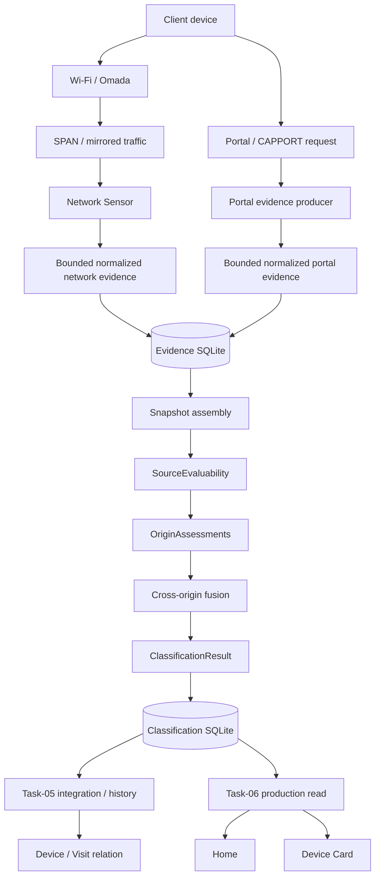

## 4. DF-02 — Evidence sources / origins

**Purpose:** distinguish independent origin families.
**Inputs:** normalized admitted evidence plus MAC-registry knowledge.
**Outputs:** per-origin assessments.
**Persistence boundary:** five physical/application evidence families persist through Task-01; MAC Registry is knowledge-derived, not packet evidence.
**Failure behavior:** unavailable/unsupported/disabled/unknown origin stays explicit and conservative.
**Authoritative owner/module:** evidence adapters + `origin_assessment.py`.

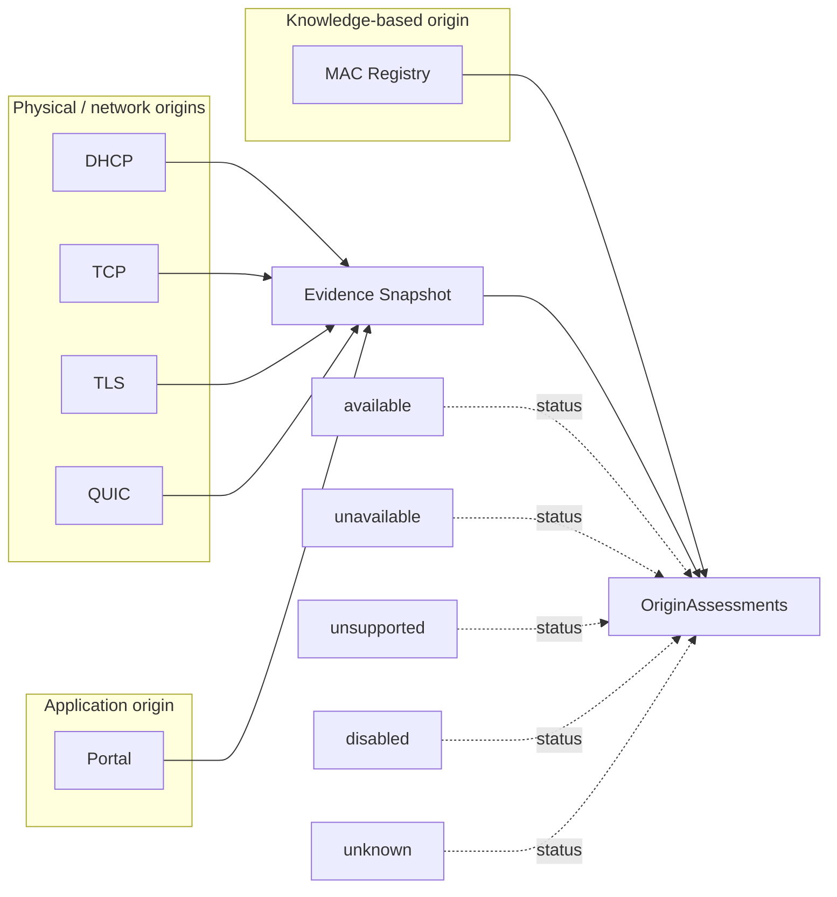

Current classifier origin order is exactly:

```text
dhcp, portal, tcp, tls, quic, mac_registry
```

Repeated rows from one origin do not become independent votes.

## 5. Evidence Foundation and producers

### Evidence Foundation

Task-01 owns the normalized evidence/source-health persistence boundary and its
internal direct-TLS ingest/read service. The foundation remains separate from the
classification SQLite.

Normalized durable evidence is P1/bounded. Raw packets, raw EVE, raw User-Agent,
raw Client Hints, cookies, credentials and full request material are not durable
classification evidence.

### Network producer

Conceptual flow:

```text
SPAN / mirrored traffic
→ sensor-side capture/parsing
→ bounded normalization
→ durable normalized evidence
→ Device Fingerprint Evidence SQLite
```

Current network evidence families include admitted DHCP, TCP SYN, TLS client and
QUIC client schemas. The deployed sensor architecture keeps raw frames in memory;
Suricata extraction is minimized and the product persistence boundary is the
normalized evidence envelope, not EVE/PCAP storage.

### Portal producer

Conceptual flow:

```text
Portal / CAPPORT request
→ bounded request metadata
→ portal evidence producer
→ normalized portal evidence
→ existing Evidence SQLite
```

Portal evidence is another origin. It is not a second classifier.

Current Portal source-health uses the accepted periodic replacement emitter with a
60-second nominal same-state heartbeat. The historical EVENT_DRIVEN Portal emitter
remains part of lineage but is not the current liveness contract.

## 6. DF-03 — Evidence + source health + time

**Purpose:** explain why absence of evidence is not automatically negative evidence.
**Inputs:** evidence rows, source-health timeline, binding timeline, clock policy.
**Outputs:** conservative source coverage/evaluability.
**Persistence boundary:** evidence and immutable source-health events persist; evaluability is derived classification input.
**Failure behavior:** stale/missing/incompatible health becomes unknown or another explicit non-covered state; no optimistic backfill.
**Authoritative owner/module:** `source_health_policy.py`, binding contracts, `source_evaluability.py`.

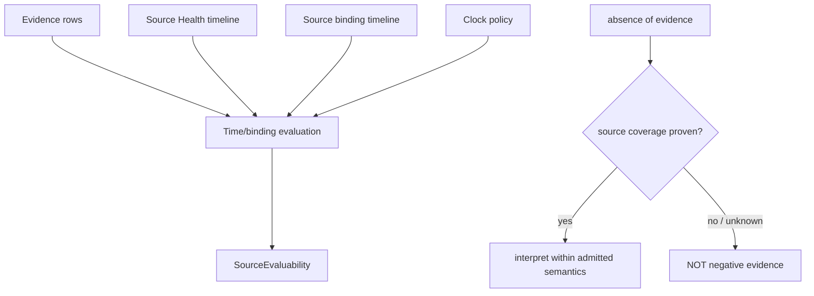

Current frozen source-health freshness includes:

```text
network periodic emitter = 600 seconds
historical Portal EVENT_DRIVEN emitter = 0 seconds
current Portal PERIODIC emitter = 180 seconds
timeout result = unknown
```

Recovery never retroactively upgrades a missed interval to complete.

## 7. Binding and time model

Classification is Site-scoped and time-windowed. Snapshot membership depends on:

```text
Site
observed MAC
classification window
source binding epoch
capture/source identity
clock policy
source-health coverage
Task-01 generation/watermark
```

A classifier cannot safely use “the latest row” without proving that row belongs
to the requested Site, binding epoch and time window.

## 8. DF-04 — Snapshot assembly

**Purpose:** separate semantic snapshot contents from transient verified materialization and operational limits.
**Inputs:** retained Task-01 evidence/health plus foundation contracts.
**Outputs:** `EvidenceSnapshotContent`, verified `EvidenceSnapshotMaterialization`, `SourceEvaluability`.
**Persistence boundary:** `EvidenceSnapshotContent`/`SnapshotRecord` are retained audit lineage; materialization is transient.
**Failure behavior:** invalid integrity, incompatible binding, or exceeded resource policy fails closed for that classification request.
**Authoritative owner/module:** snapshot service/artifacts + foundation runtime profile.

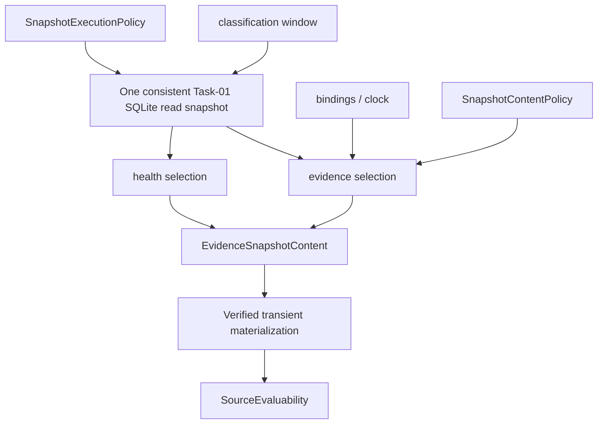

Permanent distinction:

```text
SnapshotContentPolicy != SnapshotExecutionPolicy
semantic content ceilings != operational execution guard
```

Current production-aligned memory guard:

```text
process_memory_guard_bytes = 1073741824
                         = 1024 MiB
                         = 1 GiB

SnapshotExecutionPolicy:v1:sha256:
36074993bb86daca8c43268c19ce0efab7e0e3ef5d644e07b9b6e65f5fff7f77
```

This is a guard/threshold, not a 1-GiB memory reservation. Historical 96 MiB and
512 MiB values are not current configuration.

## 9. Knowledge and policy

Knowledge is pinned, versioned and auditable. Production classification cannot
silently consult arbitrary current Internet/vendor knowledge.

Current knowledge families include:

| Family | Role |
|---|---|
| K1 | offline pinned Satori DHCP knowledge |
| K2A | p0f parser/conformance foundation |
| K2B | offline pinned legacy p0f TCP knowledge |
| K3 | internal normalized Portal rule set |
| K4 | offline admitted IEEE MAC-assignment knowledge |

Other major artifacts include:

```text
ClassificationTaxonomy
AliasMapping
KnowledgeFreshnessPolicy
SourceGovernanceRecord
KnowledgeProvenanceManifest
CanonicalKnowledgeRecordSet
KnowledgeBundle
ClassificationPolicy
EvidenceAdapterContractSet
ClassifierArtifactManifest
```

## 10. DF-07 — Knowledge and policy

**Purpose:** show how admitted knowledge becomes deterministic classifier input.
**Inputs:** taxonomy, aliases, versioned knowledge families, provenance/freshness.
**Outputs:** pinned `KnowledgeBundle` + policy/adapter contracts.
**Persistence boundary:** immutable artifact/control-plane content, not query-time cloud results.
**Failure behavior:** stale/unadmitted/incompatible knowledge blocks admission or produces conservative no-claim semantics; there is no silent fallback.
**Authoritative owner/module:** knowledge artifact builders, governance gates, runtime-profile artifacts.

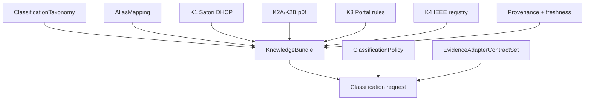

## 11. DF-05 — Pure deterministic classification core

**Purpose:** show the I/O-free semantic core.
**Inputs:** exact snapshot/evaluability + admitted knowledge/policy/adapters/classifier identity.
**Outputs:** six `OriginAssessment`s, four `DimensionResult`s, global `ClassificationResult`.
**Persistence boundary:** none inside the pure core. Persistence happens outside it.
**Failure behavior:** malformed/incompatible inputs fail closed; no external fallback.
**Authoritative owner/module:** origin assessment + fusion/classification core.

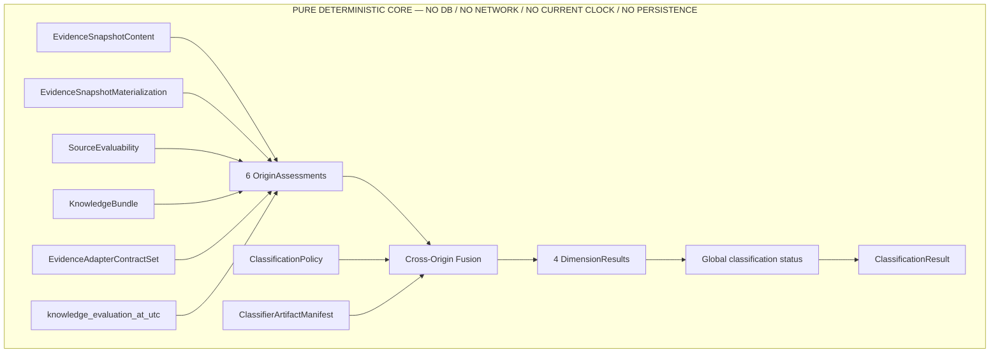

The pure core does not read DBs, network, filesystem discovery, current wall clock,
mutable configuration or vendor schemas.

## 12. OriginAssessment

Every origin is evaluated independently before fusion:

```text
DHCP
Portal
TCP
TLS
QUIC
MAC Registry
```

An origin can provide a candidate, no claim, ambiguity/conflict, or be
unsupported/not evaluable. Documentation must not reduce this architecture to
“User-Agent means Android” or “DHCP means Smartphone”.

## 13. DF-06 — Per-dimension fusion

**Purpose:** explain one dimension without pretending fusion is majority voting.
**Inputs:** one dimension's independently constructed origin assessments.
**Outputs:** status, canonical value when resolved, support and audit references.
**Persistence boundary:** result persists only after the pure decision is complete.
**Failure behavior:** ambiguity/conflict/insufficient evidence remains an explicit valid outcome.
**Authoritative owner/module:** `fusion.py` + `ClassificationPolicy`.

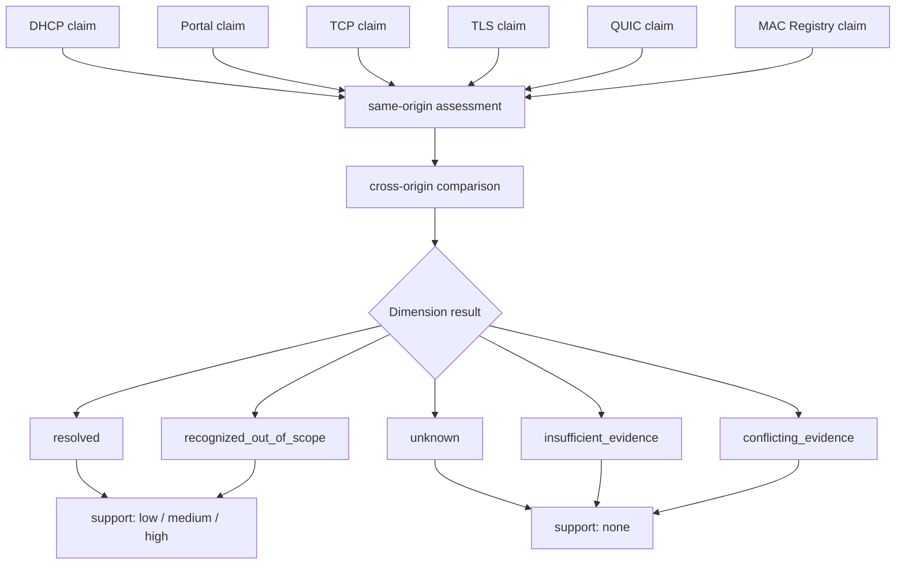

Independent-origin agreement and contradiction matter. Row counts are not votes.

## 14. ClassificationResult

`ClassificationResult` is the authoritative structured classifier product artifact.

It includes global classification status plus:

```text
platform_result
device_class_result
manufacturer_result
model_result
```

Each dimension carries:

```text
canonical value (when resolved)
status
support level
supporting origins
contradicting origins
not-evaluable origins
out-of-scope references
explanation codes
knowledge references
```

The product UI consumes this artifact through typed read/presentation boundaries;
it does not recompute its semantics.

## 15. Reproducibility and audit

A result is explainable relative to exact:

```text
evidence snapshot
source evaluability
knowledge bundle
classification policy
adapter contracts
classifier implementation identity
runtime profile
activation/admission lineage
```

Key retained identities include:

```text
SnapshotRecord
ClassificationRequestManifest
ClassifierArtifactManifest
ClassificationResult
FoundationRuntimeProfile
ClassificationRuntimeProfile
RuntimeProfileAdmissionManifest
RuntimeProfileActivationRecord
RuntimeProfileValidityRecord
```

`ClassifierArtifactManifest` pins the exact executable classifier implementation
identity used by the admitted runtime profile. A semantic classifier
implementation-byte change is therefore not merely an Admin/UI revision: it can
require a new candidate lineage and the applicable acceptance/admission path
before that implementation becomes production-active.

Reacceptance boundary:

```text
classifier semantic implementation / admitted classifier artifacts changed
→ new candidate identity + applicable acceptance/admission required

Admin presentation-only change with unchanged classifier semantics/artifacts
→ does not by itself require classifier reacceptance
```

## 16. DF-09 — Artifact / audit lineage

**Purpose:** show why a retained result can be reproduced and explained.
**Inputs:** exact request artifacts and activation lineage.
**Outputs:** retained result with immutable references.
**Persistence boundary:** control-plane + classification audit persistence.
**Failure behavior:** missing/inconsistent lineage fails closed; random “latest settings” are not substituted.
**Authoritative owner/module:** artifact/control-plane + classification persistence.

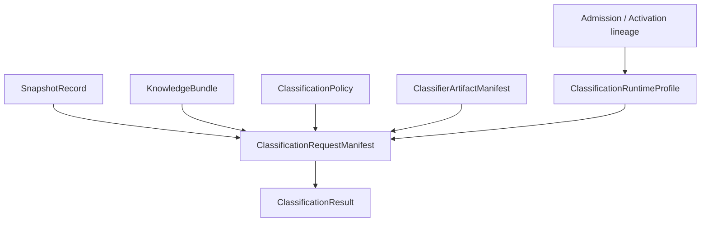

## 17. Runtime profiles and admission

There are two compatibility levels:

```text
FoundationRuntimeProfile
ClassificationRuntimeProfile
```

The classification profile pins the exact Foundation profile, KnowledgeBundle,
ClassificationPolicy, EvidenceAdapterContractSet and ClassifierArtifactManifest.

A production request reads the active classification pointer once and pins one
exact profile generation for the entire request. It does not repeatedly choose
“current” artifacts.

## 18. DF-08 — Runtime profile / admission lifecycle

**Purpose:** make candidate/accepted/admitted/active states visibly different.
**Inputs:** immutable foundation/classifier artifacts and acceptance proofs.
**Outputs:** one active pinned runtime profile.
**Persistence boundary:** dedicated control-plane SQLite.
**Failure behavior:** compatibility/predecessor/validity failure blocks activation; no mixed generation.
**Authoritative owner/module:** runtime-profile/control-plane admission code.

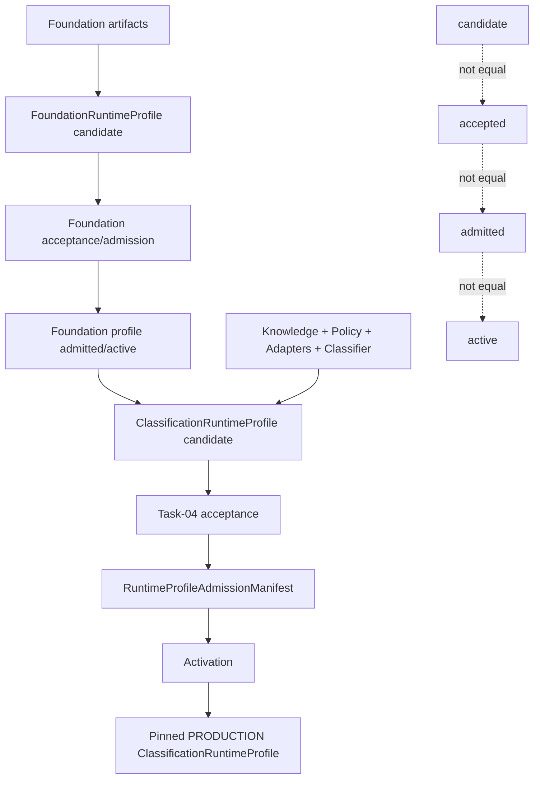

### In-flight stability

```text
request starts
→ exact ClassificationRuntimeProfile generation pinned once
→ entire request uses the same semantic generation
→ commit guard validates the pinned activation lineage
```

A safe profile activation during the request does not mix the new generation into
the already-running request.

## 19. Persistence

Device Fingerprint uses separate stores by ownership:

```text
/opt/CaptivePortal/data/device_fingerprint_evidence.sqlite3
/opt/CaptivePortal/data/device_fingerprint_classification.sqlite3
/opt/CaptivePortal/data/device_fingerprint_control_plane.sqlite3
/opt/CaptivePortal/data/device_fingerprint_integration.sqlite3
```

The evidence, classification, control-plane and integration domains are not one
database and must not be aliased.

Classification retention is a versioned policy; current accepted V1 retention is
90 days. A classification result is historical product/audit evidence, not a field
that overwrites the Device row.

## 20. DF-15 — Production components and stores

**Purpose:** show runtime ownership.
**Inputs:** main Auth lifecycle plus passive evidence.
**Outputs:** classification and read-only Admin presentation.
**Persistence boundary:** four dedicated Device Fingerprint SQLite domains.
**Failure behavior:** independent components fail without changing Authorization semantics.
**Authoritative owner/module:** deployment templates + integration/classification services.

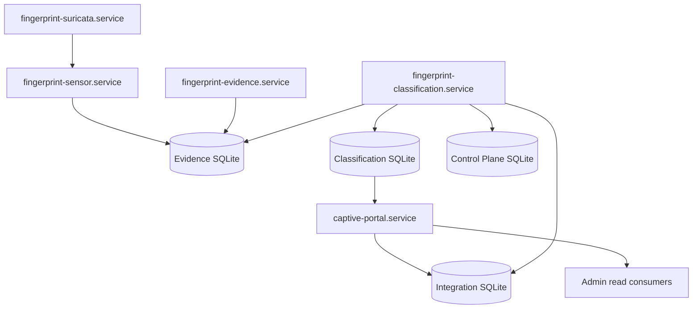

The production status explicitly confirmed for the final Task-06 checkpoint is
`captive-portal.service=active` and `fingerprint-classification.service=active`.
Repository component existence is not used to invent an unverified live service
state for other auxiliary units.

## 21. Task-05 — post-Auth integration

One successful AuthRun creates one durable classification opportunity. Current
code constants define:

```text
lookback before Auth      = 300 s
post-Auth evidence window = 120 s
due time                  = Auth + 150 s
lease                     = 300 s
max attempts              = 5
retry delays              = 30 / 120 / 300 / 600 s
identity retry interval   = 30 s
identity horizon          = 3600 s
```

Current job states:

```text
PENDING
LEASED
CLASSIFIED
NO_RESULT_FINAL
```

Identity states:

```text
UNRESOLVED
DEVICE_RESOLVED
DEVICE_AND_VISIT_RESOLVED
CONFLICT
```

## 22. DF-10 — Post-Auth integration / worker

**Purpose:** show the durable production classification trigger.
**Inputs:** confirmed authorization plus exact identity/session context.
**Outputs:** persisted production classification linked where exact identity permits.
**Persistence boundary:** integration SQLite + classification/control-plane stores.
**Failure behavior:** bounded retry, lease recovery and terminal no-result; Auth remains independent.
**Authoritative owner/module:** `app/device_fingerprint_integration/`, `fingerprint-classification.service`.

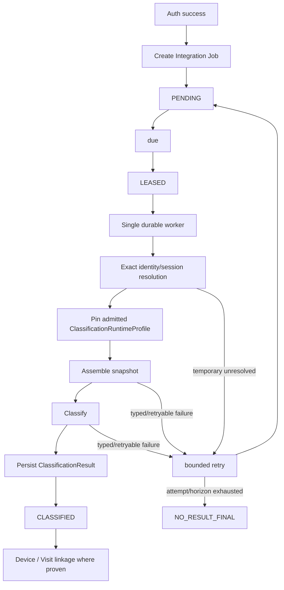

Identity resolution does not guess. It uses exact Site/session/MAC Registry
snapshots and exact Visit/session/run relation where available.

## 23. Device identity and later visits

Device identity and classification result are different records. Current relation
uses Site, observed MAC, device/session anchors, integration job and
classification ID.

For the same Site + MAC, a later Visit can create another fingerprint opportunity:

```text
existing Device identity
+ new Visit/AuthRun
+ new ClassificationResult
```

There is no automatic cross-MAC identity merge. A randomized MAC can therefore be
a separate Device identity unless another separately proven linking mechanism
exists.

## 24. DF-11 — Device classification history

**Purpose:** distinguish Device identity from repeated classification history.
**Inputs:** successive auth/visit opportunities for one Site+MAC.
**Outputs:** retained classification history and one current production selection.
**Persistence boundary:** classification SQLite retains multiple results.
**Failure behavior:** a failed/new opportunity does not rewrite older retained evidence.
**Authoritative owner/module:** classification persistence/read + Task-05 relation.

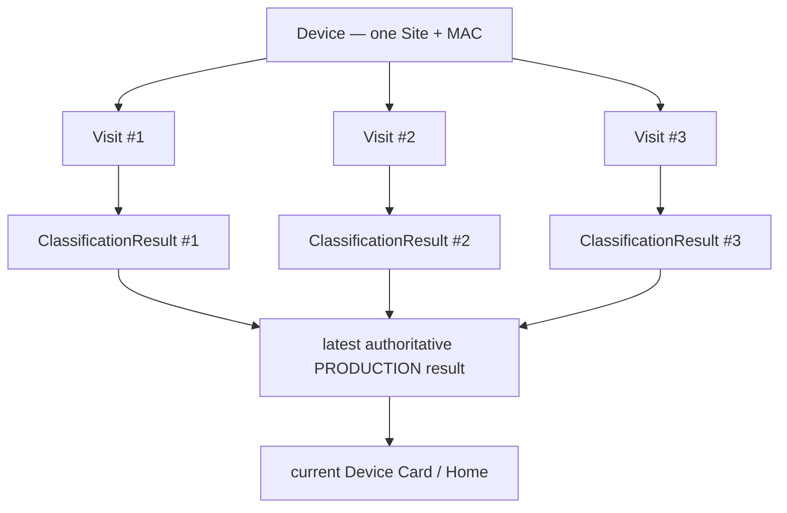

## 25. Task-05 performance and memory-pressure history

The first successful production-shaped assembly exposed a CPU-bound performance
problem: repeated validation/rematerialization of the same immutable knowledge
closure. `TASK-DEVICE-FINGERPRINT-05-PERF-01` introduced request-scoped validation
proof reuse without changing classifier semantics or artifact identities.

Accepted engineering history:

```text
before: wall ≈ 248.5 s, CPU ≈ 247.9 s
after:  wall ≈ 32.35 s
speedup ≈ 7.68x
reduction ≈ 86.98%
```

A later live `snapshot_memory_pressure` exposed that the historical 96-MiB process
RSS guard was operationally too small. This was not proof of host OOM, a semantic
classifier regression or a memory leak. The final current policy is 1 GiB.

Historical failed rows remain history; a later successful Owner-device job reached
`CLASSIFIED` in one attempt with an empty last reason.

## 26. Task-06 authoritative product read

The UI does not classify.

```text
persisted PRODUCTION ClassificationResult
→ DeviceFingerprintClassificationReadService
→ typed DeviceFingerprintPresentationService
→ AdminQueryService/read model
→ Home / Device Card
```

A newer `PRE_ACCEPTANCE_CANDIDATE` result cannot shadow the current production
result.

Home batch reads are bounded to at most 250 input MACs. Inputs are canonicalized
and deduplicated. The implementation uses one read-only SQLite connection /
transaction and bounded grouped SELECTs, not one connection/query per device row.

## 27. DF-12 — Admin presentation read path

**Purpose:** show the one authoritative read path shared by product surfaces.
**Inputs:** persisted PRODUCTION ClassificationResult.
**Outputs:** compact Home Type/Platform and detailed Device Card fingerprint information.
**Persistence boundary:** read-only; no UI writes/classification.
**Failure behavior:** fail-soft presentation on read failure.
**Authoritative owner/module:** classification read + Admin fingerprint presentation service.

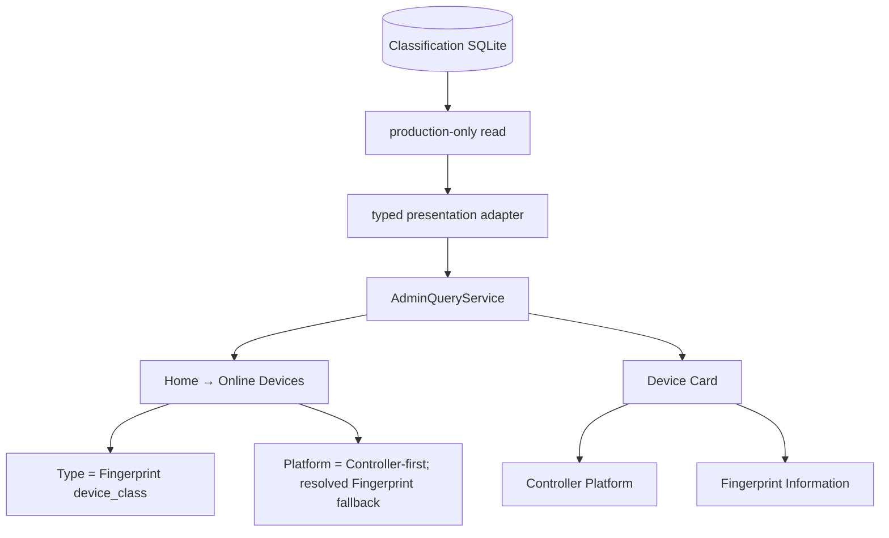

## 28. Home → Online Devices current UI

Current Home column semantics:

```text
Device / MAC
Type       = fingerprint device_class
Platform   = Controller-first; resolved PRODUCTION Fingerprint fallback only
Auth
IP
AP
Band
RSSI
SNR
Uptime
Traffic
```

Backend `device_type` / `device_type_key` remain unchanged Controller evidence.
Home uses Controller when its key is neither null nor `unknown`; otherwise only
resolved authoritative PRODUCTION Fingerprint Platform is eligible. Other keys
are not heuristically reinterpreted. Both compact projections use the same
bounded Site-scoped PRODUCTION batch. The server composes
`platform_presentation = {source, value, key}` (`controller|fingerprint|none`);
the browser renders its value and uses exact effective key `android` for the icon.
No visible provenance badge or browser normalization is added.

Explicit Controller Unknown or completed unresolved Fingerprint renders
`Unknown`; absent Controller plus no-result/unavailable Fingerprint renders
`—`. Fingerprint failures remain fail-soft and never suppress usable Controller
data. Type never falls back to Controller; Device Card source separation below
is unchanged. This HOME-UX-REFINEMENT-01 repository behavior does not claim a new
production deployment.

Permanent product rule:

```text
Fingerprint Type != Controller Platform
Controller Platform NEVER backfills Fingerprint Type
```

## 29. Device Card current UI

Device Card keeps controller evidence and fingerprint evidence separate:

```text
Controller information
  Controller Platform = controller/source value

Fingerprint Information
  Status
  Classified at
  Type
  Fingerprint Platform
  Manufacturer
  Model Family
  support
```

Expandable fingerprint details may show exact per-dimension status, support,
supporting/contradicting/not-evaluable origins, out-of-scope references,
explanation codes and knowledge references.

Controller Platform and Fingerprint Platform can disagree. No reconciliation,
auto-correction, hidden override or UI-side “best guess” is performed.

## 30. DF-13 — UI state semantics

**Purpose:** make no-result/Unknown/Unavailable unambiguous.
**Inputs:** production read state + dimension status.
**Outputs:** stable human-facing presentation.
**Persistence boundary:** none.
**Failure behavior:** read failure maps to Unavailable/— without breaking core page data.
**Authoritative owner/module:** Admin fingerprint presentation.

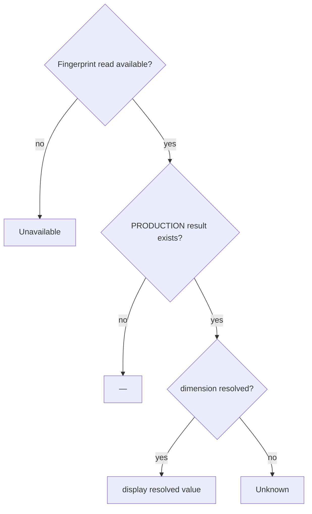

A completed global classification status of `unknown` is still a completed
classification, not read-path Unavailable.

## 31. DF-14 — Failure isolation

**Purpose:** show that Device Fingerprint is advisory and fail-soft to the rest of CaptivPortal.
**Inputs:** possible sensor/store/classifier/worker/read failures.
**Outputs:** degraded/unavailable fingerprint only.
**Persistence boundary:** failures may be retained in domain history/telemetry; they do not mutate Auth decisions.
**Failure behavior:** core Auth/CAPPORT/Admin/Traffic continue according to their own contracts.
**Authoritative owner/module:** subsystem boundaries + Admin fail-soft adapter.

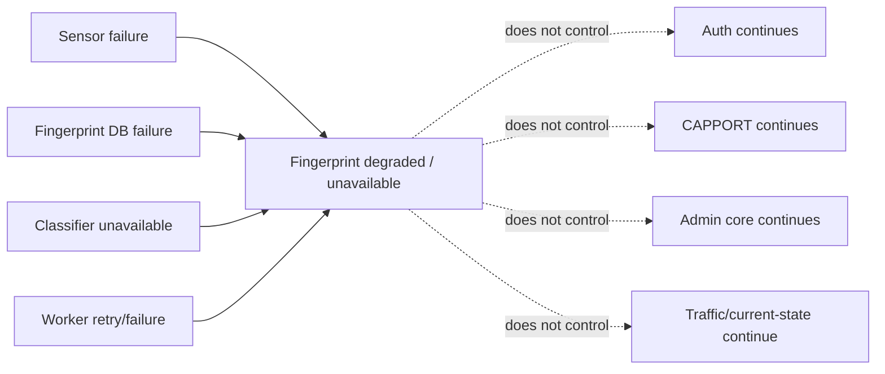

## 32. Security and privacy boundaries

Permanent invariants:

```text
classification is advisory
classification never authorizes
classification never changes CAPPORT admission
classification is not a security credential
no automatic client blocking
no destructive Omada action
no cross-MAC identity merge
runtime classifier requires no Internet
raw packets are non-durable
raw User-Agent / Client Hints are non-durable
Admin presentation is Site-authorized and read-only
```

Knowledge acquisition/import may be an offline governed process; the production
classifier does not perform query-time external/cloud classification.

## 33. Site boundary

Fingerprint reads/writes are Site-scoped. Do not model:

```text
MAC → one universal global identity
```

The current product/read boundary is Site + observed MAC. This boundary must be
preserved for future Multi-Site evolution.

## 34. DF-16 — Current Device Fingerprint vs future Traffic Enrichment

**Purpose:** prevent two initiatives from being conflated.
**Inputs:** current classification data vs future traffic/activity intelligence.
**Outputs:** richer future Device Card without changing what “fingerprint” means.
**Persistence boundary:** future initiative requires its own approved architecture.
**Failure behavior:** future work cannot silently expand current fingerprint semantics.
**Authoritative owner/module:** current Device Fingerprint docs; future Architect/roadmap for enrichment.

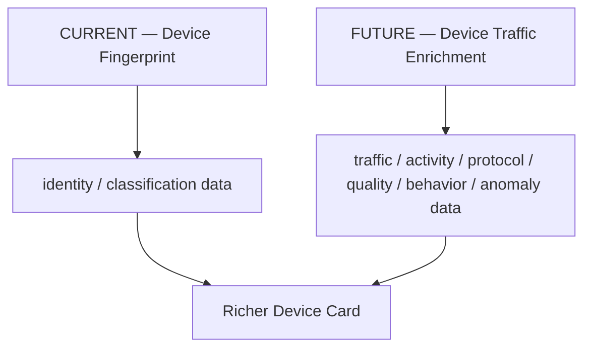

Device Traffic Enrichment / Device Intelligence is a separate accepted
architecture/roadmap program. Its v0.3 architecture is FINAL / TECH LEAD ACCEPTED
and roadmap registration is authorized, but implementation is not authorized,
Coder remains HOLD, and production is unchanged. TASK-DTI-00 is the next
executable RESEARCH / LAB / INVENTORY step. DTI must not be described as already
implemented Device Fingerprint behavior.

## 35. Historical architecture and provenance

The registered Device Fingerprint R14 architecture remains the normative detailed
semantic contract for frozen artifact/admission/classification semantics. It
contains historical lifecycle language (including periods when Task-04 was HOLD)
that is correct for that point in the project history.

Current documentation must not rewrite that history. Current-state docs instead
record the later accepted chain:

```text
Foundation accepted/admitted
→ Task-04 implemented and T-ACCEPT PASS
→ Task-05 identity/session integration
→ Task-05 PERF repair
→ Task-06 authoritative Admin presentation
→ production deploy/acceptance
```

## 36. Current source-of-truth map

| Topic | Current owner/reference |
|---|---|
| normalized evidence/store | `app/device_fingerprint/` Task-01 code |
| network sensor | `app/device_fingerprint_sensor/`, `deploy/device-fingerprint/` |
| Portal evidence | `app/device_fingerprint_portal/`, `docs/modules/device-fingerprint-portal.md` |
| source health/bindings/snapshot | `app/device_fingerprint/` foundation contracts |
| knowledge/policy | `app/device_fingerprint/` knowledge/policy artifacts |
| pure classifier/fusion | `app/device_fingerprint/origin_assessment.py`, `fusion.py` |
| runtime profiles/control plane | `app/device_fingerprint/` runtime-profile/control-plane modules |
| classification persistence/read | `classification_persistence.py`, `classification_read.py` |
| Task-05 integration | `app/device_fingerprint_integration/` |
| production worker | `fingerprint-classification.service` deployment artifact |
| Admin projection | `app/admin_web/device_fingerprint_presentation.py`, `docs/modules/admin-web.md` |
| R14 normative semantics | registered FINAL R14 architecture decision |
